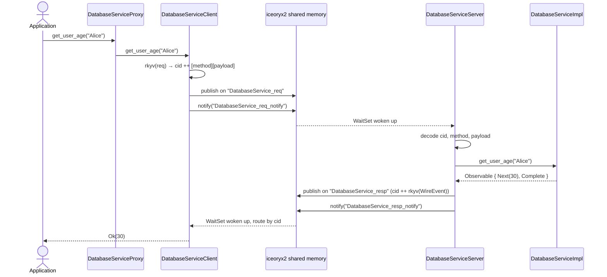
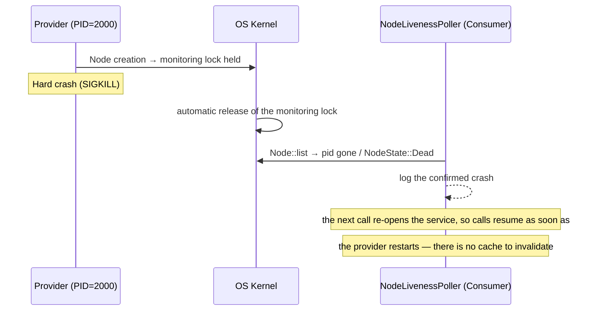

# ice-rpc — Inter-Process Communication via iceoryx2

[](https://github.com/max3163/ice-rpc/actions/workflows/ci.yml)
[](https://github.com/max3163/ice-rpc/actions/workflows/security.yml)
[](https://codecov.io/gh/max3163/ice-rpc)
[](https://api.reuse.software/info/github.com/max3163/ice-rpc)
[](https://crates.io/crates/ice-rpc)
[](https://docs.rs/ice-rpc)

`ice-rpc` is a **zero-copy** Rust RPC (Remote Procedure Call) library built on [iceoryx2](https://github.com/eclipse-iceoryx/iceoryx2) for inter-process communication (IPC) through shared memory.

From a simple Rust trait annotated with `#[service]`, the procedural macro automatically generates the entire IPC code: client, server, proxy and lifecycle. The transport is iceoryx2's **publish/subscribe**: one request channel and one response channel per logical service, correlated by a 16-byte request id, which keeps the throughput close to the raw bus (see [§4](#4-transport--publishsubscribe-with-correlation-ids)).

**Requirements.** Rust **1.85** or newer — declared as `rust-version` in the workspace manifest, with `gateway-nodejs` overriding it to **1.88** (imposed by the N-API bindings). The workspace also enforces a shared lint baseline, adopted by every member through `[workspace.lints]`: `unsafe_op_in_unsafe_fn`, `missing_docs`, `undocumented_unsafe_blocks` (every `unsafe` block carries a `// SAFETY:` justification) and `unwrap_used` (`unwrap` is banned in library code, since it would turn a recoverable error into a process abort under the release profile's `panic = "abort"`). Test, example and benchmark targets opt out of `unwrap_used` explicitly, at the top of the file.

---

## Sequence diagrams

### RPC call Consumer → Provider



### Crash detection and restart



---

## 1. Overview of the communication workflow

```
┌──────────────────────────────────────────────────────────────────────────────┐
│                           ICE-RPC GLOBAL WORKFLOW                             │
│                                                                              │
│  ┌──────────────┐                                    ┌──────────────┐        │
│  │  PROCESS 1   │                                    │  PROCESS 2   │        │
│  │  (Consumer)  │                                    │  (Provider)  │        │
│  │              │                                    │              │        │
│  │  App         │                                    │  App         │        │
│  │   │          │                                    │   │          │        │
│  │   ▼          │                                    │   ▼          │        │
│  │  Proxy       │                                    │  Proxy       │        │
│  │  (Consumer)  │                                    │  (Provider)  │        │
│  │   │          │                                    │   │          │        │
│  │   ▼          │   {service}_req   (pub/sub)        │   ▼          │        │
│  │  Transport   │────────────────────────────────►   │  Transport   │        │
│  │  publisher   │   {service}_resp  (pub/sub)        │  subscriber  │        │
│  │  + responder │◄────────────────────────────────   │  + dispatcher│        │
│  │              │                                    │              │        │
│  │  one thread  │   {service}_{req,resp}_notify      │  one thread  │        │
│  │  per service │◄─────────────(event)─────────────► │  per service │        │
│  └──────────────┘                                    └──────────────┘        │
│                                                                              │
│   iceoryx2 services per logical service:                                     │
│     • {service}_req         consumer → provider requests                     │
│     • {service}_resp        provider → consumer responses                    │
│     • {service}_req_notify  wake-up signal for the provider                  │
│     • {service}_resp_notify wake-up signal for the consumer                  │
└──────────────────────────────────────────────────────────────────────────────┘
```

---

## 2. Code architecture

```
ice-rpc/                        ← Main crate (library + runtime)
├── src/
│   ├── lib.rs                  ← Public exports, cancellation tokens, shutdown()
│   ├── transport.rs            ← Publish/subscribe transport: one request and one
│   │                              response channel per service, correlated by a
│   │                              16-byte id, Notifier/Listener/WaitSet wake-ups
│   ├── types/                  ← RPC fundamental types, one file per concern:
│   │   ├── node.rs             ← NodeId (PID) + raw_pid_to_u32
│   │   ├── wire.rs             ← Event, WireEvent, Sender, ObservableError
│   │   ├── stream.rs           ← Observable, StreamError, channel()
│   │   ├── error.rs            ← RpcError
│   │   └── consts.rs           ← name-length limits shared with the macros
│   ├── node_liveness.rs        ← Native iceoryx2 node monitoring (Node::list,
│   │                              NodeState::Alive/Dead), single shared poller
│   ├── http_gateway.rs         ← HTTP REST gateway (trillium) : exposes the services
│   │                              via GET/POST on /{service}/{method}
│   ├── locator.rs              ← ServiceLocator (register/get + Kahn topological
│   │                              initialization order)
│   ├── shutdown.rs             ← Registry of the blocking IPC threads (clean stop)
│   ├── sync.rs                 ← Poisoning-tolerant lock helper
│   ├── config.rs               ← iceoryx2 root-path / TOML configuration
│   ├── gen.rs                  ← Internal facade for the generated code (doc-hidden)
│   └── nodejs_dispatch.rs      ← Node.js bridge injection point (N-API)
│
ice-rpc-macros/                 ← Procedural macros crate
├── src/
│   ├── lib.rs                  ← Entry point : parses the trait, orchestrates the modules
│   └── codegen/
│       ├── helpers.rs          ← g_variant_name(), extract_rpc_result_types()
│       ├── client.rs           ← {Trait}Client : rkyv request → native_call
│       ├── server.rs           ← {Trait}Server : per-method ServiceDispatcher
│       ├── proxy.rs            ← {Trait}Proxy : Provider/Consumer/ProviderNodeJs modes
│       ├── lifecycle.rs        ← ServiceLifecycle/ServiceInit/ServiceNamed
│       │                          (+ spawn_native_service for the provider)
│       └── nodejs.rs           ← rkyv↔serde_json::Value converters (NodeJS mode)
│
common/                         ← Example service definitions (not shipped)
│   └── src/
│       ├── mod.rs              ← pub mod config/context/database/http + re-exports
│       ├── config.rs           ← ConfigService
│       ├── context.rs          ← ContextService
│       ├── database.rs         ← DatabaseService
│       └── http.rs             ← HttpService
gateway_nodejs/                 ← NAPI-RS gateway : NodeJsBridge singleton + generated proxies
│   ├── build.rs                ← N-API build script
│   └── src/
│       ├── lib.rs              ← Entry point : init(callback), shutdown()
│       ├── nodejs_bridge.rs    ← Generic agnostic bridge (Value ↔ native JS via NAPI)
│       ├── services.rs         ← Provider registration via with_nodejs_providers!
│       ├── consumer.rs         ← Consumer helpers
│       └── runtime.rs          ← Tokio runtime
```

### 2.1. Code generation modules (codegen/)

| Module | Responsibility |
|---|---|
| `helpers.rs` | `g_variant_name` (snake→Pascal), `extract_rpc_result_types` |
| `client.rs` | Generates `{Trait}Client` : serializes the rkyv request and calls `native_call(service, method, payload)`, returning the streamed responses as an `Observable` |
| `server.rs` | Generates `{Trait}Server` : one `ServiceDispatcher::method(...)` registration per RPC method, each decoding the rkyv request and streaming `observable_to_responses(observable)` |
| `proxy.rs` | Generates `{Trait}Proxy` (RwLock<Mode>), `provide`/`provide_with_init`/`consume`/`provide_nodejs` constructors, Provider/Consumer/ProviderNodeJs delegation |
| `lifecycle.rs` | Generates `impl ServiceLifecycle` (starts the provider's transport service), `impl ServiceNamed`, `impl ServiceInit` and the ProviderNodeJs bridge |
| `http.rs` | Generates `impl HttpCallable` for each Proxy : dynamic method dispatch → RPC call, JSON deserialization → Rust types, result serialization → `{"status":"ok","data":...}` |
| `nodejs.rs` | Generates `deserialize_request_to_value()` and `serialize_response_from_value()` : per-method rkyv ↔ `serde_json::Value` converters, used by the NodeJS bridge |

---

## 3. The `#[service("Name")]` macro

### 3.1. How it works

From an annotated trait, the macro automatically generates all the IPC code:

```rust
#[service("DatabaseService")]
pub trait DatabaseService: Send + Sync + 'static {
    async fn get_user_age(&self, name: String) -> Observable<i32, DatabaseError>;
}
```

#### Generated types

```
┌──────────────────────────────────────────────────────────────────┐
│              CODE GENERATION BY THE #[service] MACRO             │
│                                                                  │
│  Annotated trait                                                  │
│  ═══════════                                                      │
│  #[service("DatabaseService")]                                    │
│  pub trait DatabaseService { ... }                                │
│         │                                                        │
│         ▼                                                        │
│  ┌─────────────────────────────────────────────────────────────┐ │
│  │ Automatically generated types                               │ │
│  │                                                             │ │
│  │  DatabaseServiceRequest   ← rkyv enum (1 variant/method)    │ │
│  │  DatabaseServiceClient    ← IPC client (native_call)        │ │
│  │  DatabaseServiceServer    ← IPC server (ServiceDispatcher)  │ │
│  │  DatabaseServiceProxy     ← Smart Proxy (3 modes)           │ │
│  │  DatabaseServiceMode      ← Provider | Consumer |           │ │
│  │                                ProviderNodeJs               │ │
│  └─────────────────────────────────────────────────────────────┘ │
│                                                                  │
│  ┌─────────────────────────────────────────────────────────────┐ │
│  │ Generated implementations                                   │ │
│  │                                                             │ │
│  │  ServiceLifecycle  → init() starts the provider service     │ │
│  │  ServiceNamed      → const SERVICE_NAME + service_name()    │ │
│  │  ServiceInit       → on_init() + dependencies()             │ │
│  │  {Trait} for Proxy → 3-mode delegation                      │ │
│  │  deserialize_request_to_value  (static)                     │ │
│  │  serialize_response_from_value (static)                     │ │
│  └─────────────────────────────────────────────────────────────┘ │
└──────────────────────────────────────────────────────────────────┘
```

| Type | Role |
|---|---|
| `DatabaseServiceRequest` | Serializable enum (rkyv) with one variant per method |
| `DatabaseServiceClient` | IPC client : serializes the request and calls the transport |
| `DatabaseServiceServer` | IPC server : routes a decoded request to its handler |
| `DatabaseServiceProxy` | Single entry point (Smart Proxy Node, 3 modes) |
| `DatabaseServiceMode` | `Provider` / `Consumer` / `ProviderNodeJs` enum |

### 3.2. Optional parameters

```rust
#[service]                                                       // logical name = trait name in lowercase
#[service("MyService")]                                          // explicit logical name
#[service("MyService", version = 2, discovery_timeout = "5s")]   // version + deadline
```

| Parameter | Type | Default | Description |
|---|---|---|---|
| `version` | integer | `1` | Service interface version (part of the request frame). |
| `discovery_timeout` | string (`s`/`m`/`h`) | `30s` | Accepted for compatibility; the transport connects on demand, so it is currently informational. |
| `allow_large_payload` | `bool` | `false` | Accepted for compatibility; ignored (the shared-memory segment grows on demand). |
| `default_size_message` | integer (KiB) | — | Accepted for compatibility; ignored. |

---

## 4. Transport — publish/subscribe with correlation ids

### 4.1. One service pair per logical service

Each logical service `{service}` maps to four iceoryx2 services:

| iceoryx2 service | Direction | Contents |
|---|---|---|
| `{service}_req` | consumer → provider | `cid[16] ++ [method_len: u16 BE][method][payload]` |
| `{service}_resp` | provider → consumer | `cid[16] ++ rkyv(WireEvent<T, E>)` |
| `{service}_req_notify` | event | wake-up signal for the provider |
| `{service}_resp_notify` | event | wake-up signal for the consumer |

**Why not iceoryx2's `request_response`?** It allocates one channel (and one data
segment) per request in flight, which caps the throughput far below what the
shared-memory bus can do. With pub/sub the ports are created once and every call
is a single loaned sample; correlating the responses by request id gives the same
call/response semantics for a fraction of the cost.

### 4.2. Provider

One thread per service:

1. it spins briefly, then blocks on a `WaitSet` attached to its `_req_notify`
   `Listener` (only a `Listener` is attachable, not a `Subscriber`);
2. it drains `{service}_req` and decodes `cid`, method and payload;
3. it runs the `ServiceDispatcher` handler, which streams the service
   `Observable` as rkyv `WireEvent` samples;
4. it publishes each sample on `{service}_resp` and notifies the consumer.

### 4.3. Consumer

One cached publisher and one dispatch thread per service:

- `native_call(service, method, payload)` allocates a 16-byte correlation id,
  registers a typed handler under it, publishes the framed request and notifies
  the provider;
- the dispatch thread drains `{service}_resp` and routes each sample to the
  handler registered for its id;
- a terminal `WireEvent` (`Complete` / `Error`) ends the stream: there is no
  per-call connection to close, so the terminal event is part of the stream.

### 4.4. Tuning

| Setting | Value | Why |
|---|---|---|
| `subscriber_max_buffer_size` | 16 384 | absorb a burst without backpressure |
| `initial_max_slice_len` | 256 | `buffer × slice` memory; larger payloads grow the segment |
| `max_loaned_samples` | 16 384 | iceoryx2 defaults to 8, which fails with `ExceedsMaxLoans` under load |
| WaitSet deadline | 1 ms | bounds the cost of a missed notification |
| idle spin | 2 000 yields | the hot path stays at polling speed, the idle path blocks on the `WaitSet` |

### 4.5. NodeId

`NodeId` is the process PID (`std::process::id()`). It is no longer a routing key
(the service name is); it is used by the liveness monitor to attribute a live
iceoryx2 node to its process.

---

## 5. Payload encoding

Every request and response payload is rkyv-encoded (`WireEvent<T, E>` for
responses). The framed payload is **not necessarily aligned** for the archived
type, so the decoder copies it into a 16-byte-aligned buffer first
(`ice_rpc::transport::decode_aligned`). Calling `rkyv::from_bytes` on the raw
slice fails at runtime for any type with an alignment greater than 1, which is
what silently produced empty response streams before.

The name-length limits (`SERVICE_NAME_LEN`, `METHOD_NAME_LEN`, both 64) are shared
with `ice-rpc-macros`, which rejects longer names at compile time.

---

## 6. Service liveness (native iceoryx2 node monitoring)

There is no registry: a consumer opens the service by name on the first call, so
addressing is entirely static. What remains is **liveness**:

- each process owns one iceoryx2 `Node`; the OS releases its monitoring lock when
  the process dies;
- a single shared poller (started by the first `register_node_liveness_watcher`)
  runs one `Node::list` per tick for every watched PID and reports a confirmed
  death (a `Dead` node, or a node that disappeared after a clean shutdown);
- because a call re-opens its service on demand, a restarted provider is picked
  up by the next call — there is no discovery cache to invalidate.

---

## 7. Smart Proxy Node (3 modes)

### 7.1. Architecture

```
┌──────────────────────────────────────────────────────────────────────┐
│                     SMART PROXY NODE (3 MODES)                       │
│                                                                      │
│  DatabaseServiceProxy                                                │
│  ┌────────────────────────────────────────────────────────────────┐  │
│  │  mode: RwLock<DatabaseServiceMode>                             │  │
│  │  deps: Vec<&'static str>                                       │  │
│  └────────────────────────────────────────────────────────────────┘  │
│                                                                      │
│  ┌──────────────────────────┐ ┌──────────────────────────┐          │
│  │  MODE 1: PROVIDER        │ │  MODE 2: CONSUMER        │          │
│  │                          │ │                          │          │
│  │  local_impl: Arc<dyn Tr> │ │  ipc_client: Arc<Client> │          │
│  │  init_hook: Arc<dyn Init>│ │                          │          │
│  │  server_started: bool    │ │                          │          │
│  │                          │ │                          │          │
│  │  Direct local call       │ │  IPC call via the        │          │
│  │  (no serialization)      │ │  transport (rkyv)        │          │
│  └──────────────────────────┘ └──────────────────────────┘          │
│                                                                      │
│  ┌──────────────────────────────────────────────────────────────┐    │
│  │  MODE 3: PROVIDER NODEJS                                     │    │
│  │                                                              │    │
│  │  No local state — delegates to the NodeJsBridge (singleton)  │    │
│  │                                                              │    │
│  │  IPC (rkyv) → deserialize → Value → NodeJsBridge → JS        │    │
│  │  JS → NodeJsBridge → serialize → rkyv → IPC                  │    │
│  │                                                              │    │
│  │  The JS callback is UNIQUE for all services.                 │    │
│  │  Value ↔ native JS conversion : zero-copy via NAPI serde-json│    │
│  └──────────────────────────────────────────────────────────────┘    │
│                                                                      │
│  Constructors :                                                      │
│    provide(impl)          → simple Provider (default ServiceInit)    │
│    provide_with_init(impl)→ Provider with custom init hook           │
│    consume()              → pure Consumer (IPC only)                 │
│    provide_nodejs()       → NodeJS Provider (generic JS bridge)      │
└──────────────────────────────────────────────────────────────────────┘
```

### 7.2. Method delegation

```rust
impl DatabaseService for DatabaseServiceProxy {
    async fn get_user_age(&self, name: String) -> Observable<i32, DatabaseError> {
        let mode = self.mode.read().await;
        match &*mode {
            Mode::Provider { local_impl, .. } => {
                // Direct local call, without serialization
                local_impl.get_user_age(name).await
            },
            Mode::Consumer { ipc_client } => {
                // Remote call through the publish/subscribe transport
                ipc_client.get_user_age(name).await
            }
            Mode::ProviderNodeJs => {
                // Calls arrive over IPC and are bridged to the JS host
                ice_rpc::Observable::from_technical_error(ice_rpc::RpcError::Internal(
                    "ProviderNodeJs: direct calls are not supported — use IPC".into()
                ))
            }
        }
    }
}
```

### 7.3. ProviderNodeJs lifecycle

In ProviderNodeJs mode, `ServiceLifecycle::init()` starts a transport service whose
dispatcher bridges each RPC method to the JS host:

1. `deserialize_request_to_value(method, payload)` decodes the rkyv request into a
   `serde_json::Value`;
2. `ice_rpc::nodejs_dispatch::call()` invokes the JS callback (blocking until the
   JS side resolves the call);
3. `serialize_response_from_value(method, value)` encodes the JS result back into
   a rkyv `WireEvent` sample.

`ice_rpc::nodejs_dispatch` is a **function pointer** injected by `gateway_nodejs`
at startup, avoiding a circular `common` → `gateway_nodejs` dependency.

---

## 8. Lifecycle (ServiceLifecycle)

### 8.1. Topological sort

[`ServiceLocator::initialize_all()`](ice-rpc/src/locator.rs:140) sorts the services
by the dependencies declared via
[`ServiceInit::dependencies()`](ice-rpc/src/service_traits.rs:107) :

```
┌──────────────────────────────────────────────────────────────────────┐
│                TOPOLOGICAL SORT — KAHN'S ALGORITHM                   │
│                                                                      │
│  Registered services :                                               │
│    ConfigService   → dependencies() = []                             │
│    DatabaseService → dependencies() = ["ConfigService"]              │
│    HttpService     → dependencies() = []                             │
│                                                                      │
│  Dependency graph :                                                  │
│                                                                      │
│    ┌──────────────┐     ┌──────────────┐                             │
│    │ ConfigService│     │ HttpService  │   ← roots (degree 0)        │
│    └──────┬───────┘     └──────────────┘                             │
│           │                                                          │
│    ┌──────▼───────┐                                                  │
│    │DatabaseSvc   │  ← depends on ConfigService                      │
│    └──────────────┘                                                  │
│                                                                      │
│  Initialization order :                                              │
│    1. ConfigService (degree 0)                                       │
│    2. HttpService   (degree 0)                                       │
│    3. DatabaseService (degree 1, after ConfigService)                │
│                                                                      │
│  A dependency that is not registered locally is treated as           │
│  external (provided by another process) and never blocks.            │
│  A cycle falls back to the registration order.                       │
└──────────────────────────────────────────────────────────────────────┘
```

### 8.2. Provider startup

```
┌──────────────────────────────────────────────────────────────────────┐
│                 PROVIDER INITIALIZATION                              │
│                                                                      │
│  ServiceLifecycle::init()  [called from initialize_all()]            │
│  │                                                                   │
│  ├─ 1. init_hook.on_init()                                           │
│  │     → Application initialization (DB connection, TOML file...)    │
│  │     → Returns false → initialize_all() fails                      │
│  │                                                                   │
│  ├─ 2. dispatcher = Server::new(local_impl).native_dispatcher()      │
│  │                                                                   │
│  └─ 3. spawn_native_service(name, dispatcher, cancel_token)          │
│        └─ one background thread:                                     │
│             • opens {service}_req / {service}_resp                   │
│             • blocks on the WaitSet attached to {service}_req_notify │
│             • dispatches each request and publishes the responses    │
└──────────────────────────────────────────────────────────────────────┘
```

### 8.3. Consumer startup

```
┌──────────────────────────────────────────────────────────────────────┐
│                 CONSUMER INITIALIZATION                              │
│                                                                      │
│  ServiceLifecycle::init()  → true (nothing to do)                    │
│                                                                      │
│  The ports are created lazily on the FIRST call:                     │
│  │                                                                   │
│  └─ native_call(service, method, payload)                            │
│       1. consumer_ports(service)  [cached per process]               │
│          • {service}_req publisher  + notifier                       │
│          • {service}_resp subscriber + listener                      │
│          • one response dispatch thread                              │
│       2. cid = next_correlation_id()                                 │
│       3. register_response_handler(cid, typed handler)               │
│       4. publish the framed request + notify the provider            │
└──────────────────────────────────────────────────────────────────────┘
```

---

## 9. Complete flow of an RPC call

```
┌──────────────────────────────────────────────────────────────────────────┐
│             COMPLETE FLOW OF AN RPC CALL (get_user_age)                   │
│                                                                          │
│  CONSUMER (PID=1000)                    PROVIDER (PID=2000)              │
│  ═══════════════════                    ═══════════════════              │
│                                                                          │
│  proxy.get_user_age("Alice")                                             │
│    │                                                                     │
│    ▼                                                                     │
│  Client::get_user_age()                                                  │
│    │                                                                     │
│    ├─1. rkyv::to_bytes(Request::GetUserAge { name: "Alice" })            │
│    │                                                                     │
│    ├─2. consumer_ports("DatabaseService")  [created once, then cached]   │
│    │                                                                     │
│    ├─3. cid = next_correlation_id()        ← 16 bytes (pid ++ counter)   │
│    │                                                                     │
│    ├─4. register_response_handler(cid, move |bytes| {                    │
│    │       decode_aligned::<WireEvent<T, E>>(bytes)                      │
│    │       → normalize_wire_event → tx.try_send_event(...)               │
│    │     })                                                              │
│    │                                                                     │
│    ├─5. frame = cid ++ [method_len][method][payload]                     │
│    │     publisher.loan_slice_uninit(len).write_from_fn(..).send()       │
│    │     notifier.notify() ──────────────────────────────────►           │
│    │                                                                     │
│    ▼                                                       WaitSet       │
│  rx.recv() waits...                                       woken up       │
│                                                           │               │
│                                              drain {service}_req          │
│                                              decode cid, method, payload  │
│                                              dispatcher.dispatch(method)  │
│                                                           │               │
│                                              ⟳ observable_to_responses    │
│                                                rkyv::to_bytes(WireEvent)   │
│                                                publish cid ++ bytes       │
│                                                notifier.notify() ────►    │
│                                                                           │
│  WaitSet woken up                                                         │
│  drain {service}_resp                                                     │
│    → cid → response_handlers[cid]                                         │
│    → decode_aligned::<WireEvent<T, E>>                                    │
│    → tx.try_send_event(Event::Next(30))                                   │
│                                                                           │
│  ▼                                                                        │
│  rx.recv() → Some(Event::Next(30))    ← received by the user              │
└───────────────────────────────────────────────────────────────────────────┘
```

---

## 10. Crash and restart

Because the transport opens its service by name on demand, there is no connection
state to repair and no cache to invalidate:

- a call that fails while the provider is down surfaces as an in-stream
  `Event::Error(ObservableError::Technical(RpcError::TransportError(_)))`;
- once the provider restarts (same service name), the next call simply opens the
  service again and succeeds;
- the liveness poller (§11) reports the crash for observability, but the recovery
  does not depend on it.

---

## 11. Crash monitoring — native iceoryx2 node monitoring

There is **no hand-written kernel lock**. iceoryx2's node monitoring
(`<ipc_threadsafe::Service as Service>::Monitoring`) is a file lock held by the
node and released by the OS when the process dies. `Node::list` exposes it as
`NodeState::Alive` / `NodeState::Dead`, and `UniqueNodeId::pid()` maps a node back
to its process — which is ice-rpc's `NodeId`.

| Aspect | Behaviour |
|---|---|
| **Provider** | The iceoryx2 `Node` created at init already holds the monitoring lock; no extra lock is acquired. |
| **Clean shutdown** | `release_node()` drops the `Node` (releasing the lock), so peers do not mistake it for a crash. |
| **Watcher** | A **single** background poller serves the whole process: one `Node::list` per tick for *every* watched PID. |
| **Interval** | `LIVENESS_POLL_MS = 500` ms, overridable with `ICE_RPC_LIVENESS_POLL_MS`. |
| **Why one shared poller** | A single `Node::list` costs ~475–680 µs (versus ~3 µs for a bare `flock` check). Calling it once per watched node — or at 100 ms — perturbs the shared-memory notifier path, so the cost is amortised across all watched nodes. |
| **On detection** | the confirmed death is logged (`[node_liveness] CRASH DETECTED`) and the entry is removed from the watched set. |
| **Crash vs clean shutdown** | A clean shutdown removes the node entirely, so the poller confirms with a targeted query before declaring a crash. |
| **Failure policy** | Conservative: a failed or inconclusive scan never declares a node dead. |

See [`ice-rpc/src/node_liveness.rs`](ice-rpc/src/node_liveness.rs:1) for the
implementation, [`ice-rpc/examples/node_liveness_probe.rs`](ice-rpc/examples/node_liveness_probe.rs:1)
for the diagnostic harness, and [`scripts/validate-node-liveness.sh`](scripts/validate-node-liveness.sh:1)
for the automated validation (clean shutdown vs `SIGKILL`).

---

## 12. NodeJS Gateway (NAPI-RS bridge)

### 12.1. Architecture

The gateway exposes the ice-rpc services to Node.js via NAPI-RS. It implements the Proxy **mode 3 (ProviderNodeJs)** : the business logic is in JavaScript, the generated Rust code bridges the IPC bus and the NodeJS runtime.

```
┌──────────────────────────────────────────────────────────────────────────┐
│                    NODEJS GATEWAY — ARCHITECTURE                          │
│                                                                          │
│  ┌─────────────────────┐        ┌──────────────────────────────────┐     │
│  │   Node.js           │        │   Rust process (gateway_nodejs) │     │
│  │                     │        │                                  │     │
│  │  const gw =         │  NAPI  │  init(callback)                  │     │
│  │    require(...);    │◄──────►│  ┌────────────────────────────┐  │     │
│  │                     │        │  │ NodeJsBridge (SINGLETON)   │  │     │
│  │  gw.init(           │        │  │                            │  │     │
│  │    (call) => {      │        │  │ callback: ThreadsafeFn     │  │     │
│  │      // process     │        │  │ pending: HashMap<cid, Tx>  │  │     │
│  │      return         │        │  └──────────┬─────────────────┘  │     │
│  │        result;      │        │             │                    │     │
│  │    }                │        │  ┌──────────▼─────────────────┐  │     │
│  │  );                 │        │  │ Services (generated by     │  │     │
│  │                     │        │  │ #[service])                │  │     │
│  │  // The services    │        │  │                            │  │     │
│  │  // are called      │        │  │ DatabaseServiceProxy       │  │     │
│  │  // via IPC by      │        │  │   .provide_nodejs()        │  │     │
│  │  // other Nodes     │        │  │ ConfigServiceProxy         │  │     │
│  │                     │        │  │   .provide_nodejs()        │  │     │
│  └─────────────────────┘        │  │ HttpServiceProxy           │  │     │
│                                  │  │   .provide_nodejs()       │  │     │
│                                  │  └───────────────────────────┘  │     │
│                                  └─────────────────────────────────┘     │
└──────────────────────────────────────────────────────────────────────────┘
```

### 12.2. Flow of an IPC call → NodeJS

```
┌──────────────────────────────────────────────────────────────────────────┐
│            FLOW OF AN IPC CALL TO NODEJS (ProviderNodeJs mode)            │
│                                                                          │
│  Consumer (another Node)                 Gateway NodeJS                  │
│  ═════════════════════                 ══════════════                    │
│                                                                          │
│  publish on "DatabaseService_req"                                        │
│         │                                                                 │
│         ▼                                                                 │
│  ┌──────────────────────────────────────────────────────────────────┐    │
│  │ 1. The transport dispatch thread receives the request            │    │
│  │    → decode cid, method = "get_user_age", payload                │    │
│  │    → the ServiceDispatcher routes the method to the JS bridge    │    │
│  └──────────────────────────────────────────────────────────────────┘    │
│         │                                                                 │
│         ▼                                                                 │
│  ┌──────────────────────────────────────────────────────────────────┐    │
│  │ 2. Generated converter (macro)                                    │    │
│  │    a. rkyv::from_bytes(payload) → DatabaseServiceRequest         │    │
│  │    b. deserialize_request_to_value(method, bytes)                │    │
│  │       → serde_json::Value { "name": "Alice" }                    │    │
│  └──────────────────────────────────────────────────────────────────┘    │
│         │                                                                 │
│         ▼                                                                 │
│  ┌──────────────────────────────────────────────────────────────────┐    │
│  │ 3. NodeJsBridge::call_and_wait()                                 │    │
│  │    → tsfn.call({                                                 │    │
│  │         correlationId: "deadbeef-...",                            │    │
│  │         service: "DatabaseService",                               │    │
│  │         method: "get_user_age",                                   │    │
│  │         args: { name: "Alice" }   ← native JS object, not JSON!  │    │
│  │      })                                                          │    │
│  └──────────────────────────────────────────────────────────────────┘    │
│         │                                                                 │
│         ▼                                                                 │
│  ┌──────────────────────────────────────────────────────────────────┐    │
│  │ 4. NodeJS callback                                               │    │
│  │    async (call) => {                                             │    │
│  │      const age = await db.getUserAge(call.args.name);            │    │
│  │      gw.resolveNodeJsCall(call.correlationId, {                  │    │
│  │        type: "next",                                             │    │
│  │        data: { age: 30 }                                         │    │
│  │      });                                                         │    │
│  │    }                                                             │    │
│  └──────────────────────────────────────────────────────────────────┘    │
│         │                                                                 │
│         ▼                                                                 │
│  ┌──────────────────────────────────────────────────────────────────┐    │
│  │ 5. NodeJsBridge::resolve()                                       │    │
│  │    → oneshot::Sender → unblocks call_and_wait()                  │    │
│  └──────────────────────────────────────────────────────────────────┘    │
│         │                                                                 │
│         ▼                                                                 │
│  ┌──────────────────────────────────────────────────────────────────┐    │
│  │ 6. Handler (continuation)                                        │    │
│  │    c. serialize_response_from_value(method, result)              │    │
│  │       → rkyv::to_bytes(WireEvent::Next(30))                      │    │
│  │    d. publish cid ++ bytes on "DatabaseService_resp"             │    │
│  └──────────────────────────────────────────────────────────────────┘    │
└──────────────────────────────────────────────────────────────────────────┘
```

### 12.3. Node.js API

```javascript
const gw = require('gateway-nodejs');

// 1. Initialization with a single callback for ALL services
gw.init((call) => {
    // call = { correlationId, service, method, args }
    // args is a native JS object (no JSON.parse needed!)
    const { correlationId, service, method, args } = call;

    // Business processing...
    const result = processCall(service, method, args);

    // Send the response back
    gw.resolveNodeJsCall(correlationId, {
        type: "next",      // "next" | "complete" | "error"
        data: result
    });
});

// 2. The services are automatically announced on the IPC bus
//    (ConfigService, DatabaseService, HttpService)

// 3. Clean shutdown
gw.shutdown();
```

### 12.4. Key points

| Characteristic | Description |
|---|---|
| **Single bridge** | A single `NodeJsBridge` singleton for all services |
| **Zero-copy JS** | No `JSON.parse()`/`JSON.stringify()` — NAPI serde-json converts `Value` ↔ native JS object automatically |
| **Single callback** | A single JS callback `(call) => void` to dispatch to the business handlers |
| **Typed conversion** | The macro generates `deserialize_request_to_value()` and `serialize_response_from_value()` per service |
| **No direct iceoryx2** | `gateway_nodejs` does not depend on `iceoryx2` — everything goes through `ice-rpc` |
| **Always available** | The NodeJS bridge code is generated unconditionally — no `napi` feature needed |
| **Inverted dispatch** | `ice_rpc::nodejs_dispatch` is a function pointer injected by `gateway_nodejs` at `init()` |

---

## 13. HTTP REST gateway

The HTTP REST gateway is a built-in HTTP server based on [trillium](https://github.com/trillium-rs/trillium) that automatically exposes all ice-rpc services through a REST API. Each service method is dynamically accessible at the URL `/{service}/{method}` without any manual route declaration.

### 13.1. Architecture

```
┌──────────────────────────────────────────────────────────────────────────┐
│                    HTTP REST GATEWAY — ARCHITECTURE                       │
│                                                                          │
│  HTTP client (curl, browser, another app)                                 │
│       │                                                                   │
│       │  GET  /DatabaseService/get_user_age?name=Alice                    │
│       │  POST /ConfigService/set_config  {"key":"val"}                    │
│       ▼                                                                   │
│  ┌────────────────────────────────────────────────────────────────────┐  │
│  │                    Trillium Handler (port 8080)                    │  │
│  │                                                                    │  │
│  │  ┌──────────────────────────────────────────────────────────────┐  │  │
│  │  │ Origin Check                                                  │  │  │
│  │  │  → If Origin header present : checks *.my-domain.com          │  │  │
│  │  │  → Otherwise : lets it through (non-browser clients)          │  │  │
│  │  └──────────────────────────────────────────────────────────────┘  │  │
│  │                                                                    │  │
│  │  Route /{service}/{method}                                        │  │
│  │  ┌──────────────────────────────────────────────────────────────┐  │  │
│  │  │ GET  → handle_get()  : query params → params_to_json()       │  │  │
│  │  │ POST → handle_post() : JSON body → passed directly           │  │  │
│  │  └──────────────────────────────────────────────────────────────┘  │  │
│  │                          │                                         │  │
│  └──────────────────────────┼─────────────────────────────────────────┘  │
│                             │                                            │
│                             ▼                                            │
│  ┌────────────────────────────────────────────────────────────────────┐  │
│  │                 HttpGatewayState (lazy cache)                      │  │
│  │                                                                    │  │
│  │  Arc<RwLock<HashMap<String, Arc<dyn HttpCallable>>>>              │  │
│  │                                                                    │  │
│  │  Fast-path : cache.read() → hit → immediate return                 │  │
│  │  Slow-path : ServiceLocator::get::<T>() → consume_proxy()          │  │
│  │              → cache.write().entry().or_insert_with()              │  │
│  └──────────────────────────────────┬─────────────────────────────────┘  │
│                                     │                                    │
│                                     ▼                                    │
│  ┌────────────────────────────────────────────────────────────────────┐  │
│  │              HttpCallable Proxy (generated by macro)               │  │
│  │                                                                    │  │
│  │  http_invoke(method, params) → match method {                      │  │
│  │      "get_user_age" => {                                           │  │
│  │          let name: String = serde_json::from_value(params)?;       │  │
│  │          let mut rx = self.get_user_age(name).await;               │  │
│  │          match rx.recv().await {                                    │  │
│  │              Event::Next(val) => json!({"status":"ok","data":val}) │  │
│  │              Event::Error(e)  => json!({"status":"error",...})     │  │
│  │              Event::Complete   => json!({"status":"ok"})           │  │
│  │          }                                                         │  │
│  │      }                                                             │  │
│  │      _ => Err("Unknown method")                                    │  │
│  │  }                                                                 │  │
│  └────────────────────────────────────────────────────────────────────┘  │
│                                     │                                    │
│                                     ▼                                    │
│                          ┌──────────────────┐                            │
│                          │   ice-rpc IPC    │                            │
│                          │  (iceoryx2 SHM)  │                            │
│                          └──────────────────┘                            │
└──────────────────────────────────────────────────────────────────────────┘
```

### 13.2. The `HttpCallable` trait

The [`HttpCallable`](ice-rpc/src/service_traits.rs:39) trait is the contract between the HTTP gateway and the ice-rpc proxies. It allows the dynamic invocation of an RPC method from JSON parameters :

```rust
#[async_trait::async_trait]
pub trait HttpCallable: Send + Sync {
    /// Logical name of the service.
    fn service_name(&self) -> &'static str;

    /// Invokes an RPC method dynamically from JSON parameters.
    async fn http_invoke(
        &self,
        method: &str,
        params: serde_json::Value,
    ) -> Result<serde_json::Value, String>;
}
```

This trait is **implemented automatically** by the `#[service]` macro on each Proxy type (via the [`ice-rpc-macros/src/codegen/http.rs`](ice-rpc-macros/src/codegen/http.rs:1) module). The user never needs to implement it manually.

### 13.3. URL and response format

| HTTP method | URL | Parameters | Example |
|---|---|---|---|
| `GET` | `/{service}/{method}?arg1=val1&arg2=val2` | Query string | `curl "http://localhost:8080/DatabaseService/get_user_age?name=Alice"` |
| `POST` | `/{service}/{method}` | JSON body | `curl -X POST http://localhost:8080/DatabaseService/get_person -H 'Content-Type: application/json' -d '{"nom":"Dupont","prenom":"Jean"}'` |

**Success response :**
```json
{"status":"ok","data":{...}}
```

**Business error response :**
```json
{"status":"error","error":"error message"}
```

**Unknown service response (404) :**
```json
{"status":"error","error":"Unknown service 'X'. No provider detected."}
```

**Unknown method response (404) :**
```json
{"status":"error","error":"Unknown method 'X' for service 'Y'"}
```

### 13.4. GET parameter conversion

The query strings are converted automatically to JSON with smart scalar interpretation :

| Raw value | Inferred JSON type |
|---|---|
| `"true"` / `"false"` | Boolean |
| `"null"` / `"none"` | Null |
| `"42"` / `"-1"` | Integer |
| `"3.14"` | Floating-point number |
| `"Alice"` | String |

If a single parameter is present, its value is passed directly (no object). If several parameters are present, they are grouped into a JSON object `{"key1": val1, "key2": val2}`.

### 13.5. Origin security check

The trillium handler checks the HTTP `Origin` header to prevent unauthorized cross-origin requests :

- **Absent** : the request goes through (non-browser clients : curl, scripts, etc.)
- **Present** : the value must match `*.{domain}` or `{domain}` exactly
- **Non-conforming** : `403 Forbidden`

The allowed domain is configurable via the `ICE_HTTP_ALLOWED_ORIGIN` environment variable (default : `"my-domain.com"`).

```bash
# Allow requests from example.com and *.example.com
export ICE_HTTP_ALLOWED_ORIGIN=example.com
```

### 13.6. HTTP gateway usage

The HTTP gateway is available via the **`http` feature flag** of the `ice-rpc` crate :

```toml
[dependencies]
ice-rpc = { features = ["http"] }
```

**Full startup :**

```rust
#[ice_rpc::main(tokio)]
async fn main() -> Result<(), Box<dyn std::error::Error>> {
    // Starts the HTTP gateway on port 8080 and blocks until Ctrl+C.
    // `#[ice_rpc::main]` handles the ice-rpc bootstrap and shutdown.
    ice_rpc::start_http_gateway!(8080, DatabaseServiceProxy, ConfigServiceProxy).await;

    Ok(())
}
```

**Key points :**
- [`start_http_gateway!`](ice-rpc/src/lib.rs:459) builds the `name → factory` mapping and starts the gateway
- The gateway consumes the other ice-rpc services of the process through the `ServiceLocator`
- The shutdown is graceful : the trillium server stops cleanly via [`global_cancel_token()`](ice-rpc/src/lib.rs)
- The logs display example URLs at startup

### 13.7. Code generation — `impl HttpCallable`

The [`#[service]`](ice-rpc-macros/src/codegen/http.rs:1) procedural macro automatically generates the [`HttpCallable`](ice-rpc/src/service_traits.rs:39) implementation for each Proxy. The generated code performs :

1. **Match on the method name** → branches to the corresponding RPC method
2. **JSON deserialization** → conversion of the parameters to the expected Rust types
3. **RPC call** → call of the method on the proxy (local or IPC depending on the mode)
4. **Result serialization** → conversion of the `Event<T,E>` into `{"status":"ok","data":...}` or `{"status":"error","error":"..."}`

```
┌──────────────────────────────────────────────────────────────────┐
│            HttpCallable GENERATION BY THE MACRO                   │
│                                                                  │
│  #[service("DatabaseService")]                                    │
│  pub trait DatabaseService {                                      │
│      async fn get_user_age(&self, name: String)                   │
│          -> Observable<i32, DatabaseError>;                       │
│      async fn get_person(&self, nom: String, prenom: String)      │
│          -> Observable<Person, DatabaseError>;                    │
│  }                                                                │
│                         │                                         │
│                         ▼                                         │
│  ┌────────────────────────────────────────────────────────────┐  │
│  │ Generated impl for DatabaseServiceProxy                    │  │
│  │                                                            │  │
│  │ impl HttpCallable for DatabaseServiceProxy {               │  │
│  │     fn service_name() -> "DatabaseService"                 │  │
│  │                                                            │  │
│  │     async fn http_invoke(method, params) {                 │  │
│  │         match method {                                     │  │
│  │             "get_user_age" => {                            │  │
│  │                 let name: String = from_value(params)?;    │  │
│  │                 let mut rx = self.get_user_age(name).await;│  │
│  │                 match rx.recv().await {                    │  │
│  │                     Next(val)  => json!({"status":"ok",    │  │
│  │                                         "data": val})      │  │
│  │                     Error(e)   => json!({"status":"error", │  │
│  │                                         "error": e})       │  │
│  │                     Complete    => json!({"status":"ok"})  │  │
│  │                 }                                          │  │
│  │             }                                              │  │
│  │             "get_person" => {                              │  │
│  │                 // multi-params : per-field extraction     │  │
│  │                 let nom: String = from_value(params["nom"])│  │
│  │                 let prenom: String = from_value(params["prenom"])│
│  │                 ...                                        │  │
│  │             }                                              │  │
│  │             _ => Err("Unknown method '...'")               │  │
│  │         }                                                  │  │
│  │     }                                                      │  │
│  │ }                                                          │  │
│  └────────────────────────────────────────────────────────────┘  │
└──────────────────────────────────────────────────────────────────┘
```

---

## 14. iceoryx2 configuration

```rust
// At the beginning of main(), before any IPC operation :
ice_rpc::gen::setup_iceoryx2_global_config();
```

`#[ice_rpc::main]` and `run_provider!` call it for you. This function :

1. resolves the root path (`ICE_RPC_ROOT_PATH`, else `%APPDATA%\ice-rpc\iceoryx2` on
   Windows / `$XDG_DATA_HOME/ice-rpc/iceoryx2` on Unix);
2. writes `./config/iceoryx2.toml`;
3. calls `Config::setup_global_config_from_file()` to force iceoryx2 to use this
   configuration.

The `shm/` directory is created automatically by iceoryx2 for its shared-memory resources.

---

## 15. Consuming a response

A service method returns the observable directly (no `Result`), and a terminal
error travels in-band as `Event::Error(ObservableError<E>)`.

Terminal consumption is provided by `ice-rpc-rx` (or natively by `ice_rpc::Observable`) :

```rust
use ice_rpc_rx::RxStreamExt;

// First value only. `Complete`/closed → `StreamError::Empty`,
// terminal error → `StreamError::Business` or `StreamError::Technical`.
let age = db.get_user_age("Alice".into()).await.first_value().await?;

// First matching value.
let age = db.get_user_age("Alice".into()).await
    .first_with(|v| *v > 0)
    .await?;

// Cancellable consumption: the token fires a terminal
// `RpcError::Cancelled`, surfaced by `first_value` as `StreamError::Technical`.
let stream = db.get_user_age("Alice".into()).await.take_until(my_cancel_token);
let age = stream.first_value().await?;
```

---

## 16. Clean shutdown

```
┌──────────────────────────────────────────────────────────────────────┐
│                     SHUTDOWN — CRITICAL ORDER                         │
│                                                                      │
│  Ctrl+C (SIGINT) / SIGTERM                                            │
│    │                                                                  │
│    ▼                                                                  │
│  The OS default disposition terminates the process                   │
│  (the transport installs no signal handler)                          │
│                                                                      │
│  For a programmatic stop:                                            │
│    │                                                                  │
│    ▼                                                                  │
│  global_cancel_token().cancel()                                      │
│    → every transport dispatch thread observes is_cancelled()         │
│      and exits its loop                                              │
│    │                                                                  │
│    ▼                                                                  │
│  ServiceLocator::release_node().await                                │
│    → waits for the registered spawn_blocking JoinHandles             │
│      (via register_shutdown_handle)                                  │
│                                                                      │
│  ShutdownGuard (RAII) guarantees the cancellation on panic and on    │
│  the normal end of main.                                             │
└──────────────────────────────────────────────────────────────────────┘
```

---

## Release (version bump)

The project version lives in a single place: the `[workspace.package]` section of the root `Cargo.toml`. Every Rust crate inherits it through `version.workspace = true`, and the `ice-rpc` → `ice-rpc-macros` dependency version is shared via `[workspace.dependencies]`. The Node.js gateway version (`gateway_nodejs/package.json` and `gateway_nodejs/package-lock.json`) is kept in sync by `cargo release` through `pre-release-replacements`.

### Prerequisites

- [`cargo-make`](https://github.com/sagiegurari/cargo-make) : `cargo install cargo-make`
- [`cargo-release`](https://github.com/crate-ci/cargo-release) : `cargo install cargo-release`

The git working tree must be clean (all changes committed) before running a release.

### Bump the version

Run `cargo release` **directly from the workspace root**. Do **not** use the
`cargo make release-*` tasks: cargo-make's workspace flow runs the task once
per member, re-bumping the whole workspace each time and ending with
`Task "release-patch" not found` on `ice-rpc-macros-tests`.

```bash
# patch : 0.1.0 -> 0.1.1
cargo release patch --workspace --no-publish --no-confirm --execute

# minor : 0.1.0 -> 0.2.0
cargo release minor --workspace --no-publish --no-confirm --execute

# major : 0.1.0 -> 1.0.0
cargo release major --workspace --no-publish --no-confirm --execute
```

This:

1. bumps the Rust version (single source in `[workspace.package]`) and the `ice-rpc-macros` dependency requirement;
2. refreshes `Cargo.lock`;
3. commits **everything** with the message configured in `[workspace.metadata.release]`;
4. creates the git tag `vX.Y.Z`.

`cargo release` never publishes to crates.io (`--no-publish`) nor pushes to the remote (`push = false` in `Cargo.toml`).

### Manual dry-run

```bash
cargo release patch --workspace --no-publish --no-confirm
```

> By default `cargo release` runs in dry-run mode; `--execute` actually performs the release.

### Publish to crates.io

Publish the two crates **in dependency order** (macros first, since `ice-rpc`
depends on `ice-rpc-macros` by version):

```bash
cargo login                       # once per machine

cargo publish -p ice-rpc-macros
cargo publish -p ice-rpc
```

Do **not** publish `gateway_nodejs`, `examples/common` or `ice-rpc-macros-tests`.

### Push the commit and the tag

`push = false` keeps the release commit/tag local; push them manually:

```bash
git push origin main
git push origin vX.Y.Z
```
