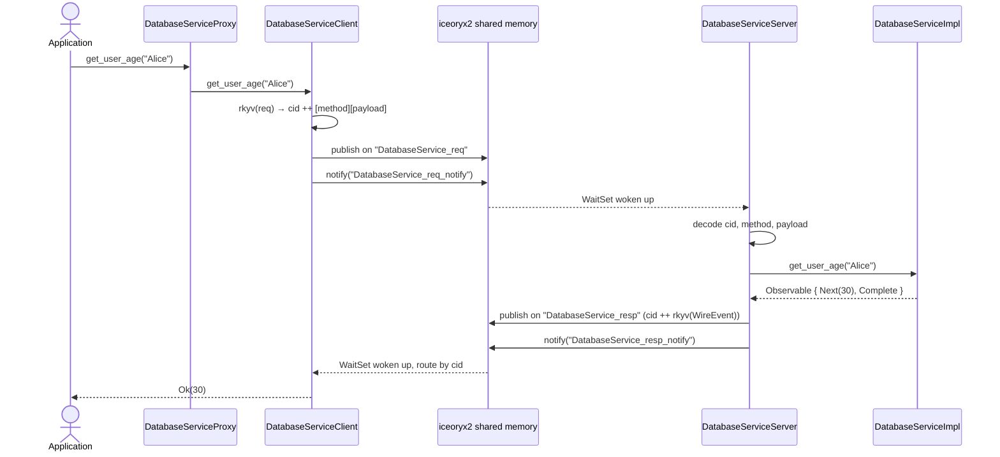
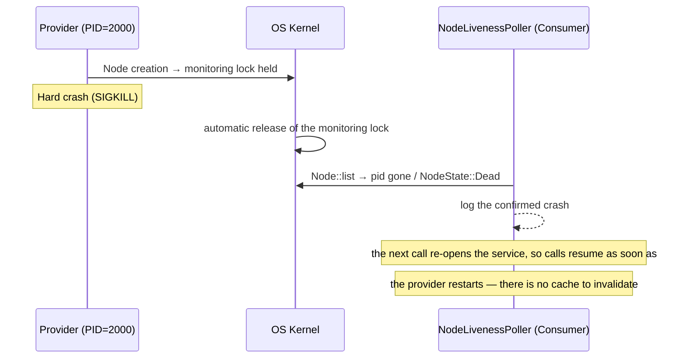
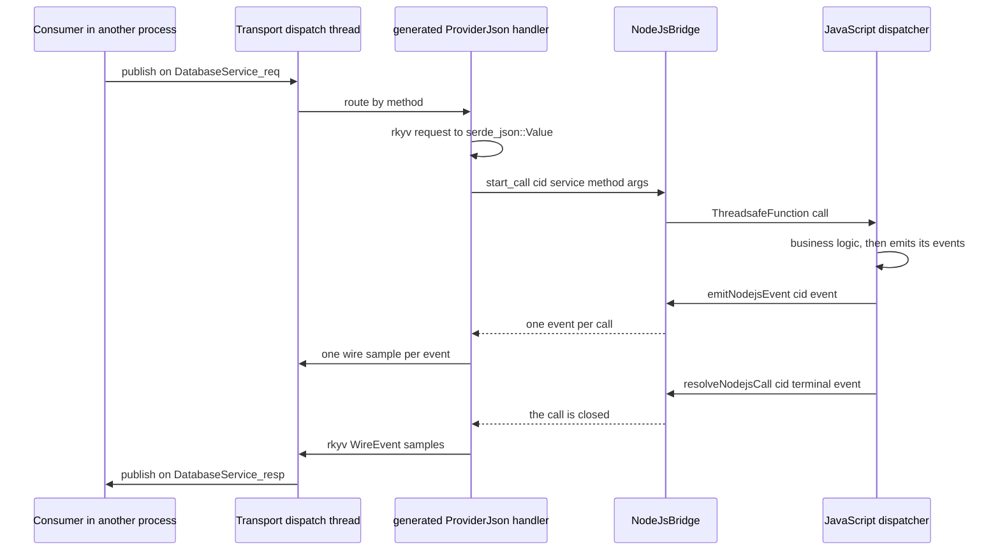

# ice-rpc — Inter-Process Communication via iceoryx2

[](https://github.com/max3163/ice-rpc/actions/workflows/ci.yml)
[](https://github.com/max3163/ice-rpc/actions/workflows/security.yml)
[](https://codecov.io/gh/max3163/ice-rpc)
[](https://api.reuse.software/info/github.com/max3163/ice-rpc)
[](https://crates.io/crates/ice-rpc)
[](https://docs.rs/ice-rpc)

`ice-rpc` is a Rust RPC (Remote Procedure Call) library built on [iceoryx2](https://github.com/eclipse-iceoryx/iceoryx2) for inter-process communication (IPC) through shared memory.

The **header is zero-copy** — written and read in place — while the **payload is rkyv-serialized**, copied once into the shared-memory sample, and read in place on the receiving side. [§5](#5-payload-encoding) gives the per-step detail.

From a simple Rust trait annotated with `#[service]`, the procedural macro automatically generates the entire IPC code: client, server, proxy and lifecycle. The transport is iceoryx2's **publish/subscribe**: one request channel and one response channel per logical service, correlated by a 16-byte request id, which keeps the throughput close to the raw bus (see [§4](#4-transport--publishsubscribe-with-correlation-ids)).

**Requirements.** Rust **1.89** or newer — declared as `rust-version` in the workspace manifest (the floor is imposed by `iceoryx2` 0.10; it also covers the **1.88** the N-API bindings need). The workspace also enforces a shared lint baseline, adopted by every member through `[workspace.lints]`: `unsafe_op_in_unsafe_fn`, `missing_docs`, `undocumented_unsafe_blocks` (every `unsafe` block carries a `// SAFETY:` justification) and `unwrap_used` (`unwrap` is banned in library code, since it would turn a recoverable error into a process abort under the release profile's `panic = "abort"`). Test, example and benchmark targets opt out of `unwrap_used` explicitly, at the top of the file.

---

## Sequence diagrams

### RPC call Consumer → Provider



### Crash detection and restart



---

## 1. Overview of the communication workflow

```
┌──────────────────────────────────────────────────────────────────────────────┐
│                           ICE-RPC GLOBAL WORKFLOW                             │
│                                                                              │
│  ┌──────────────┐                                    ┌──────────────┐        │
│  │  PROCESS 1   │                                    │  PROCESS 2   │        │
│  │  (Consumer)  │                                    │  (Provider)  │        │
│  │              │                                    │              │        │
│  │  App         │                                    │  App         │        │
│  │   │          │                                    │   │          │        │
│  │   ▼          │                                    │   ▼          │        │
│  │  Proxy       │                                    │  Proxy       │        │
│  │  (Consumer)  │                                    │  (Provider)  │        │
│  │   │          │                                    │   │          │        │
│  │   ▼          │   {service}_req   (pub/sub)        │   ▼          │        │
│  │  Transport   │────────────────────────────────►   │  Transport   │        │
│  │  publisher   │   {service}_resp  (pub/sub)        │  subscriber  │        │
│  │  + responder │◄────────────────────────────────   │  + dispatcher│        │
│  │              │                                    │              │        │
│  │  one thread  │   {service}_{req,resp}_notify      │  one thread  │        │
│  │  per service │◄─────────────(event)─────────────► │  per service │        │
│  └──────────────┘                                    └──────────────┘        │
│                                                                              │
│   iceoryx2 services per logical service:                                     │
│     • {service}_req         consumer → provider requests                     │
│     • {service}_resp        provider → consumer responses                    │
│     • {service}_req_notify  wake-up signal for the provider                  │
│     • {service}_resp_notify wake-up signal for the consumer                  │
└──────────────────────────────────────────────────────────────────────────────┘
```

---

## 2. Code architecture

```
ice-rpc-rx/                     ← Reactive layer (foundation crate, no iceoryx2)
├── src/
│   ├── lib.rs                  ← Public exports, MULTICAST_CHANNEL_CAPACITY
│   ├── event.rs                ← Event, ObservableError, Sender (producer side)
│   ├── stream.rs               ← Observable (recv/next/collect), channel()
│   ├── error.rs                ← RpcError (technical error of the stack)
│   ├── creation.rs             ← from(), of(), throw_error()
│   ├── subject.rs              ← Subject (multicast, with replay)
│   ├── subscribe.rs            ← Subscription, push-based consumption
│   ├── transform/              ← Operators: map, filter, scan, delay, timeout, …
│   ├── rt/                     ← Execution facade (spawn/sleep/block_on, tokio switch)
│   └── tests.rs                ← Tests of the stream vocabulary and the terminals
│
ice-rpc/                        ← Main crate (library + runtime)
├── src/
│   ├── lib.rs                  ← Public exports, cancellation tokens, shutdown()
│   ├── transport/              ← Publish/subscribe transport: one request and one
│   │   │                          response channel per channel (group of services),
│   │   │                          correlated by the 16-byte id of the zero-copy header
│   │   ├── mod.rs              ← aliases, tuning constants, shared node, rkyv decode
│   │   ├── notify.rs           ← coalesced wake-up notifications
│   │   ├── waitset.rs          ← blocking wait (Notifier / Listener / WaitSet)
│   │   ├── bridge.rs           ← Observable → wire samples, ServiceDispatcher
│   │   ├── client.rs           ← request publication + response routing
│   │   └── server.rs           ← channel creation, dispatch, response publication
│   ├── types/                  ← Protocol types + the stream vocabulary re-exported
│   │   │                          from ice-rpc-rx (Event, Observable, Sender, …):
│   │   ├── node.rs             ← NodeId (PID) + raw_pid_to_u32
│   │   ├── wire.rs             ← WireEvent (serializable event), normalize_wire_event
│   │   ├── header.rs           ← RpcHeader (zero-copy) + EventKind
│   │   └── consts.rs           ← name-length limits shared with the macros
│   ├── node_liveness.rs        ← Native iceoryx2 node monitoring (Node::list,
│   │                              NodeState::Alive/Dead), single shared poller
│   ├── http_gateway.rs         ← HTTP REST gateway (trillium) : exposes the services
│   │                              via GET/POST on /{service}/{method}
│   ├── locator.rs              ← ServiceLocator (register/get + Kahn topological
│   │                              initialization order)
│   ├── shutdown.rs             ← Registry of the blocking IPC threads (clean stop)
│   ├── sync.rs                 ← Poisoning-tolerant lock helper
│   ├── config.rs               ← iceoryx2 root-path / TOML configuration
│   ├── gen.rs                  ← Internal facade for the generated code (doc-hidden)
│   └── json.rs                 ← the JSON contract: caller side + host side
│
ice-rpc-macros/                 ← Procedural macros crate
├── src/
│   ├── lib.rs                  ← Entry point : parses the trait, orchestrates the modules
│   └── codegen/
│       ├── helpers.rs          ← g_variant_name(), extract_rpc_result_types()
│       ├── client.rs           ← {Trait}Client : rkyv request → native_call
│       ├── server.rs           ← {Trait}Server : per-method ServiceDispatcher
│       ├── proxy.rs            ← {Trait}Proxy : Provider/Consumer/ProviderJson modes
│       ├── lifecycle.rs        ← ServiceLifecycle/ServiceInit/ServiceNamed
│       │                          (+ spawn_native_service for the provider)
│       └── json.rs             ← The JSON view: rkyv↔Value converters and JsonInvoker
│
common/                         ← Example service definitions (not shipped)
│   └── src/
│       ├── mod.rs              ← pub mod config/context/database/http + re-exports
│       ├── config.rs           ← ConfigService
│       ├── context.rs          ← ContextService
│       ├── database.rs         ← DatabaseService
│       └── http.rs             ← HttpService
gateway_nodejs/                 ← NAPI-RS gateway : one bridge + the generated JSON views
│   ├── build.rs                ← N-API build script
│   └── src/
│       ├── lib.rs              ← N-API surface : registerService/init/callService/…
│       ├── state.rs            ← Lifecycle (Idle/Configured/Running), replayable
│       ├── error.rs            ← Stable error codes, rendered as message prefixes
│       ├── nodejs_bridge.rs    ← The bridge : ThreadsafeFunction + pending calls table
│       ├── services.rs         ← The gateway's own list of maintained services
│       └── consumer.rs         ← Consumer helpers (JsonInvoker dispatch)
```

### 2.1. Code generation modules (codegen/)

| Module | Responsibility |
|---|---|
| `helpers.rs` | `g_variant_name` (snake→Pascal), `extract_rpc_result_types` |
| `client.rs` | Generates `{Trait}Client` : serializes the rkyv request and calls `native_call(service, method, payload)`, returning the streamed responses as an `Observable` |
| `server.rs` | Generates `{Trait}Server` : one `ServiceDispatcher::method(...)` registration per RPC method, each decoding the rkyv request and streaming `observable_to_responses(observable)` |
| `proxy.rs` | Generates `{Trait}Proxy` (RwLock<Mode>), `provide`/`provide_with_init`/`consume`/`provide_json` constructors, Provider/Consumer/ProviderJson delegation |
| `lifecycle.rs` | Generates `impl ServiceLifecycle` (starts the provider's transport service), `impl ServiceNamed`, `impl ServiceInit` and the ProviderJson bridge |
| `json.rs` | Generates the JSON view of a service, and names no transport : the per-method rkyv ↔ `serde_json::Value` converters the host side needs, plus `impl JsonInvoker` — one match table for every method, with the reading mode (`First` / `All`) as an argument. Both the HTTP gateway and the Node.js bridge dispatch to that same view. |

---

## 3. The `#[service("Name")]` macro

### 3.1. How it works

From an annotated trait, the macro automatically generates all the IPC code:

```rust
#[service("DatabaseService")]
pub trait DatabaseService: Send + Sync + 'static {
    async fn get_user_age(&self, name: String) -> Observable<i32, DatabaseError>;
}
```

#### Generated types

```
┌──────────────────────────────────────────────────────────────────┐
│              CODE GENERATION BY THE #[service] MACRO             │
│                                                                  │
│  Annotated trait                                                  │
│  ═══════════                                                      │
│  #[service("DatabaseService")]                                    │
│  pub trait DatabaseService { ... }                                │
│         │                                                        │
│         ▼                                                        │
│  ┌─────────────────────────────────────────────────────────────┐ │
│  │ Automatically generated types                               │ │
│  │                                                             │ │
│  │  DatabaseServiceRequest   ← rkyv enum (1 variant/method)    │ │
│  │  DatabaseServiceClient    ← IPC client (native_call)        │ │
│  │  DatabaseServiceServer    ← IPC server (ServiceDispatcher)  │ │
│  │  DatabaseServiceProxy     ← Smart Proxy (3 modes)           │ │
│  │  DatabaseServiceMode      ← Provider | Consumer |           │ │
│  │                                ProviderJson               │ │
│  └─────────────────────────────────────────────────────────────┘ │
│                                                                  │
│  ┌─────────────────────────────────────────────────────────────┐ │
│  │ Generated implementations                                   │ │
│  │                                                             │ │
│  │  ServiceLifecycle  → init() starts the provider service     │ │
│  │  ServiceNamed      → const SERVICE_NAME + service_name()    │ │
│  │  ServiceInit       → on_init() + dependencies()             │ │
│  │  {Trait} for Proxy → 3-mode delegation                      │ │
│  │  deserialize_request_to_value  (static)                     │ │
│  │  serialize_response_from_value (static)                     │ │
│  └─────────────────────────────────────────────────────────────┘ │
└──────────────────────────────────────────────────────────────────┘
```

| Type | Role |
|---|---|
| `DatabaseServiceRequest` | Serializable enum (rkyv) with one variant per method |
| `DatabaseServiceClient` | IPC client : serializes the request and calls the transport |
| `DatabaseServiceServer` | IPC server : routes a decoded request to its handler |
| `DatabaseServiceProxy` | Single entry point (Smart Proxy Node, 3 modes) |
| `DatabaseServiceMode` | `Provider` / `Consumer` / `ProviderJson` enum |

### 3.2. Optional parameters

```rust
#[service]                                             // logical name = trait name in lowercase
#[service("MyService")]                                // explicit logical name
#[service("MyService", version = 2, group = "db")]      // version + channel
```

| Parameter | Type | Default | Description |
|---|---|---|---|
| `version` | integer | `1` | Service interface version (part of the request frame). |
| `group` | string | service name | Channel shared with the other services of the group: one request channel, one response channel and one dispatch thread, routed by the service id. |

---

## 4. Transport — publish/subscribe with correlation ids

### 4.1. One channel per group of services

A **channel** is the unit of transport: one request channel, one response channel
and one dispatch thread. Every service of the same group
(`#[service("GetPerson", group = "db")]`) shares them; `group` defaults to the
service name, i.e. one channel per service — the historical layout.

Each channel maps to four iceoryx2 services:

| iceoryx2 service | Direction | Contents |
|---|---|---|
| `{channel}_req` | consumer → provider | `RpcHeader` in `user_header` + `rkyv(args)` |
| `{channel}_resp` | provider → consumer | `RpcHeader` in `user_header` + `rkyv(WireEvent<T, E>)` |
| `{channel}_req_notify` | event | wake-up signal for the provider |
| `{channel}_resp_notify` | event | wake-up signal for the consumer |

Grouping is what makes the transport cost independent of the number of services:

| | 50 services, `G = N` | 50 services, `G = 7` | `G = 1` |
|---|---|---|---|
| iceoryx2 services | 200 | 28 | 4 |
| Data segments | 100 | 14 | 2 |
| Dispatch threads (per process) | 50 | 7 | 1 |

A channel is also the unit of **dispatch**, and its thread is a **router**: it
receives the requests and polls each handler once, on that very thread. A handler
that answers without yielding — a cache lookup, in-process state — completes
there, exactly as it did when the transport called it inline. One that `await`s is
detached at its first `Pending` and becomes an independent task on the execution
facade, so a `query_db` awaiting 100 ms does not hold back the next request of the
same group — which matters most for a `group`, since the group is exactly what
owns that thread.

The thread is also the channel's **publisher** — and the only one to publish *in
place*: a handler that answers during its inline poll publishes from it, one that
yielded publishes from whatever thread of the executor it resumed on. Measured on
this transport, `loan`+`send` convoy when several threads call them at once
(2.75 µs of mean on one thread against 10.9 µs with eight); handing the responses
to a single publisher thread was tried, measured, and removed, because it costs
more than the convoy it avoids on a channel whose handlers answer in place. Both
properties below are measured, and both are the subject of a test:

- `ice-rpc-macros-tests/tests/dispatch_serialization.rs` — a fast call issued while
  a 400 ms call is in flight answers in ~300 µs, against 292 ms when the thread ran
  the handler;
- `ice-rpc-macros-tests/tests/dispatch_load.rs` — `N` concurrent calls that await
  30 ms each keep a latency of `1.01 × 30 ms` from `N = 1` to `N = 8`, where a
  channel-wide dispatcher gives `N × 30 ms` (32 req/s whatever the load, against
  ~250 req/s at 8 clients).

What the single thread still bounds is the routing and publication throughput: a
service needing more than ~50k req/s belongs alone in its group (measured ceiling:
~350k req/s per channel *and* thread).

**Why not iceoryx2's `request_response`?** It allocates one channel (and one data
segment) per request in flight, which caps the throughput far below what the
shared-memory bus can do. With pub/sub the ports are created once and every call
is a single loaned sample; correlating the responses by request id gives the same
call/response semantics for a fraction of the cost.

### 4.2. Zero-copy header

Every sample carries an `RpcHeader` ([`ice_rpc::types::header`](ice-rpc/src/types/header.rs))
in iceoryx2's `user_header`: a plain `#[repr(C)] ZeroCopySend` struct copied in
place by the bus, so it costs no serialization and no allocation.

| Field | Type | Contents |
|---|---|---|
| `correlation_id` | `[u8; 16]` | process id ++ counter; identifies one in-flight call |
| `timestamp_ns` | `u64` | emission time (ns since the Unix epoch), stamped by the emitter |
| `seq` | `u64` | per-publisher, per-channel monotonic sample counter, read by the observer to count the samples **it** missed |
| `trace_id` | `[u8; 16]` | W3C trace id, shared by every hop of a call tree; zero when no trace is propagated |
| `parent_span_id` | `u64` | span of the caller, onto which the receiver parents its own span |
| `service_id` | `u32` | FNV-1a of the service name; selects the dispatcher inside a shared channel |
| `method_name` | `StaticString<32>` | target method (carried by requests) |
| `event_kind` | `u8` | `Request` / `Next` / `Complete` / `Error` / `RpcError` |
| `protocol_version` | `u16` | framing version, validated by the provider |
| `service_version` | `u16` | service API version, validated by the provider and echoed on the responses |
| `flags` | `u8` | W3C trace flags (bit 0: sampled) |

`Error` labels a **business** error, whose payload is the service's
`WireEvent<T, E>`; `RpcError` labels a **transport-level** rejection — unknown
method, unknown service, protocol or interface-version mismatch — whose payload
is a bare `RpcError`. The distinction is deliberate: a rejection must be
decodable **without** the service types, since the provider cannot name them for
a method it does not have. That is what lets it answer such a call immediately
instead of leaving the client to time out.

The header carries **no emitter identity**: iceoryx2's native sample header
already exposes the source `node_id` (hence the PID) and the unique
`publisher_id`, which the transport re-exports as
[`Emitter`](ice-rpc/src/transport/monitor.rs:62). Duplicating it in the wire
header would only risk a divergence, and the native `publisher_id` is a more
robust key than a PID for scoping `seq` — it survives a PID reuse.

`event_kind` is stored as a `u8` because `ZeroCopySend` is only derivable on
structs, not on enums: the enum lives in [`EventKind`](ice-rpc/src/types/header.rs:20)
and is converted with `as_u8()` / `from_u8()`. A response carries the **real**
kind of its sample (derived from the `WireEvent` before serialization), so an
observer counts completion and errors without decoding the payload.

The field carries one **request-direction** kind as well: `EventKind::Cancel`,
which asks the provider to abandon the call named by the correlation id. The
consumer publishes it on `{channel}_req` when it drops a call that is still in
flight — see the consumption section below — so a cancellation needs neither an
extra service nor an extra port. It is **not** terminal: it ends the tail of a
call, it does not close the call as answered. `from_u8` being fail-closed, a
provider from an older build reads it as `EventKind::Error`, logs an unexpected
sample and ignores it — see [`docs/wire-compat.md`](docs/wire-compat.md).

`service_id` is a `const fn` of the name
([`service_id_of`](ice-rpc/src/types/header.rs:129)), so the provider and the
consumer derive the **same** value with no coordination and no discovery; a
collision between two services of a channel is detected when the channel is
registered.

The monitoring fields make the header **self-describing for an out-of-band
observer** (`ice-rpc-monitor`): it subscribes to the same services, reads the
header without touching the rkyv payload, and derives an exact latency
(`response.timestamp_ns - request.timestamp_ns`) plus its **own** sample loss
(`seq` holes, scoped by the native `publisher_id`). The layout is pinned to
exactly 128 bytes by a unit test: iceoryx2 validates the `user_header` size when
a service is opened,
so every process on a machine must be rebuilt together after a layout change.

### 4.3. Provider

One thread per channel:

1. it spins briefly, then blocks on a `WaitSet` attached to its `_req_notify`
   `Listener` (only a `Listener` is attachable, not a `Subscriber`);
2. it drains `{channel}_req`, reads the `RpcHeader` from `sample.user_header()`
   and takes the rkyv payload from `&sample[..]`;
3. it picks the dispatcher registered under `header.service_id` — an unknown id
   is logged and dropped, never mis-routed;
4. it builds the handler's task and polls it **once, here**: a handler that
   answers without yielding completes on this thread, one that `await`s is
   detached at its first `Pending` and runs as a task on the execution facade;
5. each response is published on `{channel}_resp`, with the request's
   correlation id copied into the response header and a channel-wide `seq`
   stamped on it, and the consumer is notified. A handler that answered in place
   publishes from this thread; one that yielded publishes from the thread of the
   executor it resumed on — `loan`+`send` convoy when several threads publish at
   once, which is why the ones that can stay on this thread do.

A provider does not start its channel itself: it **registers** its dispatcher
during `on_init`, and the channel threads start at the end of
`ServiceLocator::initialize_all`. That ordering is what keeps the guarantee the
consumer relies on — *a subscriber exists* means *the provider is ready*.

### 4.4. Consumer

One cached publisher and one dispatch thread per **channel**:

- `native_call(channel, service_id, method, payload)` builds an
  `RpcHeader::request`, keeps its `correlation_id`, registers a typed handler
  under it, publishes the request and notifies the provider;
- the dispatch thread drains `{channel}_resp` and routes each sample to the
  handler registered for its id — several services of the channel share it;
- a terminal `WireEvent` (`Complete` / `Error`) ends the stream: there is no
  per-call connection to close, so the terminal event is part of the stream.

### 4.5. Tuning

| Setting | Value | Why |
|---|---|---|
| `subscriber_max_buffer_size` | 1 024 | one term of the memory budget of a channel (see `max_loaned_samples`) |
| `enable_safe_overflow` | **false** | enabled, a full subscriber buffer silently overwrites its **oldest pending sample** — losing a request that is never answered (a 5 s timeout in the benchmark). Disabled, `send()` reports `0` delivered and [`publish_until_delivered`](ice-rpc/src/transport/client.rs:276) retries: the overflow becomes backpressure instead of data loss |
| `initial_max_slice_len` | 256 | `slice` memory per sample; larger payloads grow the segment |
| `max_loaned_samples` | 1 024 | sizes the data segment of a publisher (`max_loaned_samples × ~400 B`): ~400 KB, against ~6.5 MB at the iceoryx2 default of 8 raised to 16 384 — untenable with dozens of services |
| `max_publishers` / `max_subscribers` | 16 | a channel is shared: every consuming process publishes on it, every provider subscribes to it |
| `max_nodes` | 32 | processes that can open the same channel at once |
| WaitSet deadline | 1 ms | bounds the cost of a missed notification |
| idle spin | 2 000 yields | the hot path stays at polling speed, the idle path blocks on the `WaitSet` |

### 4.6. NodeId

`NodeId` is the process PID (`std::process::id()`). It is no longer a routing key
(the service name is); it is used by the liveness monitor to attribute a live
iceoryx2 node to its process.

---

## 5. Payload encoding

The routing metadata (correlation id, service id, method, event kind, versions)
travels in the `user_header`, so the payload holds the rkyv bytes alone:
`rkyv(args)` for a request, `rkyv(WireEvent<T, E>)` for a response.

**Zero-copy applies to the header and to reading a payload in place — not to the
payload itself:**

| Step | Byte copy | What happens |
|---|---|---|
| Encode (both directions) | none — but **serialization** | `rkyv` walks the object graph into a reusable scratch buffer (`to_bytes_in`): one allocation per **thread**, then reused |
| Publish | **one copy** | [`try_publish`](ice-rpc/src/transport/client.rs:454) loans a sample and writes `header ++ payload` into it (`write_from_fn`); this is where the bytes enter shared memory |
| Deliver on the bus | none | iceoryx2 makes the sample visible to its subscribers |
| Decode, aligned | **none of the raw bytes** | [`decode_aligned`](ice-rpc/src/transport/mod.rs:113) sees a 16-byte-aligned payload and calls `rkyv::from_bytes` directly on the sample |
| Materialise | none — but **deserialization** | `from_bytes` performs access **and** deserialization into an owned `T`: the traversal and the allocations remain |
| Decode, unaligned | one copy | the fallback: the payload is copied into a 16-byte-aligned `AlignedVec` first |

The sample is requested with `payload_alignment(Alignment::new(16))`, the
alignment `rkyv::to_bytes` produces, so a delivered payload is aligned by
construction and the in-place path is the one actually taken. The copy is kept
for the callers that cannot promise that alignment — a payload built by hand, a
buffer read outside the transport — because `rkyv::from_bytes` fails at runtime
on a misaligned slice for any type whose alignment is greater than 1, which is
what silently produced empty response streams before.

In one line: **zero-copy header, one copy into shared memory, serialized rkyv
payload, alignment-safe decoding.** The same care applies to the observer: the
`stats` mode reads the header and the payload length and never touches the
payload, while the `detail` mode pays one decode per sample by design
([§13](#13-out-of-band-monitoring)).

The name-length limits are shared with `ice-rpc-macros`, which rejects longer names
at compile time: `SERVICE_NAME_LEN` = 64, the limit of the `group` parameter of
`#[service]`, and `METHOD_NAME_LEN` = 32, the capacity of the header's
`StaticString`. The method name is the largest field of a header capped by
iceoryx2's `user_header`, and the 32 bytes it gives back fund the trace context —
32 characters is ample for a method name.

### 5.1. Stale iceoryx2 services

Changing the wire format (the header, the payload alignment, `enable_safe_overflow`,
and the buffer sizes or port limits resolved from `tuning.rs`) changes the
service's static configuration, and iceoryx2 refuses to open a service whose
recorded configuration differs from the requested one. A process killed while it
holds a service can also leave a file without its shared memory, which iceoryx2
tries to remove in an **unbounded recursion** (of the builder's `Debug` output)
and ends in `thread has overflowed its stack`.

Both failures are reported as [`RpcError::ProtocolMismatch`](ice-rpc/src/types/error.rs:8),
which is deliberately **not retryable** and whose message names the iceoryx2
variant and the remedy, so a failing startup log is enough to act.

The procedure is documented once, in
[`docs/wire-compat.md`](docs/wire-compat.md): stop every process of the previous
build, remove the iceoryx2 root path —
[`scripts/purge-iceoryx2-root.sh`](scripts/purge-iceoryx2-root.sh) resolves it per
OS, shows what it holds and only removes it with `--yes` — then rebuild everything
and restart the provider first.

---

## 6. Service liveness (native iceoryx2 node monitoring)

There is no registry: a consumer opens the service by name on the first call, so
addressing is entirely static. What remains is **liveness**:

- each process owns one iceoryx2 `Node`; the OS releases its monitoring lock when
  the process dies;
- a single shared poller (started by the first `register_node_liveness_watcher`)
  runs one `Node::list` per tick for every watched PID and reports a confirmed
  death (a `Dead` node, or a node that disappeared after a clean shutdown);
- because a call re-opens its service on demand, a restarted provider is picked
  up by the next call — there is no discovery cache to invalidate.

---

## 7. Smart Proxy Node (3 modes)

### 7.1. Architecture

```
┌──────────────────────────────────────────────────────────────────────┐
│                     SMART PROXY NODE (3 MODES)                       │
│                                                                      │
│  DatabaseServiceProxy                                                │
│  ┌────────────────────────────────────────────────────────────────┐  │
│  │  mode: RwLock<DatabaseServiceMode>                             │  │
│  │  deps: Vec<&'static str>                                       │  │
│  └────────────────────────────────────────────────────────────────┘  │
│                                                                      │
│  ┌──────────────────────────┐ ┌──────────────────────────┐          │
│  │  MODE 1: PROVIDER        │ │  MODE 2: CONSUMER        │          │
│  │                          │ │                          │          │
│  │  local_impl: Arc<dyn Tr> │ │  ipc_client: Arc<Client> │          │
│  │  init_hook: Arc<dyn Init>│ │                          │          │
│  │  server_started: bool    │ │                          │          │
│  │                          │ │                          │          │
│  │  Direct local call       │ │  IPC call via the        │          │
│  │  (no serialization)      │ │  transport (rkyv)        │          │
│  └──────────────────────────┘ └──────────────────────────┘          │
│                                                                      │
│  ┌──────────────────────────────────────────────────────────────┐    │
│  │  MODE 3: PROVIDER NODEJS                                     │    │
│  │                                                              │    │
│  │  No local state — delegates to the NodeJsBridge (singleton)  │    │
│  │                                                              │    │
│  │  IPC (rkyv) → deserialize → Value → NodeJsBridge → JS        │    │
│  │  JS → NodeJsBridge → serialize → rkyv → IPC                  │    │
│  │                                                              │    │
│  │  The JS callback is UNIQUE for all services.                 │    │
│  │  Not zero-copy: rkyv → serde_json::Value → JS                │    │
│  └──────────────────────────────────────────────────────────────┘    │
│                                                                      │
│  Constructors :                                                      │
│    provide(impl)          → simple Provider (default ServiceInit)    │
│    provide_with_init(impl)→ Provider with custom init hook           │
│    consume()              → pure Consumer (IPC only)                 │
│    provide_json()       → NodeJS Provider (generic JS bridge)      │
└──────────────────────────────────────────────────────────────────────┘
```

### 7.2. Method delegation

```rust
impl DatabaseService for DatabaseServiceProxy {
    async fn get_user_age(&self, name: String) -> Observable<i32, DatabaseError> {
        let mode = self.mode.read().await;
        match &*mode {
            Mode::Provider { local_impl, .. } => {
                // Direct local call, without serialization
                local_impl.get_user_age(name).await
            },
            Mode::Consumer { ipc_client } => {
                // Remote call through the publish/subscribe transport
                ipc_client.get_user_age(name).await
            }
            Mode::ProviderJson => {
                // Calls arrive over IPC and are bridged to the JS host
                ice_rpc::Observable::from_technical_error(ice_rpc::RpcError::Internal(
                    "ProviderJson: direct calls are not supported — use IPC".into()
                ))
            }
        }
    }
}
```

### 7.3. ProviderJson lifecycle

In ProviderJson mode, `ServiceLifecycle::init()` starts a transport service whose
dispatcher bridges each RPC method to the JS host:

1. `deserialize_request_to_value(method, payload)` decodes the rkyv request into a
   `serde_json::Value`;
2. `ice_rpc::json::dispatch_json(…)` hands it to the registered
   `JsonDispatcher` and returns the stream of its events — each event becomes its
   own wire sample, so a method may answer several values;
3. `serialize_response_from_value(method, value)` encodes each event back into a
   rkyv `WireEvent` sample.

`ice_rpc::json` holds an `Arc<dyn JsonDispatcher>` registered at startup
by the JSON host (`gateway_nodejs` calls `set_json_dispatcher`), which avoids a
circular `common` → `gateway_nodejs` dependency and lets any other host — a Rust
test today, a future WASM bridge — implement that same trait.

---

## 8. Lifecycle (ServiceLifecycle)

### 8.1. Topological sort

[`ServiceLocator::initialize_all()`](ice-rpc/src/locator.rs:140) sorts the services
by the dependencies declared via
[`ServiceInit::dependencies()`](ice-rpc/src/service_traits.rs:107) :

```
┌──────────────────────────────────────────────────────────────────────┐
│                TOPOLOGICAL SORT — KAHN'S ALGORITHM                   │
│                                                                      │
│  Registered services :                                               │
│    ConfigService   → dependencies() = []                             │
│    DatabaseService → dependencies() = ["ConfigService"]              │
│    HttpService     → dependencies() = []                             │
│                                                                      │
│  Dependency graph :                                                  │
│                                                                      │
│    ┌──────────────┐     ┌──────────────┐                             │
│    │ ConfigService│     │ HttpService  │   ← roots (degree 0)        │
│    └──────┬───────┘     └──────────────┘                             │
│           │                                                          │
│    ┌──────▼───────┐                                                  │
│    │DatabaseSvc   │  ← depends on ConfigService                      │
│    └──────────────┘                                                  │
│                                                                      │
│  Initialization order :                                              │
│    1. ConfigService (degree 0)                                       │
│    2. HttpService   (degree 0)                                       │
│    3. DatabaseService (degree 1, after ConfigService)                │
│                                                                      │
│  A dependency that is not registered locally is treated as           │
│  external (provided by another process) and never blocks.            │
│  A cycle falls back to the registration order.                       │
└──────────────────────────────────────────────────────────────────────┘
```

### 8.2. Provider startup

```
┌──────────────────────────────────────────────────────────────────────┐
│                 PROVIDER INITIALIZATION                              │
│                                                                      │
│  ServiceLifecycle::init()  [called from initialize_all()]            │
│  │                                                                   │
│  ├─ 1. init_hook.on_init()                                           │
│  │     → Application initialization (DB connection, TOML file...)    │
│  │     → Returns false → initialize_all() fails                      │
│  │                                                                   │
│  ├─ 2. dispatcher = Server::new(local_impl).native_dispatcher()      │
│  │                                                                   │
│  └─ 3. spawn_native_service(name, dispatcher, cancel_token)          │
│        └─ one background thread:                                     │
│             • opens {service}_req / {service}_resp                   │
│             • blocks on the WaitSet attached to {service}_req_notify │
│             • dispatches each request and publishes the responses    │
└──────────────────────────────────────────────────────────────────────┘
```

### 8.3. Consumer startup

```
┌──────────────────────────────────────────────────────────────────────┐
│                 CONSUMER INITIALIZATION                              │
│                                                                      │
│  ServiceLifecycle::init()  → true (nothing to do)                    │
│                                                                      │
│  The ports are created lazily on the FIRST call:                     │
│  │                                                                   │
│  └─ native_call(service, method, payload)                            │
│       1. consumer_ports(service)  [cached per process]               │
│          • {service}_req publisher  + notifier                       │
│          • {service}_resp subscriber + listener                      │
│          • one response dispatch thread                              │
│       2. cid = next_correlation_id()                                 │
│       3. register_response_handler(cid, typed handler)               │
│       4. publish the request (header + payload) + notify             │
└──────────────────────────────────────────────────────────────────────┘
```

---

## 9. Complete flow of an RPC call

```
┌──────────────────────────────────────────────────────────────────────────┐
│             COMPLETE FLOW OF AN RPC CALL (get_user_age)                   │
│                                                                          │
│  CONSUMER (PID=1000)                    PROVIDER (PID=2000)              │
│  ═══════════════════                    ═══════════════════              │
│                                                                          │
│  proxy.get_user_age("Alice")                                             │
│    │                                                                     │
│    ▼                                                                     │
│  Client::get_user_age()                                                  │
│    │                                                                     │
│    ├─1. rkyv::to_bytes(Request::GetUserAge { name: "Alice" })            │
│    │                                                                     │
│    ├─2. consumer_ports("DatabaseService")  [created once, then cached]   │
│    │                                                                     │
│    ├─3. cid = next_correlation_id()        ← 16 bytes (pid ++ counter)   │
│    │                                                                     │
│    ├─4. register_response_handler(cid, move |bytes| {                    │
│    │       decode_aligned::<WireEvent<T, E>>(bytes)                      │
│    │       → normalize_wire_event → tx.try_send_event(...)               │
│    │     })                                                              │
│    │                                                                     │
│    ├─5. header = RpcHeader::request(method, 1)                        │
│    │     loan_slice_uninit(len); *user_header_mut() = header; send()    │
│    │     notifier.notify() ──────────────────────────────────►           │
│    │                                                                     │
│    ▼                                                       WaitSet       │
│  rx.recv() waits...                                       woken up       │
│                                                           │               │
│                                              drain {service}_req          │
│                                              read header; decode payload  │
│                                              dispatcher.dispatch(method)  │
│                                                           │               │
│                                              ⟳ observable_to_responses    │
│                                                rkyv::to_bytes(WireEvent)   │
│                                                publish header + bytes     │
│                                                notifier.notify() ────►    │
│                                                                           │
│  WaitSet woken up                                                         │
│  drain {service}_resp                                                     │
│    → cid → response_handlers[cid]                                         │
│    → decode_aligned::<WireEvent<T, E>>                                    │
│    → tx.try_send_event(Event::Next(30))                                   │
│                                                                           │
│  ▼                                                                        │
│  rx.recv() → Some(Event::Next(30))    ← received by the user              │
└───────────────────────────────────────────────────────────────────────────┘
```

---

## 10. Crash and restart

Because the transport opens its service by name on demand, there is no connection
state to repair and no cache to invalidate:

- a call that fails while the provider is down surfaces as an in-stream
  `Event::Error(ObservableError::Technical(RpcError::TransportError(_)))`;
- once the provider restarts (same service name), the next call simply opens the
  service again and succeeds;
- the liveness poller (§11) reports the crash for observability, but the recovery
  does not depend on it.

---

## 11. Crash monitoring — native iceoryx2 node monitoring

There is **no hand-written kernel lock**. iceoryx2's node monitoring
(`<ipc_threadsafe::Service as Service>::Monitoring`) is a file lock held by the
node and released by the OS when the process dies. `Node::list` exposes it as
`NodeState::Alive` / `NodeState::Dead`, and `UniqueNodeId::pid()` maps a node back
to its process — which is ice-rpc's `NodeId`.

| Aspect | Behaviour |
|---|---|
| **Provider** | The iceoryx2 `Node` created at init already holds the monitoring lock; no extra lock is acquired. |
| **Clean shutdown** | `release_node()` drops the `Node` (releasing the lock), so peers do not mistake it for a crash. |
| **Watcher** | A **single** background poller serves the whole process: one `Node::list` per tick for *every* watched PID. |
| **Interval** | `LIVENESS_POLL_MS = 500` ms, overridable with `ICE_RPC_LIVENESS_POLL_MS`. |
| **Why one shared poller** | A single `Node::list` costs ~475–680 µs (versus ~3 µs for a bare `flock` check). Calling it once per watched node — or at 100 ms — perturbs the shared-memory notifier path, so the cost is amortised across all watched nodes. |
| **On detection** | the confirmed death is logged (`[node_liveness] CRASH DETECTED`) and the entry is removed from the watched set. |
| **Crash vs clean shutdown** | A clean shutdown removes the node entirely, so the poller confirms with a targeted query before declaring a crash. |
| **Failure policy** | Conservative: a failed or inconclusive scan never declares a node dead. |

See [`ice-rpc/src/node_liveness.rs`](ice-rpc/src/node_liveness.rs:1) for the
implementation, [`ice-rpc/examples/node_liveness_probe.rs`](ice-rpc/examples/node_liveness_probe.rs:1)
for the diagnostic harness, and [`scripts/validate-node-liveness.sh`](scripts/validate-node-liveness.sh:1)
for the automated validation (clean shutdown vs `SIGKILL`).

---

## 12. Node.js gateway (NAPI-RS bridge)

The gateway lets a Node.js process **provide** and **consume** ice-rpc services:
the business logic is JavaScript, the IPC transport stays Rust. A service
declared with `#[service]` is not implemented in Rust at all — the generated
`ProviderJson` proxy bridges every incoming call to a single JavaScript
dispatcher, and the generated consumer entry points let JavaScript call any other
ice-rpc service of the machine.

The full contract — signatures, argument convention, event envelope, error codes,
lifecycle — is in [`docs/nodejs-gateway-api-v2.md`](docs/nodejs-gateway-api-v2.md),
and the user-facing guide is [`gateway_nodejs/Readme.md`](gateway_nodejs/Readme.md).

### 12.1. Flow of an incoming IPC call



### 12.2. Node.js API

```javascript
const gateway = require('gateway-nodejs');

// 1. Register only the services THIS process provides.
gateway.registerService('ContextService');

// 2. One dispatcher for every service. The signature is (err, call).
gateway.init((err, call) => {
    if (err) return;
    const { correlationId, service, method, args } = call;
    // args is a native JS value: no JSON.parse anywhere.
    gateway.resolveNodejsCall(correlationId, { type: 'next', data: store.get(args) });
});

// 3. Consume: the proxy is created on demand, nothing to declare.
const age = await gateway.callService('DatabaseService', 'get_user_age', 'Alice');
const values = await gateway.callServiceStream('NotificationService', 'watch', 3);

// 4. Clean shutdown releases the IPC resources.
await gateway.shutdown();
```

A method that streams several values answers one call with several events:
`emitNodejsEvent` for each intermediate one, `resolveNodejsCall` for the terminal
one, which also closes the call.

### 12.3. Key points

| Characteristic | Description |
|---|---|
| **Single bridge** | One `NodeJsBridge` per gateway, owning the calls JavaScript has not closed yet |
| **Zero-copy JS** | No `JSON.parse`/`JSON.stringify`: NAPI serde-json converts `Value` and native JS objects |
| **Single callback** | One JS dispatcher `(err, call)` for every service and method |
| **Generated surface** | `#[service]` emits the provider converters **and** the consumer entry points, so neither can drift from the declaration |
| **No direct iceoryx2** | `gateway_nodejs` never depends on `iceoryx2`: everything goes through `ice-rpc` |
| **Non-blocking calls** | `callService` and `callServiceStream` run on the libuv thread pool; the Node.js event loop is never blocked |
| **Stable codes** | Every failure starts with a documented code (`E_NO_PROVIDER`, `E_TIMEOUT`, `E_BUSINESS`, …) |
| **Bounded waits** | The transport thread waits for the first event at most 30 s, and the pending table is capped |
| **Two-process consumption** | A process cannot consume a service it provides: the locator returns the registered provider proxy |

## 13. HTTP REST gateway

The HTTP REST gateway is a built-in HTTP server based on [trillium](https://github.com/trillium-rs/trillium) that automatically exposes all ice-rpc services through a REST API. Each service method is dynamically accessible at the URL `/{service}/{method}` without any manual route declaration.

### 13.1. Architecture

```
┌──────────────────────────────────────────────────────────────────────────┐
│                    HTTP REST GATEWAY — ARCHITECTURE                       │
│                                                                          │
│  HTTP client (curl, browser, another app)                                 │
│       │                                                                   │
│       │  GET  /DatabaseService/get_user_age?name=Alice                    │
│       │  POST /ConfigService/set_config  {"key":"val"}                    │
│       ▼                                                                   │
│  ┌────────────────────────────────────────────────────────────────────┐  │
│  │                    Trillium Handler (port 8080)                    │  │
│  │                                                                    │  │
│  │  ┌──────────────────────────────────────────────────────────────┐  │  │
│  │  │ Origin Check                                                  │  │  │
│  │  │  → If Origin header present : checks *.my-domain.com          │  │  │
│  │  │  → Otherwise : lets it through (non-browser clients)          │  │  │
│  │  └──────────────────────────────────────────────────────────────┘  │  │
│  │                                                                    │  │
│  │  Route /{service}/{method}                                        │  │
│  │  ┌──────────────────────────────────────────────────────────────┐  │  │
│  │  │ GET  → handle_get()  : query params → params_to_json()       │  │  │
│  │  │ POST → handle_post() : JSON body → passed directly           │  │  │
│  │  └──────────────────────────────────────────────────────────────┘  │  │
│  │                          │                                         │  │
│  └──────────────────────────┼─────────────────────────────────────────┘  │
│                             │                                            │
│                             ▼                                            │
│  ┌────────────────────────────────────────────────────────────────────┐  │
│  │                HttpGatewayState (lazy cache)                       │  │
│  │                                                                    │  │
│  │  cache : HashMap<String, Arc<dyn JsonInvoker>>                     │  │
│  │  Fast-path : cache hit -> immediate return                         │  │
│  │  Slow-path : factory() -> consume() -> cache entry                 │  │
│  └──────────────────────────────────┬─────────────────────────────────┘  │
│                                     │                                    │
│                                     ▼                                    │
│  ┌────────────────────────────────────────────────────────────────────┐  │
│  │            JsonInvoker (generated once by the macro)               │  │
│  │                                                                    │  │
│  │  invoke_json(method, args, ReadMode::First) -> one match table     │  │
│  │      "get_user_age" => read_json(self.get_user_age(name).await, read)│  │
│  │      _              => None                   (-> HTTP 404)        │  │
│  └────────────────────────────────────────────────────────────────────┘  │
│                                     │                                    │
│                                     ▼                                    │
│                          ┌──────────────────┐                            │
│                          │   ice-rpc IPC    │                            │
│                          │  (iceoryx2 SHM)  │                            │
│                          └──────────────────┘                            │
└──────────────────────────────────────────────────────────────────────────┘
```

### 13.2. The `JsonInvoker` trait

The [`JsonInvoker`](ice-rpc/src/json.rs:87) trait is the contract between a JSON transport and the ice-rpc proxies. It allows the dynamic invocation of an RPC method from JSON parameters :

```rust
#[async_trait::async_trait]
pub trait JsonInvoker: Send + Sync {
    /// Logical name of the service.
    fn service_name(&self) -> &'static str;

    /// Invokes one method with JSON arguments.
    ///
    /// `None` when the service has no such method, so a caller can tell a typo
    /// from a call that failed.
    async fn invoke_json(
        &self,
        method: &str,
        args: serde_json::Value,
        read: ReadMode,
    ) -> Option<Result<JsonOutcome, JsonCallError>>;
}
```

`ReadMode` says how much of the call is read: `First` (the first value — the only
mode able to serve an endless stream) or `All` (every value, waiting for the
terminal event). It travels as an **argument**, not as a second entry point, which
is what keeps a single match table per service; and it is why `JsonOutcome::Nothing`
exists — a service may legitimately complete without emitting any value, which a
bare `null` could not be told apart from a real `null` payload.

This trait is **implemented automatically** by the `#[service]` macro on each Proxy
type (via the [`ice-rpc-macros/src/codegen/json.rs`](ice-rpc-macros/src/codegen/json.rs:1)
module), **once per service**, whatever the JSON transport. The user never needs to
implement it manually — and neither does a gateway: the HTTP gateway and the
Node.js bridge both dispatch to this single view, so the two cannot drift apart.

### 13.3. URL and response format

| HTTP method | URL | Parameters | Example |
|---|---|---|---|
| `GET` | `/{service}/{method}?arg1=val1&arg2=val2` | Query string | `curl "http://localhost:8080/DatabaseService/get_user_age?name=Alice"` |
| `POST` | `/{service}/{method}` | JSON body | `curl -X POST http://localhost:8080/DatabaseService/get_person -H 'Content-Type: application/json' -d '{"nom":"Dupont","prenom":"Jean"}'` |

**Success response :**
```json
{"status":"ok","data":{...}}
```

**Business error response :**
```json
{"status":"error","error":"error message"}
```

**Unknown service response (404) :**
```json
{"status":"error","error":"Unknown service 'X'. No provider detected."}
```

**Unknown method response (404) :**
```json
{"status":"error","error":"Unknown method 'X' for service 'Y'"}
```

### 13.4. GET parameter conversion

The query strings are converted automatically to JSON with smart scalar interpretation :

| Raw value | Inferred JSON type |
|---|---|
| `"true"` / `"false"` | Boolean |
| `"null"` / `"none"` | Null |
| `"42"` / `"-1"` | Integer |
| `"3.14"` | Floating-point number |
| `"Alice"` | String |

If a single parameter is present, its value is passed directly (no object). If several parameters are present, they are grouped into a JSON object `{"key1": val1, "key2": val2}`.

### 13.5. Origin security check

The trillium handler checks the HTTP `Origin` header to prevent unauthorized cross-origin requests :

- **Absent** : the request goes through (non-browser clients : curl, scripts, etc.)
- **Present** : the value must match `*.{domain}` or `{domain}` exactly
- **Non-conforming** : `403 Forbidden`

The allowed domain is configurable via the `ICE_HTTP_ALLOWED_ORIGIN` environment variable (default : `"my-domain.com"`).

```bash
# Allow requests from example.com and *.example.com
export ICE_HTTP_ALLOWED_ORIGIN=example.com
```

### 13.6. HTTP gateway usage

The HTTP gateway is available via the **`http` feature flag** of the `ice-rpc` crate :

```toml
[dependencies]
ice-rpc = { features = ["tokio", "http-tokio"] }
```

**Full startup :**

```rust
#[ice_rpc::main(tokio)]
async fn main() -> Result<(), Box<dyn std::error::Error>> {
    // Starts the HTTP gateway on port 8080 and blocks until Ctrl+C.
    // `#[ice_rpc::main]` handles the ice-rpc bootstrap and shutdown.
    ice_rpc::start_http_gateway!(8080, DatabaseServiceProxy, ConfigServiceProxy).await;

    Ok(())
}
```

**Key points :**
- [`start_http_gateway!`](ice-rpc/src/lib.rs:459) builds the `name → factory` mapping and starts the gateway
- The gateway consumes the other ice-rpc services of the process through the `ServiceLocator`
- The shutdown is graceful : the trillium server stops cleanly via [`global_cancel_token()`](ice-rpc/src/lib.rs)
- The logs display example URLs at startup

### 13.7. Code generation — `impl JsonInvoker`

The [`#[service]`](ice-rpc-macros/src/codegen/json.rs:1) procedural macro generates the [`JsonInvoker`](ice-rpc/src/json.rs:87) implementation for each Proxy. It is emitted **once per service**, for `json` or `http`, and it names no transport. The generated code performs :

1. **Match on the method name** → branches to the corresponding RPC method
2. **JSON deserialization** → conversion of the parameters to the expected Rust types, reported as `JsonCallError::InvalidArgs` when they do not fit
3. **RPC call** → call of the method on the proxy (local or IPC depending on the mode)
4. **Reading** → `ice_rpc::gen::read_json(call, read)`: the one helper carrying the `First` / `All` policy and mapping a business failure onto `JsonCallError::Business`

┌──────────────────────────────────────────────────────────────────┐
│            JsonInvoker GENERATION BY THE MACRO                   │
│                                                                  │
│  #[service("DatabaseService")]                                   │
│  pub trait DatabaseService {                                     │
│      async fn get_user_age(&self, name: String)                  │
│          -> Observable<i32, DatabaseError>;                      │
│      async fn get_person(&self, nom: String, prenom: String)     │
│          -> Observable<Person, DatabaseError>;                   │
│  }                                                               │
│                         │                                         │
│                         ▼                                         │
│  ┌──────────────────────────────────────────────────────────────┐  │
│  │ Generated impl for DatabaseServiceProxy                      │  │
│  │                                                              │  │
│  │ impl JsonInvoker for DatabaseServiceProxy {                  │  │
│  │     fn service_name() -> "DatabaseService"                   │  │
│  │                                                              │  │
│  │     async fn invoke_json(method, args, read) {               │  │
│  │         match method {                                       │  │
│  │             "get_user_age" => {                              │  │
│  │                 let name: String = from_value(args)?;        │  │
│  │                 // one line: the policy lives in read_json   │  │
│  │                 read_json(self.get_user_age(name).await, read)│  │
│  │             }                                                │  │
│  │             "get_person" => {                                │  │
│  │                 // multi-params : per-field extraction       │  │
│  │                 let nom: String = from_value(args["nom"])    │  │
│  │                 let prenom: String = from_value(args["prenom"])│  │
│  │                 ...                                          │  │
│  │             }                                                │  │
│  │             _ => None   // no such method: gateway 404       │  │
│  │         }                                                    │  │
│  │     }                                                        │  │
│  │ }                                                            │  │
│  └──────────────────────────────────────────────────────────────┘  │
└──────────────────────────────────────────────────────────────────┘
└──────────────────────────────────────────────────────────────────┘
```

---

## 14. iceoryx2 configuration

```rust
// At the beginning of main(), before any IPC operation :
ice_rpc::gen::setup_iceoryx2_global_config();
```

`#[ice_rpc::main]` and `run_provider!` call it for you. This function :

1. resolves the root path (`ICE_RPC_ROOT_PATH`, else `%APPDATA%\ice-rpc\iceoryx2` on
   Windows / `$XDG_DATA_HOME/ice-rpc/iceoryx2` on Unix);
2. writes `./config/iceoryx2.toml`;
3. calls `Config::setup_global_config_from_file()` to force iceoryx2 to use this
   configuration.

The `shm/` directory is created automatically by iceoryx2 for its shared-memory resources.

---

## 15. Consuming a response

A service method returns the observable directly (no `Result`), and a terminal
error travels in-band as `Event::Error(ObservableError<E>)`.

Every terminal and operator is an inherent method on the `Observable` (nothing to
import):

```rust
// First value only. `Complete`/closed → `ObservableError::Empty`,
// terminal error → `ObservableError::Business` or `ObservableError::Technical`.
let age = db.get_user_age("Alice".into()).await.first_value().await?;

// First matching value.
let age = db.get_user_age("Alice".into()).await
    .first_with(|v| *v > 0)
    .await?;

// Cancellable consumption: the token fires a terminal
// `RpcError::Cancelled`, surfaced by `first_value` as `ObservableError::Technical`.
let stream = db.get_user_age("Alice".into()).await.take_until(my_cancel_token);
let age = stream.first_value().await?;
```

Dropping a response stream whose call is still in flight is what makes the
cancellation **remote**: the consumer publishes an `EventKind::Cancel` carrying
the call's correlation id on the request channel, and the provider drops the
handler's future instead of letting it run to completion. The two cases are told
apart exactly — a call whose terminal event was read is released in silence, an
abandoned one is cancelled.

The implementation is what makes it effective, by reading **its own** token:

```rust,ignore
async fn generate_report(&self, id: String) -> Observable<Report, DbError> {
    let cancel = CallContext::cancellation().expect("a served call always has one");
    // The operator turns the token into the end of the response stream: the work
    // stops where the caller abandoned it, instead of after the last value.
    self.build_report(id).take_until(&cancel)
}
```

Cancellation is **cooperative**: it takes effect at an `await` point. A handler
that computes without ever yielding — and a Node.js handler, synchronous by
construction — is not interrupted mid-poll, and a blocking library called through
`spawn_blocking` only stops if it watches the token itself. On the provider side
the transport drops the **handler's** future, so a producer task the handler
offloaded its work to has to watch the token itself — which is exactly what the
example below does.

[`examples/remote_cancel.rs`](ice-rpc/examples/remote_cancel.rs) runs both halves,
in one process or in two, and the provider logs the line that proves the signal
arrived:

```bash
cargo run -p ice-rpc --example remote_cancel --features tokio
cargo run -p ice-rpc --example remote_cancel --features tokio -- provider
cargo run -p ice-rpc --example remote_cancel --features tokio -- consumer
```

---

## 16. Clean shutdown

```
┌──────────────────────────────────────────────────────────────────────┐
│                     SHUTDOWN — CRITICAL ORDER                         │
│                                                                      │
│  Ctrl+C (SIGINT) / SIGTERM                                            │
│    │                                                                  │
│    ▼                                                                  │
│  iceoryx2 owns the SIGINT/SIGTERM handler (init() selects the        │
│  HandleTerminationRequests mode) and the WaitSet reports it.         │
│                                                                      │
│  Both paths end in:                                                  │
│    │                                                                  │
│    ▼                                                                  │
│  request_shutdown()  -> logs and cancels both tokens                 │
│    → every transport dispatch thread observes is_cancelled()         │
│      and exits its loop                                              │
│    │                                                                  │
│    ▼                                                                  │
│  ServiceLocator::release_node().await                                │
│    → waits for the registered spawn_blocking JoinHandles             │
│      (via register_shutdown_handle)                                  │
│                                                                      │
│  ShutdownGuard (RAII) guarantees the cancellation on panic and on    │
│  the normal end of main.                                             │
└──────────────────────────────────────────────────────────────────────┘
```

---

## Release (version bump)

The project version lives in a single place: the `[workspace.package]` section of the root `Cargo.toml`. Every Rust crate inherits it through `version.workspace = true`, and the `ice-rpc` → `ice-rpc-macros` dependency version is shared via `[workspace.dependencies]`. The Node.js gateway version (`gateway_nodejs/package.json` and `gateway_nodejs/package-lock.json`) is kept in sync by `cargo release` through `pre-release-replacements`.

### Prerequisites

- [`cargo-make`](https://github.com/sagiegurari/cargo-make) : `cargo install cargo-make`
- [`cargo-release`](https://github.com/crate-ci/cargo-release) : `cargo install cargo-release`

The git working tree must be clean (all changes committed) before running a release.

### Bump the version

Run `cargo release` **directly from the workspace root**. Do **not** use the
`cargo make release-*` tasks: cargo-make's workspace flow runs the task once
per member, re-bumping the whole workspace each time and ending with
`Task "release-patch" not found` on `ice-rpc-macros-tests`.

```bash
# patch : 0.1.0 -> 0.1.1
cargo release patch --workspace --no-publish --no-confirm --execute

# minor : 0.1.0 -> 0.2.0
cargo release minor --workspace --no-publish --no-confirm --execute

# major : 0.1.0 -> 1.0.0
cargo release major --workspace --no-publish --no-confirm --execute
```

This:

1. bumps the Rust version (single source in `[workspace.package]`) and the `ice-rpc-macros` dependency requirement;
2. refreshes `Cargo.lock`;
3. commits **everything** with the message configured in `[workspace.metadata.release]`;
4. creates the git tag `vX.Y.Z`.

`cargo release` never publishes to crates.io (`--no-publish`) nor pushes to the remote (`push = false` in `Cargo.toml`).

### Manual dry-run

```bash
cargo release patch --workspace --no-publish --no-confirm
```

> By default `cargo release` runs in dry-run mode; `--execute` actually performs the release.

### Publish to crates.io

Publish the three crates **in dependency order** (`ice-rpc` depends on both
`ice-rpc-rx` and `ice-rpc-macros` by version):

```bash
cargo login                       # once per machine

cargo publish -p ice-rpc-rx       # the reactive layer, without iceoryx2
cargo publish -p ice-rpc-macros
cargo publish -p ice-rpc
```

Do **not** publish `gateway_nodejs`, `examples/common` or `ice-rpc-macros-tests`.

### Push the commit and the tag

`push = false` keeps the release commit/tag local; push them manually:

```bash
git push origin main
git push origin vX.Y.Z
```

---

## 13. Out-of-band monitoring

[`ice-rpc-monitor`](ice-rpc-monitor/Readme.md) is a standalone workspace binary
that observes the traffic **without touching the hot path**: it attaches in
read-only mode to the iceoryx2 services a process already exposes
(`{channel}_req`, `{channel}_resp` and their `_notify` event services) and reads
the zero-copy `RpcHeader` only.

Two capture modes, because reading the payload is not free:

| Mode | Reads/decodes the payload | Use case |
|---|---|---|
| `stats` (default) | never | high throughput: counts, error kinds, exact latency, observer loss |
| `detail` | yes (decoded) | debugging at moderate throughput: the message content |

Decoding is opt-in: building the service definitions with the `monitoring`
feature makes `#[service]` generate a `{Service}Decoder` per service and submit
it into a link-time registry (`ice_rpc::monitor::DECODERS`), which
`Decoders::linked()` reads back to render each message with the `Display`
implementation of the service types, or with their `Debug` implementation when
they have none. The observer maintains no list: the services it can decode are
the ones linked into its binary. See
[`ice-rpc-monitor`](ice-rpc-monitor/Readme.md#decoding-the-messages).

Beyond the bus traffic, the observer also inventories the **health of the
network**: nodes by liveness state, iceoryx2 services and their participants,
per-channel publishers/subscribers and capacity, optional per-process resources
(`process-metrics` feature) and a measured shared-memory footprint. The scan is
throttled (`--health-interval-ms`, `0` disables) and never reports a live node as
dead. See [`ice-rpc-monitor`](ice-rpc-monitor/Readme.md#health-of-the-network).

With `--live` (or `cargo make monitoring-live`) the console is redrawn in place —
like `top`, no scrolling — using the alternate screen buffer, with the most
recent decoded messages shown inside the frame. The mode disables itself when
stdout is not a terminal.

```bash
# Stats on every discovered channel, Prometheus endpoint on :9898.
cargo run -p ice-rpc-monitor

# Full capture (`--detail`) on one channel only, NDJSON trace stream to a file.
cargo run -p ice-rpc-monitor -- \
    --detail-channel DatabaseService --trace-sample-rate 1 --trace-file traces.ndjson

# Console example: live stats, plus the messages with --detail (--demo is standalone).
cargo run -p ice-rpc-monitor --example console-monitor -- --demo --detail
```

It is a **separate process**, so its cost never runs on the observed processes.
`iceoryx2` natively supports several subscribers per service, and because the
transport disables safe overflow
([§4.5](#45-tuning)), a saturated observer is skipped by the publisher instead of
blocking it; the loss is measured from `seq` holes rather than guessed.

The exact latency comes from the header timestamps
(`response.timestamp_ns - request.timestamp_ns`), and the real response kind
(`complete` / `error`) is stamped by the provider, so completion and error rates
are countable without decoding rkyv.
