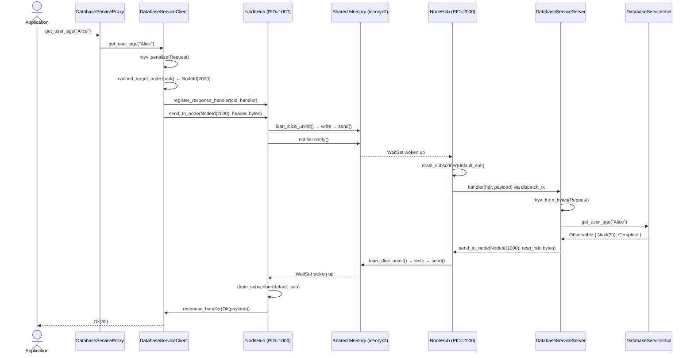
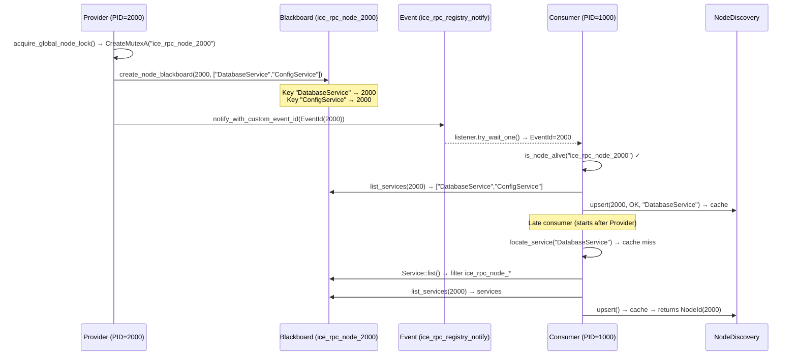
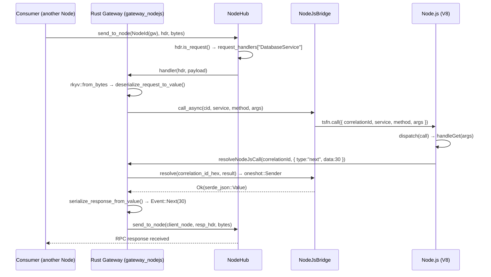
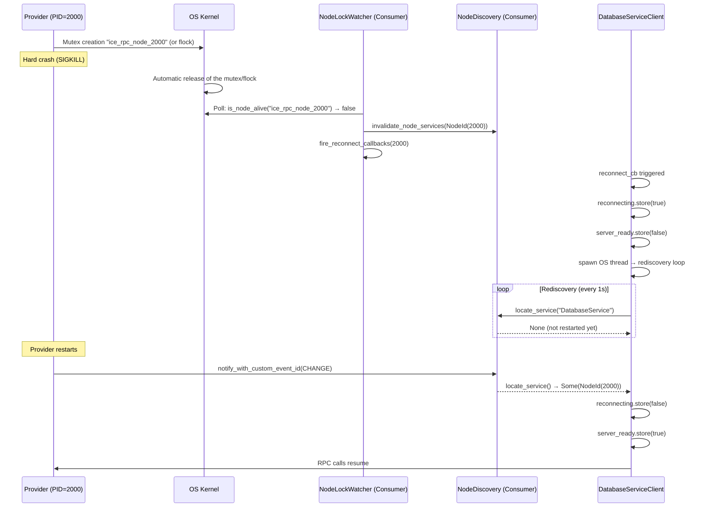

# ice-rpc — Inter-Process Communication via iceoryx2

[](https://github.com/max3163/ice-rpc/actions/workflows/ci.yml)
[](https://github.com/max3163/ice-rpc/actions/workflows/security.yml)
[](https://codecov.io/gh/max3163/ice-rpc)
[](https://api.reuse.software/info/github.com/max3163/ice-rpc)
[](https://crates.io/crates/ice-rpc)
[](https://docs.rs/ice-rpc)

`ice-rpc` is a **zero-copy** Rust RPC (Remote Procedure Call) library built on [iceoryx2](https://github.com/eclipse-iceoryx/iceoryx2) for inter-process communication (IPC) through shared memory.

From a simple Rust trait annotated with `#[service]`, the procedural macro automatically generates the entire IPC code: client, server, proxy and lifecycle. The library implements an **automatic reconnection** strategy after a provider crash, including hard kills (`SIGKILL`), thanks to a cross-platform kernel watchdog (Windows Mutex / Unix `flock`).

---

## Sequence diagrams

### RPC call Consumer → Provider



### Service discovery (Provider → Consumer)



### IPC call → Node.js (ProviderNodeJs mode)



### Crash detection and reconnection



---

## 1. Overview of the communication workflow

```
┌──────────────────────────────────────────────────────────────────────────────┐
│                           ICE-RPC GLOBAL WORKFLOW                             │
│                                                                              │
│  ┌─────────────┐                                     ┌─────────────┐         │
│  │  PROCESS 1   │                                     │  PROCESS 2   │         │
│  │  (Consumer)  │                                     │  (Provider)  │         │
│  │             │                                     │             │         │
│  │  App        │                                     │  App        │         │
│  │   │         │                                     │   │         │         │
│  │   ▼         │                                     │   ▼         │         │
│  │  Proxy      │                                     │  Proxy      │         │
│  │  (Consumer) │                                     │  (Provider) │         │
│  │   │         │                                     │   │         │         │
│  │   ▼         │                                     │   ▼         │         │
│  │  Client IPC │───┐                                 │  Server IPC │         │
│  │             │   │                                 │   │         │         │
│  │  NodeHub ◄──┼───┤          iceoryx2 SHM           │   ▼         │         │
│  │   │         │   │    ┌─────────────────────┐      │  NodeHub    │         │
│  │   │         │   │    │  node_{pid}_default│      │   ▲         │         │
│  │   │         │   └───►│  node_{pid}_large   │──────┼───┘         │         │
│  │   │         │        │  node_{pid}_notify  │      │             │         │
│  │   │         │        └─────────────────────┘      │             │         │
│  │   │         │                                     │             │         │
│  │   ▼         │        ┌─────────────────────┐      │             │         │
│  │  Dispatch   │◄───────│ ice_rpc_registry_    │      │  Dispatch   │         │
│  │  Loop       │        │    notify (event)    │      │  Loop       │         │
│  └─────────────┘        └─────────────────────┘      └─────────────┘         │
│                                                                              │
└──────────────────────────────────────────────────────────────────────────────┘
```

---

## 2. Code architecture

```
ice-rpc/                        ← Main crate (library + runtime)
├── src/
│   ├── lib.rs                  ← Public exports, cancellation tokens, shutdown()
│   ├── types.rs                ← Event<T,E>, RpcHeader (ZeroCopySend), EventKind,
│   │                              NodeId, RpcError, TakeOneError, ServiceInfo…
│   ├── hub.rs                  ← NodeHub : dispatch loop, send_to_node(),
│   │                              response handler hash table, publishers
│   ├── node_discovery.rs       ← NodeDiscovery : local service→NodeId cache,
│   │                              DiscoveryEvent, initial discovery
│   ├── blackboard.rs           ← Registry : 1 Blackboard per node (ice_rpc_node_{pid}),
│   │                              key = service name, value = NodeId
│   ├── cache.rs                ← RpcCache : consumer-side TTL cache (feature `cache`)
│   ├── registry_notify.rs      ← Event notifications : carries the NodeId via EventId
│   ├── registry_listener.rs    ← WaitSet listener : receives Events, updates cache,
│   │                              cleans dead nodes
│   ├── reconnect.rs            ← Reconnection callbacks (triggered by crashes)
│   ├── node_lock.rs            ← Kernel Named Lock (Windows Mutex / Unix flock)
│   │                              for heartbeat-free crash detection
│   ├── http_gateway.rs         ← HTTP REST gateway (trillium) : exposes the services
│   │                              via GET/POST on /{service}/{method}
│   ├── locator.rs              ← ServiceLocator, ServiceLifecycle, ServiceInit,
│   │                              ServiceNamed (const + method), Kahn topological
│   │                              sort, ServiceRegistry (lazy proxies), HttpRegistry
│   ├── macros.rs               ← take_one(), take_one_or_cancel(), try_or_log!
│
ice-rpc-macros/                 ← Procedural macros crate
├── src/
│   ├── lib.rs                  ← Entry point : parses the trait, orchestrates the 6 modules
│   └── codegen/
│       ├── helpers.rs          ← g_variant_name(), extract_rpc_result_types()
│       ├── client.rs           ← {Trait}Client : AtomicU64 NodeId cache, reconnect_cb
│       ├── server.rs           ← {Trait}Server : oneshot ready_tx, dispatch channel
│       ├── proxy.rs            ← {Trait}Proxy : Provider/Consumer/ProviderNodeJs modes
│       ├── lifecycle.rs        ← ServiceLifecycle/ServiceInit/ServiceNamed
│       │                          (const SERVICE_NAME + default method)
│       └── nodejs.rs           ← rkyv↔serde_json::Value converters (NodeJS mode)
│
common/                         ← Example service definitions (not shipped)
│   └── src/
│       ├── mod.rs              ← pub mod config/context/database/http + re-exports
│       ├── config.rs           ← ConfigService
│       ├── context.rs          ← ContextService
│       ├── database.rs         ← DatabaseService
│       └── http.rs             ← HttpService
gateway_nodejs/                 ← NAPI-RS gateway : NodeJsBridge singleton + generated proxies
│   ├── build.rs                ← N-API build script
│   └── src/
│       ├── lib.rs              ← Entry point : init(callback), shutdown()
│       ├── nodejs_bridge.rs    ← Generic agnostic bridge (Value ↔ native JS via NAPI)
│       ├── services.rs         ← Provider registration via with_all_nodejs_proxies!
│       ├── consumer.rs         ← Consumer helpers
│       └── runtime.rs          ← Tokio runtime
patches/                        ← Unused archive (local iceoryx2-pal-posix 0.9.1 patch)
```

### 2.1. Code generation modules (codegen/)

| Module | Responsibility |
|---|---|
| `helpers.rs` | `g_variant_name` (snake→Pascal), `extract_rpc_result_types` |
| `client.rs` | Generates `{Trait}Client` : `AtomicU64` NodeId cache (hot path ~1 ns), `reconnect_cb` (crash detection + Blackboard loop), `reconnecting` flag, `spawn_blocking` fallback if publishers are invalidated |
| `server.rs` | Generates `{Trait}Server::run()` : `dispatch_tx/rx` channel (capacity 1024), handler registration in `NodeHub`, `server_ready` Blackboard with writer kept alive via `OnceLock`, `ready_tx` oneshot signal |
| `proxy.rs` | Generates `{Trait}Proxy` (RwLock<Mode>), `provide`/`provide_with_init`/`consume`/`provide_nodejs` constructors, Provider/Consumer/ProviderNodeJs delegation |
| `lifecycle.rs` | Generates `impl ServiceLifecycle` (exponential backoff 200ms→5s), `impl ServiceNamed` (const + method), `impl ServiceInit`, ProviderNodeJs case (handler registration + JS dispatch) |
| `http.rs` | Generates `impl HttpCallable` for each Proxy : dynamic method dispatch → RPC call, JSON deserialization → Rust types, result serialization → `{"status":"ok","data":...}` |
| `nodejs.rs` | **NEW** — Generates `deserialize_request_to_value()` and `serialize_response_from_value()` : per-method rkyv ↔ `serde_json::Value` converters, used by the NodeJS bridge |

---

## 3. The `#[service("Name")]` macro

### 3.1. How it works

From an annotated trait, the macro automatically generates all the IPC code:

```rust
#[service("DatabaseService")]
pub trait DatabaseService: Send + Sync + 'static {
    async fn get_user_age(&self, name: String) -> Observable<i32, DatabaseError>;
}
```

#### Generated types

```
┌──────────────────────────────────────────────────────────────────┐
│              CODE GENERATION BY THE #[service] MACRO             │
│                                                                  │
│  Annotated trait                                                  │
│  ═══════════                                                      │
│  #[service("DatabaseService")]                                    │
│  pub trait DatabaseService { ... }                                │
│         │                                                        │
│         ▼                                                        │
│  ┌─────────────────────────────────────────────────────────────┐ │
│  │ Automatically generated types                               │ │
│  │                                                             │ │
│  │  DatabaseServiceRequest   ← rkyv enum (1 variant/method)    │ │
│  │  DatabaseServiceClient    ← IPC client (AtomicU64 cache)    │ │
│  │  DatabaseServiceServer    ← IPC server (oneshot ready_tx)   │ │
│  │  DatabaseServiceProxy     ← Smart Proxy (3 modes)           │ │
│  │  DatabaseServiceMode      ← Provider | Consumer |           │ │
│  │                                ProviderNodeJs               │ │
│  └─────────────────────────────────────────────────────────────┘ │
│                                                                  │
│  ┌─────────────────────────────────────────────────────────────┐ │
│  │ Generated implementations                                   │ │
│  │                                                             │ │
│  │  ServiceLifecycle  → init() starts server/client/bridge     │ │
│  │  ServiceNamed      → const SERVICE_NAME + service_name()    │ │
│  │  ServiceInit       → on_init() + dependencies()             │ │
│  │  {Trait} for Proxy → 3-mode delegation                      │ │
│  │  deserialize_request_to_value  (static)                     │ │
│  │  serialize_response_from_value (static)                     │ │
│  └─────────────────────────────────────────────────────────────┘ │
└──────────────────────────────────────────────────────────────────┘
```

| Type | Role |
|---|---|
| `DatabaseServiceRequest` | Serializable enum (rkyv) with one variant per method |
| `DatabaseServiceClient` | IPC client : sends via `NodeHub`, automatic reconnection |
| `DatabaseServiceServer` | IPC server : registers a handler in the `NodeHub` |
| `DatabaseServiceProxy` | Single entry point (Smart Proxy Node, 3 modes) |
| `DatabaseServiceMode` | `Provider` / `Consumer` / `ProviderNodeJs` enum |

### 3.2. Optional parameters

```rust
#[service]                                                       // logical name = trait name in lowercase
#[service("MyService")]                                          // explicit logical name
#[service(allow_large_payload = true)]                           // creates the _large segment
#[service(default_size_message = 8)]                             // default segment size, in KiB
#[service("MyService", allow_large_payload = true, default_size_message = 8)]
```

| Parameter | Type | Default | Description |
|---|---|---|---|
| `allow_large_payload` | `bool` | `false` | Creates the second shared-memory segment (`_large`) for payloads above `LARGE_PAYLOAD_THRESHOLD`. |
| `default_size_message` | integer (KiB) | `256` bytes | Initial slice size of the `_default` shared-memory segment publisher. |

---

## 4. 2-channel architecture per Node (NodeHub)

### 4.1. Principle

Each process (Node) owns exactly **3 iceoryx2 topics** :

```
┌─────────────────────────────────────────────────────────────────┐
│                   TOPICS PER PROCESS (Node)                      │
│                                                                 │
│  Process PID=1000                     Process PID=2000           │
│  ┌──────────────────────┐             ┌──────────────────────┐  │
│  │ node_1000_default   │             │ node_2000_default   │  │
│  │  ↕ messages ≤ 1 KB   │             │  ↕ messages ≤ 1 KB   │  │
│  │                      │             │                      │  │
│  │ node_1000_large      │             │ node_2000_large      │  │
│  │  ↕ messages > 1 KB   │             │  ↕ messages > 1 KB   │  │
│  │                      │             │                      │  │
│  │ node_1000_notify     │             │ node_2000_notify     │  │
│  │  → wake-up event     │             │  → wake-up event     │  │
│  └──────────────────────┘             └──────────────────────┘  │
│                                                                 │
│  All services of the same process SHARE these 3 topics.         │
│  Multiplexing is provided by the service_name field of the      │
│  RpcHeader.                                                     │
└─────────────────────────────────────────────────────────────────┘
```

### 4.2. NodeHub — Centralized Dispatch Loop

```
┌──────────────────────────────────────────────────────────────────┐
│                     NODEHUB — DISPATCH LOOP                       │
│                                                                  │
│  The NodeHub is a per-process singleton (OnceLock).               │
│  It runs in a SINGLE spawn_blocking.                              │
│                                                                  │
│  ┌────────────────────────────────────────────────────────────┐  │
│  │                   Main loop                                │  │
│  │                                                           │  │
│  │  1. WaitSet::wait_and_process_once_with_timeout(500µs)     │  │
│  │     │                                                     │  │
│  │     ├─ listener.try_wait_one() → empties the notifier     │  │
│  │     ├─ drain_subscriber(default_sub)                      │  │
│  │     └─ drain_subscriber(large_sub)                        │  │
│  │                                                           │  │
│  │  2. Continuous drain (while loop)                         │  │
│  │     │                                                     │  │
│  │     ├─ drain_subscriber_has_work(default_sub)             │  │
│  │     └─ drain_subscriber_has_work(large_sub)               │  │
│  │                                                           │  │
│  │  3. If no more messages → back to WaitSet (sleep)         │  │
│  │                                                           │  │
│  │  Stop : global_cancel_token().is_cancelled()              │  │
│  └────────────────────────────────────────────────────────────┘  │
│                                                                  │
│  ┌────────────────────────────────────────────────────────────┐  │
│  │          Response handler hash table                       │  │
│  │                                                           │  │
│  │  Mutex<HashMap<correlation_id, ResponseHandler>>           │  │
│  │                                                           │  │
│  │  → Stores the callbacks waiting for an RPC response       │  │
│  └────────────────────────────────────────────────────────────┘  │
└──────────────────────────────────────────────────────────────────┘
```

### 4.3. Message routing

```
┌─────────────────────────────────────────────────────────────────────────┐
│                     MESSAGE ROUTING IN THE NODEHUB                       │
│                                                                         │
│  Each received message is an iceoryx2 sample containing :                │
│    • user_header: RpcHeader (ZeroCopy)                                   │
│    • payload: &[u8] (rkyv-serialized data)                               │
│                                                                         │
│  ┌──────────────────────────────────────────────────────────────────┐   │
│  │                     MESSAGE DISPATCH                             │   │
│  │                                                                  │   │
│  │  sample.receive()                                                │   │
│  │       │                                                          │   │
│  │       ▼                                                          │   │
│  │  hdr = sample.user_header()                                      │   │
│  │  svc = hdr.service()    // &str from StaticString<SERVICE_NAME>  │   │
│  │       │                                                          │   │
│  │       ├─── svc NOT EMPTY ────────────────────────────┐           │   │
│  │       │   → It is a REQUEST                          │           │   │
│  │       │   → Looks in request_handlers[svc]           │           │   │
│  │       │   → Calls handler(hdr, payload)              │           │   │
│  │       │   → The handler pushes into dispatch_tx      │           │   │
│  │       │                                              │           │   │
│  │       ├─── svc EMPTY ────────────────────────────────┤           │   │
│  │       │   → It is a RESPONSE                         │           │   │
│  │       │   → Looks in response_handlers[cid]          │           │   │
│  │       │   → Calls handler(Ok(payload))               │           │   │
│  │       │   → If terminal → remove(cid)                │           │   │
│  │       │                                              │           │   │
│  │       └─── unknown svc → silently ignored            │           │   │
│  └──────────────────────────────────────────────────────────────────┘   │
└─────────────────────────────────────────────────────────────────────────┘
```

### 4.4. Publishers : lazy creation + cache

```
┌──────────────────────────────────────────────────────────────────────┐
│                PUBLISHER CREATION (send_to_node)                      │
│                                                                      │
│  HashMap<u32, Arc<NodePublishers>>                                    │
│                                                                      │
│  ┌────────────────────────────────────────────────────────────────┐  │
│  │ NodePublishersInner                                           │  │
│  │   small: Mutex<IpcPublisher>    ← messages ≤ 1 KB              │  │
│  │   large: Mutex<IpcPublisher>    ← messages > 1 KB              │  │
│  │   notifier: Notifier            ← wakes up the remote WaitSet  │  │
│  └────────────────────────────────────────────────────────────────┘  │
│                                                                      │
│  Creation flow :                                                     │
│  1. Fast path : read lock → publishers contains the NodeId ? → OK   │
│  2. Slow path : create_lock Mutex → double-check → open_or_create   │
│     (outside the RwLock to avoid blocking concurrent send_to_node)  │
│  3. Short write lock : insertion of the already-built Arc           │
│                                                                      │
│  Invalidation : on send failure → invalidate_publishers()           │
│                 + fire_reconnect_callbacks() (in node_discovery)    │
└──────────────────────────────────────────────────────────────────────┘
```

### 4.5. NodeId = PID

The `NodeId` is the process PID (`std::process::id()`). It is used as a routing key in the `NodeHub` and as an identifier in the `NodeDiscovery`.

---

## 5. RpcHeader — ZeroCopy format

The [`RpcHeader`](ice-rpc/src/types.rs:228) is carried in the iceoryx2 `user_header` (**ZeroCopySend**, no rkyv serialization) :

```
┌──────────────────────────────────────────────────────────────────────┐
│                      RpcHeader (ZeroCopy, 176+ bytes)                │
│                                                                      │
│  Offset │ Size  │ Field               │ Description                 │
│  ───────┼────────┼─────────────────────┼──────────────────────────── │
│   0     │ 16     │ correlation_id      │ [PID(4B) | counter(8B) |   │
│         │        │                     │  padding(4B)] unique UUID   │
│  16     │ 8      │ sent_at_ns          │ Emission timestamp (ns)     │
│  24     │ 128    │ service_name        │ StaticString<126> — target  │
│ 152     │ 128    │ method_name         │ StaticString<126> — method  │
│ 280     │ 1      │ event_kind          │ Next=0, Complete=1, Error=2 │
└──────────────────────────────────────────────────────────────────────┘
```

### EventKind

[`EventKind`](ice-rpc/src/types.rs:197) is a stable `#[repr(C)]` discriminant :

```
  Next     = 0  → intermediate event (non-terminal)
  Complete = 1  → normal end of the stream (terminal)
  Error    = 2  → business error (terminal)
```

The [`is_terminal()`](ice-rpc/src/types.rs:214) method allows the client to detect the end of a stream without ever deserializing the payload.

---

## 6. Service discovery (Registry + Event + NodeLock)

### 6.1. Architecture : 1 Blackboard per node

Each node creates ONE Blackboard `ice_rpc_node_{pid}` containing one **key per service**.
`list_keys()` allows enumerating all services without any prior knowledge.

```
┌──────────────────────────────────────────────────────────────────────┐
│              DISCOVERY — 1 BLACKBOARD PER NODE                       │
│                                                                      │
│  Blackboard: ice_rpc_node_1234    KeyType = [u8;64], ValueType = u32 │
│  ┌──────────────────────────────────────────────────────────────┐   │
│  │  Key "ConfigService"   → 1234                                │   │
│  │  Key "DatabaseService" → 1234                                │   │
│  │  Key "HttpService"     → 1234                                │   │
│  └──────────────────────────────────────────────────────────────┘   │
│                                                                      │
│  MECHANISMS :                                                        │
│  ┌──────────────────────────────────────────────────────────────┐   │
│  │ 1. EVENT (ice_rpc_registry_notify)                           │   │
│  │    • Carries the NodeId directly in the EventId              │   │
│  │    • event-id-max-value = 65535 (iceoryx2.toml config)       │   │
│  └──────────────────────────────────────────────────────────────┘   │
│  ┌──────────────────────────────────────────────────────────────┐   │
│  │ 2. BLACKBOARD (ice_rpc_node_{pid}) — persistent              │   │
│  │    • list_keys() → all service names of the node             │   │
│  │    • Late-join : Service::list() → filter ice_rpc_node_*     │   │
│  └──────────────────────────────────────────────────────────────┘   │
│  ┌──────────────────────────────────────────────────────────────┐   │
│  │ 3. NAMED KERNEL LOCK (ice_rpc_node_{pid})                    │   │
│  │    • Windows : CreateMutexA / Unix : flock                   │   │
│  │    • is_node_alive() → immediate crash detection             │   │
│  └──────────────────────────────────────────────────────────────┘   │
└──────────────────────────────────────────────────────────────────────┘
```

### 6.2. Real-time flow (Event → NodeId)

```
┌──────────────────────────────────────────────────────────────────────┐
│           LISTENER : Event(NodeId) → Direct processing               │
│                                                                      │
│  Provider starts :                                                   │
│    → create_node_blackboard(pid, services)                           │
│    → notify_with_custom_event_id(EventId::new(pid))                  │
│                                                                      │
│  Listener receives :                                                 │
│    → try_wait_one() → EventId = NodeId                               │
│    → is_node_alive(lock_name) ?                                      │
│       YES → list_services(pid) → upsert() → cache                    │
│       NO  → invalidate_node_services() + fire_reconnect_callbacks()  │
└──────────────────────────────────────────────────────────────────────┘
```

### 6.3. Initial discovery (Service::list)

```
┌──────────────────────────────────────────────────────────────────────┐
│           INITIAL DISCOVERY : Consumer started after Provider        │
│                                                                      │
│  locate_service("DatabaseService") :                                 │
│    1. Local cache → miss                                              │
│    2. list_nodes() → Service::list() → filter ice_rpc_node_*         │
│    3. For each NodeId : is_node_alive() ?                            │
│       YES → list_services(pid) → rebuilds the cache                  │
│       NO  → ignored (dead node)                                      │
│    4. Returns the found NodeId (or None → retry)                     │
└──────────────────────────────────────────────────────────────────────┘
```

---

## 7. Smart Proxy Node (3 modes)

### 7.1. Architecture

```
┌──────────────────────────────────────────────────────────────────────┐
│                     SMART PROXY NODE (3 MODES)                       │
│                                                                      │
│  DatabaseServiceProxy                                                │
│  ┌────────────────────────────────────────────────────────────────┐  │
│  │  mode: RwLock<DatabaseServiceMode>                             │  │
│  │  deps: Vec<&'static str>                                       │  │
│  └────────────────────────────────────────────────────────────────┘  │
│                                                                      │
│  ┌──────────────────────────┐ ┌──────────────────────────┐          │
│  │  MODE 1: PROVIDER        │ │  MODE 2: CONSUMER        │          │
│  │                          │ │                          │          │
│  │  local_impl: Arc<dyn Tr> │ │  ipc_client: Arc<Client> │          │
│  │  init_hook: Arc<dyn Init>│ │                          │          │
│  │  server_started: bool    │ │                          │          │
│  │                          │ │                          │          │
│  │  Direct local call       │ │  IPC call via NodeHub    │          │
│  │  (no serialization)      │ │  (rkyv serialization)    │          │
│  └──────────────────────────┘ └──────────────────────────┘          │
│                                                                      │
│  ┌──────────────────────────────────────────────────────────────┐    │
│  │  MODE 3: PROVIDER NODEJS  (NEW)                              │    │
│  │                                                              │    │
│  │  No local state — delegates to the NodeJsBridge (singleton)  │    │
│  │                                                              │    │
│  │  IPC (rkyv) → deserialize → Value → NodeJsBridge → JS        │    │
│  │  JS → NodeJsBridge → serialize → rkyv → IPC                  │    │
│  │                                                              │    │
│  │  The JS callback is UNIQUE for all services.                 │    │
│  │  Value ↔ native JS conversion : zero-copy via NAPI serde-json│    │
│  └──────────────────────────────────────────────────────────────┘    │
│                                                                      │
│  Constructors :                                                      │
│    provide(impl)          → simple Provider (default ServiceInit)    │
│    provide_with_init(impl)→ Provider with custom init hook           │
│    consume()              → pure Consumer (IPC only)                 │
│    provide_nodejs()       → NodeJS Provider (generic JS bridge)      │
└──────────────────────────────────────────────────────────────────────┘
```

### 7.2. Method delegation

```rust
impl DatabaseService for DatabaseServiceProxy {
    async fn get_user_age(&self, name: String) -> Observable<i32, DatabaseError> {
        let mode = self.mode.read().await;
        match &*mode {
            Mode::Provider { local_impl, .. } => {
                // Direct local call, without serialization
                local_impl.get_user_age(name).await
            },
            Mode::Consumer { ipc_client } => {
                // Remote IPC call via NodeHub
                ipc_client.get_user_age(name).await
            }
            Mode::ProviderNodeJs => {
                // Calls arrive via IPC and are handled by the handler
                // (registered in ServiceLifecycle::init())
                Err(RpcError::IpcError("ProviderNodeJs: use IPC".into()))
            }
        }
    }
}
```

### 7.3. ProviderNodeJs lifecycle

In ProviderNodeJs mode, `ServiceLifecycle::init()` :
1. Creates the iceoryx2 Node (via ServiceLocator)
2. Starts the discovery
3. Registers a `RequestHandler` in the `NodeHub` which :
   - Deserializes the rkyv request → `serde_json::Value`
   - Calls `common::nodejs_dispatch::call()` (JS bridge)
   - Serializes the `Value` response → rkyv
   - Sends via `NodeHub::send_to_node()`
4. Starts the dispatch loop

The `common::nodejs_dispatch` is a **function pointer** injected by `gateway_nodejs` at startup, avoiding a circular `common` → `gateway_nodejs` dependency.

---

## 8. Lifecycle (ServiceLifecycle)

### 8.1. Topological sort

[`ServiceLocator::initialize_all()`](ice-rpc/src/locator.rs:327) sorts the services by the dependencies declared via [`ServiceInit::dependencies()`](ice-rpc/src/locator.rs:43) :

```
┌──────────────────────────────────────────────────────────────────────┐
│                TOPOLOGICAL SORT — KAHN'S ALGORITHM                   │
│                                                                      │
│  Registered services :                                               │
│    ConfigService   → dependencies() = []                             │
│    DatabaseService → dependencies() = ["ConfigService"]              │
│    HttpService     → dependencies() = []                             │
│                                                                      │
│  Dependency graph :                                                  │
│                                                                      │
│    ┌──────────────┐     ┌──────────────┐                             │
│    │ ConfigService│     │ HttpService  │   ← roots (degree 0)        │
│    └──────┬───────┘     └──────────────┘                             │
│           │                                                          │
│    ┌──────▼───────┐                                                  │
│    │DatabaseSvc   │  ← depends on ConfigService                      │
│    └──────────────┘                                                  │
│                                                                      │
│  Initialization order :                                              │
│    1. ConfigService (degree 0)                                       │
│    2. HttpService   (degree 0)                                       │
│    3. DatabaseService (degree 1, after ConfigService)                │
│                                                                      │
│  IPC discovery : if a dependency is already active in another        │
│  process, it is considered satisfied and excluded from the local     │
│  graph.                                                              │
└──────────────────────────────────────────────────────────────────────┘
```

### 8.2. Provider : server startup

```
┌──────────────────────────────────────────────────────────────────────┐
│                 PROVIDER INITIALIZATION                              │
│                                                                      │
│  ServiceLifecycle::init()  [called from initialize_all()]            │
│  │                                                                   │
│  ├─ 1. init_hook.on_init()                                           │
│  │     → Application initialization (DB connection, TOML file...)    │
│  │     → Returns false → initialize_all() will retry                 │
│  │                                                                   │
│  ├─ 2. spawn_blocking {                                              │
│  │       get_node_sync()           ← creates the iceoryx2 Node       │
│  │       start_discovery()         ← listens to registry_notify     │
│  │     }                                                             │
│  │                                                                   │
│  ├─ 3. server.run(ready_tx)       ← tokio::spawn                     │
│  │     └─ spawn_blocking {                                           │
│  │          register_request_handler()  ← registers in NodeHub       │
│  │          Blackboard server_ready     ← writes true                │
│  │          ready_tx.send(Ok(()))       ← signals ready              │
│  │        }                                                          │
│  │     └─ tokio::select! loop {                                      │
│  │          dispatch_rx.recv() → deserialize → tokio::spawn          │
│  │        }                                                          │
│  │                                                                   │
│  ├─ 4. ready_rx.await → Ok(())                                       │
│  │     → server_started = true                                       │
│  │     → start_dispatch_if_needed()  ← starts the message pump       │
│  │                                                                   │
│  └─ Automatic restart (if run() fails after startup) :               │
│       exponential backoff : 200ms → 400ms → 800ms → … → 5s max      │
└──────────────────────────────────────────────────────────────────────┘
```

### 8.3. Client : connecting to the server

```
┌──────────────────────────────────────────────────────────────────────┐
│                 CONSUMER INITIALIZATION                              │
│                                                                      │
│  ServiceLifecycle::init()  [called from initialize_all()]            │
│  │                                                                   │
│  ├─ 1. get_node()           ← creates the iceoryx2 Node              │
│  │                                                                   │
│  ├─ 2. spawn_blocking { start_discovery() }                          │
│  │     → Listens to ice_rpc_registry_notify (independent listener)   │
│  │                                                                   │
│  ├─ 3. locate_service("DatabaseService")                             │
│  │     → Local cache (fed by the registry_notify listener)           │
│  │     → Blackboard (persistent)                                     │
│  │     → Returns None → init() returns false                         │
│  │       (initialize_all() will retry automatically)                 │
│  │                                                                   │
│  ├─ 4. spawn_blocking { start_dispatch_if_needed() }                 │
│  │     → Starts the message pump (only if the service is found)      │
│  │                                                                   │
│  ├─ 5. spawn_blocking { ensure_publishers_blocking(target_node) }    │
│  │     → Pre-creates the publishers (hot path without open_or_create)│
│  │                                                                   │
│  └─ 6. cached_target_node.store(node_id)  ← AtomicU64 (hot path)     │
│                                                                      │
│  Key points :                                                        │
│  • The registry_notify listener runs PERMANENTLY in the background   │
│  • The Blackboard is read on EACH attempt (no stale cache)           │
│  • initialize_all() handles the retry with a global 30s timeout      │
└──────────────────────────────────────────────────────────────────────┘
```

### 8.4. Discovery / dispatch separation

```
┌──────────────────────────────────────────────────────────────────────┐
│          DISCOVERY / DISPATCH SEPARATION (v2)                        │
│                                                                      │
│  BEFORE (v1) : the dispatch loop was started in get_node_sync(),     │
│  EVEN if no service had been discovered yet.                         │
│                                                                      │
│  AFTER (v2) : three distinct phases                                  │
│                                                                      │
│  Phase 1: get_node_sync()                                            │
│    → Creates the iceoryx2 Node ONLY                                  │
│    → Starts NEITHER the dispatch NOR the registry_notify listener    │
│                                                                      │
│  Phase 2: start_discovery()                                          │
│    → Starts the ice_rpc_registry_notify listener in its own          │
│      spawn_blocking with its own WaitSet                             │
│    → Independent of the dispatch loop                                │
│    → Allows receiving the event notifications from the other Nodes   │
│                                                                      │
│  Phase 3: start_dispatch_if_needed()                                 │
│    → Starts the dispatch loop ONLY when a target service             │
│      is found (provider or consumer)                                 │
│    → Idempotent via AtomicBool                                       │
│    → Avoids consuming IPC resources uselessly                        │
└──────────────────────────────────────────────────────────────────────┘
```

---

## 9. Complete flow of an IPC call

```
┌──────────────────────────────────────────────────────────────────────────┐
│             COMPLETE FLOW OF AN RPC CALL (get_user_age)                   │
│                                                                          │
│  CONSUMER (PID=1000)                    PROVIDER (PID=2000)              │
│  ═══════════════════                    ═══════════════════              │
│                                                                          │
│  proxy.get_user_age("Alice")                                             │
│    │                                                                     │
│    ▼                                                                     │
│  Client::get_user_age()                                                  │
│    │                                                                     │
│    ├─1. rkyv::serialize(Request::GetUserAge { name: "Alice" })           │
│    │                                                                     │
│    ├─2. Fast path : cached_target_node.load(Acquire)                     │
│    │     └─ AtomicU64 → NodeId (0 if not cached yet)                     │
│    │   Slow path : locate_service() + retry 100ms (30s max)              │
│    │                                                                     │
│    ├─3. register_reconnect_callback_once()   ← idempotent (built-in HashSet) │
│    │                                                                     │
│    ├─4. RpcHeader::new("DatabaseService", "get_user_age")                │
│    │     → correlation_id = [PID(4B) | counter(8B) | padding(4B)]        │
│    │     → sent_at_ns = now_ns()                                         │
│    │                                                                     │
│    ├─5. mpsc::channel::<Event<Ok, Err>>(8) → (tx, rx)                    │
│    │                                                                     │
│    ├─6. hub.register_response_handler(cid, handler)                      │
│    │                                                                     │
│    ├─7. hub.send_to_node(NodeId(2000), header, &bytes)                   │
│    │     │                                                               │
│    │     ├─ publishers[2000].small.lock()                                │
│    │     ├─ loan_slice_uninit(n)                                         │
│    │     ├─ user_header = rpc_header                                     │
│    │     ├─ write_from_slice(&bytes)                                     │
│    │     ├─ send()                                                       │
│    │     └─ notifier.notify() ──────────────────────────────►            │
│    │                                                                     │
│    ▼                                                       WaitSet       │
│  rx.recv() waits...                                       woken up       │
│                                                           │               │
│                                              drain_subscriber(default_sub)│
│                                                           │               │
│                                              hdr.service() = "DatabaseSvc"│
│                                              → REQUEST                     │
│                                              → request_handlers["DB"](hdr, │
│                                                                  payload) │
│                                                           │               │
│                                              dispatch_tx.try_send(        │
│                                                (cid, raw_bytes))          │
│                                                           │               │
│                                                           ▼               │
│                                              tokio::spawn {               │
│                                                rkyv::from_bytes(req)      │
│                                                match req {                │
│                                                  GetUserAge { name } => { │
│                                                    let stream = impl      │
│                                                      .get_user_age(name)  │
│                                                      .await;              │
│                                                    while let Some(e) =    │
│                                                      stream.recv().await {│
│                                                      scratch.clear();     │
│                                                      to_bytes_in(&e,      │
│                                                        &mut scratch);     │
│                                                      hub.send_to_node(    │
│                                                        NodeId(1000),      │
│                                                        RpcHeader {        │
│                                                          cid,             │
│                                                          event_kind: Next,│
│                                                          ... },           │
│                                                        &scratch);         │
│                                                      notifier.notify();   │
│                                                    }                      │
│                                                  }                        │
│                                                }                          │
│                                              }                            │
│                                                           │               │
│                                              send_to_node(1000)           │
│                                              → node_1000_default         │
│                                              → notifier.notify() ────►    │
│                                                                           │
│  WaitSet woken up                                           │             │
│  drain_subscriber(default_sub)                              │             │
│    │                                                                      │
│  hdr.service() = "" → RESPONSE                                            │
│  hdr.correlation_id → response_handlers[cid]                              │
│    │                                                                      │
│  handler(Ok(payload_bytes))                                               │
│    │                                                                      │
│  rkyv::from_bytes::<Event<Ok, Err>>(bytes)                                │
│    │                                                                      │
│  tx.try_send(event)                                                       │
│    │                                                                      │
│  If terminal (Complete/Error) :                                           │
│    → hub.remove_response_handler(&cid)                                    │
│                                                                           │
│  ▼                                                                        │
│  rx.recv() → Some(Event::Next(30))    ← received by the user              │
└───────────────────────────────────────────────────────────────────────────┘
```


---

## 10. Automatic reconnection after crash

```
┌──────────────────────────────────────────────────────────────────────────┐
│               AUTOMATIC RECONNECTION — UNIFIED CALLBACKS                  │
│                                                                          │
│  A single central point : register_reconnect_callback_once()             │
│  in node_discovery, called by the client on the first RPC.               │
│  The callbacks are triggered by 3 independent sources :                  │
│                                                                          │
│  ┌────────────────────────────────────────────────────────────────────┐  │
│  │ SOURCE 1 : IPC send failure (NodeHub)                              │  │
│  │                                                                    │  │
│  │  send_to_node() ──FAILURE──► invalidate_publishers()               │  │
│  │                         └─ fire_reconnect_callbacks()              │  │
│  └────────────────────────────────────────────────────────────────────┘  │
│                                                                          │
│  ┌────────────────────────────────────────────────────────────────────┐  │
│  │ SOURCE 2 : NodeLockWatcher (kernel lock)                           │  │
│  │                                                                    │  │
│  │  Dedicated thread polling is_node_alive(lock_name) every 100ms     │  │
│  │  is_alive() returns false →                                        │  │
│  │    ├─ invalidate_node_services()  ← clears the local cache         │  │
│  │    ├─ fire_reconnect_callbacks()  ← unified callback               │  │
│  │    └─ stops (running = false)                                      │  │
│  │                                                                    │  │
│  │  The lock is released by the kernel on crash (SIGKILL included).   │  │
│  └────────────────────────────────────────────────────────────────────┘  │
│                                                                          │
│  ┌────────────────────────────────────────────────────────────────────┐  │
│  │ SOURCE 3 : DEAD notification via registry_notify event             │  │
│  │                                                                    │  │
│  │  When a Node stops cleanly (release_node) :                        │  │
│  │    → announce_dead_node(NodeId::current())                         │  │
│  │    → notify_with_custom_event_id(REGISTRY_EVENT_DEAD)              │  │
│  │    → The listeners receive the DEAD event                          │  │
│  │    → fire_reconnect_callbacks()                                    │  │
│  └────────────────────────────────────────────────────────────────────┘  │
│                                                                          │
│  ┌────────────────────────────────────────────────────────────────────┐  │
│  │ UNIFIED CALLBACK (reconnect_cb — in the generated client)          │  │
│  │                                                                    │  │
│  │  Triggered by one of the 3 sources above :                         │  │
│  │  ├─ reconnecting.store(true)                                       │  │
│  │  ├─ server_ready.store(false)                                      │  │
│  │  ├─ cached_target_node.store(0)                                    │  │
│  │  ├─ invalidate_node_services()                                     │  │
│  │  ├─ invalidate_publishers()                                        │  │
│  │  └─ spawn OS thread → rediscovery loop                             │  │
│  │       ├─ locate_service(svc_name)                                  │  │
│  │       ├─ sleep(1000ms)                                             │  │
│  │       └─ if found :                                                │  │
│  │            ├─ cached_node.store(new_id)                            │  │
│  │            ├─ ready.store(true)                                    │  │
│  │            └─ reconnecting.store(false)                            │  │
│  └────────────────────────────────────────────────────────────────────┘  │
└──────────────────────────────────────────────────────────────────────────┘
```

---

## 11. Crash monitoring — NodeLock

```
┌──────────────────────────────────────────────────────────────────────┐
│              NAMED KERNEL LOCK — CROSS-PLATFORM                       │
│                                                                      │
│  ┌────────────────────────────────────────────────────────────────┐  │
│  │ WINDOWS                                                        │  │
│  │                                                                │  │
│  │  Provider :                                                    │  │
│  │    dedicated thread → CreateMutexA("ice_rpc_node_{pid}")       │  │
│  │                     → WaitForSingleObject(INFINITE)            │  │
│  │                     → infinite loop (sleep 3600s)              │  │
│  │                                                                │  │
│  │  Watcher :                                                     │  │
│  │    OpenMutexA(SYNCHRONIZE, "ice_rpc_node_{pid}")               │  │
│  │    → NULL     = mutex destroyed → process DEAD                 │  │
│  │    → non-NULL = mutex exists    → process ALIVE                │  │
│  └────────────────────────────────────────────────────────────────┘  │
│                                                                      │
│  ┌────────────────────────────────────────────────────────────────┐  │
│  │ UNIX (Linux / macOS)                                           │  │
│  │                                                                │  │
│  │  Provider :                                                    │  │
│  │    open("/tmp/ice_rpc_node_{pid}.lock", O_CREAT|O_WRONLY)      │  │
│  │    flock(fd, LOCK_EX|LOCK_NB)                                  │  │
│  │    → fd kept open → kernel releases on crash                   │  │
│  │                                                                │  │
│  │  Watcher :                                                     │  │
│  │    open(lock_path, O_WRONLY)                                   │  │
│  │    flock(fd, LOCK_EX|LOCK_NB)                                  │  │
│  │    → success = nobody holds the lock → process DEAD            │  │
│  │    → failure = lock held            → process ALIVE            │  │
│  └────────────────────────────────────────────────────────────────┘  │
│                                                                      │
│  ┌────────────────────────────────────────────────────────────────┐  │
│  │ NodeLockWatcher (client side)                                  │  │
│  │                                                                │  │
│  │  • Runs in a spawn_blocking (Tokio) or std::thread             │  │
│  │  • Polls is_node_alive(lock_name) every 100ms                  │  │
│  │  • On detected crash :                                         │  │
│  │      invalidate_node_services()  → clears the NodeDiscovery cache │
│  │      fire_reconnect_callbacks()  → unified callback            │  │
│  │  • Auto-detection : Tokio runtime → spawn_blocking,            │  │
│  │    otherwise std::thread::spawn                                │  │
│  └────────────────────────────────────────────────────────────────┘  │
└──────────────────────────────────────────────────────────────────────┘
```

---

## 12. NodeJS Gateway (NAPI-RS bridge)

### 13.1. Architecture

The gateway exposes the ice-rpc services to Node.js via NAPI-RS. It implements the Proxy **mode 3 (ProviderNodeJs)** : the business logic is in JavaScript, the generated Rust code bridges the IPC bus and the NodeJS runtime.

```
┌──────────────────────────────────────────────────────────────────────────┐
│                    NODEJS GATEWAY — ARCHITECTURE                          │
│                                                                          │
│  ┌─────────────────────┐        ┌──────────────────────────────────┐     │
│  │   Node.js           │        │   Rust process (gateway_nodejs) │     │
│  │                     │        │                                  │     │
│  │  const gw =         │  NAPI  │  init(callback)                  │     │
│  │    require(...);    │◄──────►│  ┌────────────────────────────┐  │     │
│  │                     │        │  │ NodeJsBridge (SINGLETON)   │  │     │
│  │  gw.init(           │        │  │                            │  │     │
│  │    (call) => {      │        │  │ callback: ThreadsafeFn     │  │     │
│  │      // process     │        │  │ pending: HashMap<cid, Tx>  │  │     │
│  │      return         │        │  └──────────┬─────────────────┘  │     │
│  │        result;      │        │             │                    │     │
│  │    }                │        │  ┌──────────▼─────────────────┐  │     │
│  │  );                 │        │  │ Services (generated by     │  │     │
│  │                     │        │  │ #[service])                │  │     │
│  │  // The services    │        │  │                            │  │     │
│  │  // are called      │        │  │ DatabaseServiceProxy       │  │     │
│  │  // via IPC by      │        │  │   .provide_nodejs()        │  │     │
│  │  // other Nodes     │        │  │ ConfigServiceProxy         │  │     │
│  │                     │        │  │   .provide_nodejs()        │  │     │
│  └─────────────────────┘        │  │ HttpServiceProxy           │  │     │
│                                  │  │   .provide_nodejs()       │  │     │
│                                  │  └───────────────────────────┘  │     │
│                                  └─────────────────────────────────┘     │
└──────────────────────────────────────────────────────────────────────────┘
```

### 13.2. Flow of an IPC call → NodeJS

```
┌──────────────────────────────────────────────────────────────────────────┐
│            FLOW OF AN IPC CALL TO NODEJS (ProviderNodeJs mode)            │
│                                                                          │
│  Consumer (another Node)                 Gateway NodeJS                  │
│  ═════════════════════                 ══════════════                    │
│                                                                          │
│  send_to_node(NodeId(gw), hdr, bytes)                                    │
│         │                                                                 │
│         ▼                                                                 │
│  ┌──────────────────────────────────────────────────────────────────┐    │
│  │ 1. NodeHub receives the message                                  │    │
│  │    → hdr.service() = "DatabaseService"                           │    │
│  │    → hdr.is_request() = true                                     │    │
│  │    → request_handlers["DatabaseService"](hdr, payload)           │    │
│  └──────────────────────────────────────────────────────────────────┘    │
│         │                                                                 │
│         ▼                                                                 │
│  ┌──────────────────────────────────────────────────────────────────┐    │
│  │ 2. Generated handler (macro)                                      │    │
│  │    a. rkyv::from_bytes(payload) → DatabaseServiceRequest         │    │
│  │    b. deserialize_request_to_value(method, bytes)                │    │
│  │       → serde_json::Value { "name": "Alice" }                    │    │
│  └──────────────────────────────────────────────────────────────────┘    │
│         │                                                                 │
│         ▼                                                                 │
│  ┌──────────────────────────────────────────────────────────────────┐    │
│  │ 3. NodeJsBridge::call_and_wait()                                 │    │
│  │    → tsfn.call({                                                 │    │
│  │         correlationId: "deadbeef-...",                            │    │
│  │         service: "DatabaseService",                               │    │
│  │         method: "get_user_age",                                   │    │
│  │         args: { name: "Alice" }   ← native JS object, not JSON!  │    │
│  │      })                                                          │    │
│  └──────────────────────────────────────────────────────────────────┘    │
│         │                                                                 │
│         ▼                                                                 │
│  ┌──────────────────────────────────────────────────────────────────┐    │
│  │ 4. NodeJS callback                                               │    │
│  │    async (call) => {                                             │    │
│  │      const age = await db.getUserAge(call.args.name);            │    │
│  │      gw.resolveNodeJsCall(call.correlationId, {                  │    │
│  │        type: "next",                                             │    │
│  │        data: { age: 30 }                                         │    │
│  │      });                                                         │    │
│  │    }                                                             │    │
│  └──────────────────────────────────────────────────────────────────┘    │
│         │                                                                 │
│         ▼                                                                 │
│  ┌──────────────────────────────────────────────────────────────────┐    │
│  │ 5. NodeJsBridge::resolve()                                       │    │
│  │    → oneshot::Sender → unblocks call_and_wait()                  │    │
│  └──────────────────────────────────────────────────────────────────┘    │
│         │                                                                 │
│         ▼                                                                 │
│  ┌──────────────────────────────────────────────────────────────────┐    │
│  │ 6. Handler (continuation)                                        │    │
│  │    c. serialize_response_from_value(method, result)              │    │
│  │       → rkyv::to_bytes(Event::Next(30))                          │    │
│  │    d. hub.send_to_node(client_node, resp_hdr, &bytes)            │    │
│  └──────────────────────────────────────────────────────────────────┘    │
└──────────────────────────────────────────────────────────────────────────┘
```

### 13.3. Node.js API

```javascript
const gw = require('gateway-nodejs');

// 1. Initialization with a single callback for ALL services
gw.init((call) => {
    // call = { correlationId, service, method, args }
    // args is a native JS object (no JSON.parse needed!)
    const { correlationId, service, method, args } = call;

    // Business processing...
    const result = processCall(service, method, args);

    // Send the response back
    gw.resolveNodeJsCall(correlationId, {
        type: "next",      // "next" | "complete" | "error"
        data: result
    });
});

// 2. The services are automatically announced on the IPC bus
//    (ConfigService, DatabaseService, HttpService)

// 3. Clean shutdown
gw.shutdown();
```

### 13.4. Key points

| Characteristic | Description |
|---|---|
| **Single bridge** | A single `NodeJsBridge` singleton for all services |
| **Zero-copy JS** | No `JSON.parse()`/`JSON.stringify()` — NAPI serde-json converts `Value` ↔ native JS object automatically |
| **Single callback** | A single JS callback `(call) => void` to dispatch to the business handlers |
| **Typed conversion** | The macro generates `deserialize_request_to_value()` and `serialize_response_from_value()` per service |
| **No direct iceoryx2** | `gateway_nodejs` does not depend on `iceoryx2` — everything goes through `ice-rpc` |
| **Always available** | The NodeJS bridge code is generated unconditionally — no `napi` feature needed |
| **Inverted dispatch** | `common::nodejs_dispatch` is a function pointer injected by `gateway_nodejs` at `init()` |

---

## 13. HTTP REST gateway

The HTTP REST gateway is a built-in HTTP server based on [trillium](https://github.com/trillium-rs/trillium) that automatically exposes all ice-rpc services through a REST API. Each service method is dynamically accessible at the URL `/{service}/{method}` without any manual route declaration.

### 13.1. Architecture

```
┌──────────────────────────────────────────────────────────────────────────┐
│                    HTTP REST GATEWAY — ARCHITECTURE                       │
│                                                                          │
│  HTTP client (curl, browser, another app)                                 │
│       │                                                                   │
│       │  GET  /DatabaseService/get_user_age?name=Alice                    │
│       │  POST /ConfigService/set_config  {"key":"val"}                    │
│       ▼                                                                   │
│  ┌────────────────────────────────────────────────────────────────────┐  │
│  │                    Axum Router (port 8080)                         │  │
│  │                                                                    │  │
│  │  ┌──────────────────────────────────────────────────────────────┐  │  │
│  │  │ Middleware Origin Check                                       │  │  │
│  │  │  → If Origin header present : checks *.my-domain.com          │  │  │
│  │  │  → Otherwise : lets it through (non-browser clients)          │  │  │
│  │  └──────────────────────────────────────────────────────────────┘  │  │
│  │                                                                    │  │
│  │  Route /{service}/{method}                                        │  │
│  │  ┌──────────────────────────────────────────────────────────────┐  │  │
│  │  │ GET  → handle_get()  : query params → params_to_json()       │  │  │
│  │  │ POST → handle_post() : JSON body → passed directly           │  │  │
│  │  └──────────────────────────────────────────────────────────────┘  │  │
│  │                          │                                         │  │
│  └──────────────────────────┼─────────────────────────────────────────┘  │
│                             │                                            │
│                             ▼                                            │
│  ┌────────────────────────────────────────────────────────────────────┐  │
│  │                 HttpGatewayState (lazy cache)                      │  │
│  │                                                                    │  │
│  │  Arc<RwLock<HashMap<String, Arc<dyn HttpCallable>>>>              │  │
│  │                                                                    │  │
│  │  Fast-path : cache.read() → hit → immediate return                 │  │
│  │  Slow-path : ServiceLocator::get_http(service) → HttpRegistry     │  │
│  │              → cache.write().entry().or_insert_with()              │  │
│  └──────────────────────────────────┬─────────────────────────────────┘  │
│                                     │                                    │
│                                     ▼                                    │
│  ┌────────────────────────────────────────────────────────────────────┐  │
│  │              HttpCallable Proxy (generated by macro)               │  │
│  │                                                                    │  │
│  │  http_invoke(method, params) → match method {                      │  │
│  │      "get_user_age" => {                                           │  │
│  │          let name: String = serde_json::from_value(params)?;       │  │
│  │          let rx = self.get_user_age(name).await?;                  │  │
│  │          match rx.recv().await {                                    │  │
│  │              Event::Next(val) => json!({"status":"ok","data":val}) │  │
│  │              Event::Error(e)  => json!({"status":"error",...})     │  │
│  │              Event::Complete   => json!({"status":"ok"})           │  │
│  │          }                                                         │  │
│  │      }                                                             │  │
│  │      _ => Err("Unknown method")                                    │  │
│  │  }                                                                 │  │
│  └────────────────────────────────────────────────────────────────────┘  │
│                                     │                                    │
│                                     ▼                                    │
│                          ┌──────────────────┐                            │
│                          │   ice-rpc IPC    │                            │
│                          │  (iceoryx2 SHM)  │                            │
│                          └──────────────────┘                            │
└──────────────────────────────────────────────────────────────────────────┘
```

### 13.2. The `HttpCallable` trait

The [`HttpCallable`](ice-rpc/src/service_traits.rs:42) trait is the contract between the HTTP gateway and the ice-rpc proxies. It allows the dynamic invocation of an RPC method from JSON parameters :

```rust
#[async_trait::async_trait]
pub trait HttpCallable: Send + Sync {
    /// Logical name of the service.
    fn service_name(&self) -> &'static str;

    /// Invokes an RPC method dynamically from JSON parameters.
    async fn http_invoke(
        &self,
        method: &str,
        params: serde_json::Value,
    ) -> Result<serde_json::Value, String>;
}
```

This trait is **implemented automatically** by the `#[service]` macro on each Proxy type (via the [`ice-rpc-macros/src/codegen/http.rs`](ice-rpc-macros/src/codegen/http.rs:28) module). The user never needs to implement it manually.

### 13.3. URL and response format

| HTTP method | URL | Parameters | Example |
|---|---|---|---|
| `GET` | `/{service}/{method}?arg1=val1&arg2=val2` | Query string | `curl "http://localhost:8080/DatabaseService/get_user_age?name=Alice"` |
| `POST` | `/{service}/{method}` | JSON body | `curl -X POST http://localhost:8080/DatabaseService/get_person -H 'Content-Type: application/json' -d '{"nom":"Dupont","prenom":"Jean"}'` |

**Success response :**
```json
{"status":"ok","data":{...}}
```

**Business error response :**
```json
{"status":"error","error":"error message"}
```

**Unknown service response (404) :**
```json
{"status":"error","error":"Unknown service 'X'. Make sure common::init_http_registry() was called..."}
```

**Unknown method response (404) :**
```json
{"status":"error","error":"Unknown method 'X' for service 'Y'"}
```

### 13.4. GET parameter conversion

The query strings are converted automatically to JSON with smart scalar interpretation :

| Raw value | Inferred JSON type |
|---|---|
| `"true"` / `"false"` | Boolean |
| `"null"` / `"none"` | Null |
| `"42"` / `"-1"` | Integer |
| `"3.14"` | Floating-point number |
| `"Alice"` | String |

If a single parameter is present, its value is passed directly (no object). If several parameters are present, they are grouped into a JSON object `{"key1": val1, "key2": val2}`.

### 13.5. Origin security middleware

An Axum middleware checks the HTTP [`Origin`](ice-rpc/src/http_gateway.rs:243) header to prevent unauthorized cross-origin requests :

- **Absent** : the request goes through (non-browser clients : curl, scripts, etc.)
- **Present** : the value must match `*.{domain}` or `{domain}` exactly
- **Non-conforming** : `403 Forbidden`

The allowed domain is configurable via the `ICE_HTTP_ALLOWED_ORIGIN` environment variable (default : `"my-domain.com"`).

```bash
# Allow requests from example.com and *.example.com
export ICE_HTTP_ALLOWED_ORIGIN=example.com
```

### 13.6. HTTP registry (`HttpRegistry`)

The HTTP registry is a **function pointer** injected by `common::init_http_registry()` at startup. It allows the gateway to resolve a service name into an [`HttpCallable`](ice-rpc/src/service_traits.rs:42) proxy without knowing the concrete types :

```rust
// Registry signature
pub type HttpRegistry = fn(&str) -> Option<Arc<dyn HttpCallable>>;
```

The registry is generated automatically by the `common` build script ([`common/build.rs`](common/build.rs)) which lists all the `#[service]`-annotated services and produces a static name → proxy constructor hash table.

### 13.7. Usage

The HTTP gateway is available via the **`http` feature flag** of the `ice-rpc` crate :

```toml
[dependencies]
ice-rpc = { features = ["http"] }
```

**Full startup :**

```rust
#[tokio::main]
async fn main() -> Result<(), Box<dyn std::error::Error>> {
    // 1. Initializes the ice-rpc consumer
    ice_rpc::init_consumer(common::init_service_registry);

    // 2. Injects the HTTP registry (name → proxy table)
    common::init_http_registry();

    // 3. Starts the HTTP gateway on port 8080
    //    (blocks until Ctrl+C or global_cancel_token)
    ice_rpc::init_http(8080).await;

    Ok(())
}
```

**Key points :**
- [`init_http()`](ice-rpc/src/lib.rs:437) is an alias of [`start_http_server()`](ice-rpc/src/http_gateway.rs:335)
- The gateway shares the same [`NodeHub`](ice-rpc/src/hub.rs) as the other ice-rpc services of the process
- The shutdown is graceful : the trillium server stops cleanly via [`global_cancel_token()`](ice-rpc/src/lib.rs)
- The logs display example URLs at startup

### 13.8. Code generation — `impl HttpCallable`

The [`#[service]`](ice-rpc-macros/src/codegen/http.rs:28) procedural macro automatically generates the [`HttpCallable`](ice-rpc/src/service_traits.rs:42) implementation for each Proxy. The generated code performs :

1. **Match on the method name** → branches to the corresponding RPC method
2. **JSON deserialization** → conversion of the parameters to the expected Rust types
3. **RPC call** → call of the method on the proxy (local or IPC depending on the mode)
4. **Result serialization** → conversion of the `Event<T,E>` into `{"status":"ok","data":...}` or `{"status":"error","error":"..."}`

```
┌──────────────────────────────────────────────────────────────────┐
│            HttpCallable GENERATION BY THE MACRO                   │
│                                                                  │
│  #[service("DatabaseService")]                                    │
│  pub trait DatabaseService {                                      │
│      async fn get_user_age(&self, name: String)                   │
│          -> Observable<i32, DatabaseError>;                       │
│      async fn get_person(&self, nom: String, prenom: String)      │
│          -> Observable<Person, DatabaseError>;                    │
│  }                                                                │
│                         │                                         │
│                         ▼                                         │
│  ┌────────────────────────────────────────────────────────────┐  │
│  │ Generated impl for DatabaseServiceProxy                    │  │
│  │                                                            │  │
│  │ impl HttpCallable for DatabaseServiceProxy {               │  │
│  │     fn service_name() -> "DatabaseService"                 │  │
│  │                                                            │  │
│  │     async fn http_invoke(method, params) {                 │  │
│  │         match method {                                     │  │
│  │             "get_user_age" => {                            │  │
│  │                 let name: String = from_value(params)?;    │  │
│  │                 let rx = self.get_user_age(name).await?;   │  │
│  │                 match rx.recv().await {                    │  │
│  │                     Next(val)  => json!({"status":"ok",    │  │
│  │                                         "data": val})      │  │
│  │                     Error(e)   => json!({"status":"error", │  │
│  │                                         "error": e})       │  │
│  │                     Complete    => json!({"status":"ok"})  │  │
│  │                 }                                          │  │
│  │             }                                              │  │
│  │             "get_person" => {                              │  │
│  │                 // multi-params : per-field extraction     │  │
│  │                 let nom: String = from_value(params["nom"])│  │
│  │                 let prenom: String = from_value(params["prenom"])│
│  │                 ...                                        │  │
│  │             }                                              │  │
│  │             _ => Err("Unknown method '...'")               │  │
│  │         }                                                  │  │
│  │     }                                                      │  │
│  │ }                                                          │  │
│  └────────────────────────────────────────────────────────────┘  │
└──────────────────────────────────────────────────────────────────┘
```

### 13.9. Overview of the HTTP → IPC flow

```
┌──────────────────────────────────────────────────────────────────────────┐
│                COMPLETE FLOW : HTTP → ice-rpc IPC                        │
│                                                                          │
│  HTTP client            HTTP gateway          ice-rpc Provider service    │
│  ═══════════            ═══════════════          ═══════════════════════  │
│                                                                          │
│  GET /DatabaseService/                                                    │
│      get_user_age?name=Alice                                              │
│       │                                                                   │
│       ▼                                                                   │
│  Origin Check Middleware                                                  │
│       │                                                                   │
│       ▼                                                                   │
│  handle_get()                                                             │
│    → params_to_json({"name":"Alice"})                                     │
│    → Value::String("Alice")                                               │
│       │                                                                   │
│       ▼                                                                   │
│  HttpGatewayState::get_or_create("DatabaseService")                       │
│    → cache hit : returns Arc<dyn HttpCallable>                            │
│       │                                                                   │
│       ▼                                                                   │
│  proxy.http_invoke("get_user_age", "Alice")                               │
│    → match "get_user_age"                                                 │
│    → from_value::<String>("Alice") → Ok("Alice")                          │
│    → self.get_user_age("Alice").await                                     │
│       │                                                    ───────────►   │
│       │  (Consumer mode : IPC via NodeHub)                 iceoryx2 SHM    │
│       │  (Provider mode : direct local call)               ───────────►   │
│       │                                                    Provider       │
│       │                                                    ───────────►   │
│       │  Event::Next(30) ←────────────────────────────────────────────   │
│       ▼                                                                   │
│    → json!({"status":"ok","data":30})                                     │
│       │                                                                   │
│       ▼                                                                   │
│  HTTP 200 response                                                        │
│  {"status":"ok","data":30}                                                │
└──────────────────────────────────────────────────────────────────────────┘
```

### 13.10. Consumer-side cache (`cache` feature)

The cache is a consumer-side TTL cache. Enable the `cache` Cargo feature:

```toml
[dependencies]
ice-rpc = { features = ["cache"] }
```

Alternatively, use the `full` feature to enable `http`, `cache` and `tokio`
together:

```toml
[dependencies]
ice-rpc = { features = ["full"] }
```

Then annotate an idempotent service method with `#[cache(ttl = "60s")]`:

```rust
use ice_rpc::{cache, service, Observable};

#[service("ConfigService")]
pub trait ConfigService {
    #[cache(ttl = "60s", max_entries = 128)]
    async fn get(&self, key: String) -> Observable<String, ConfigError>;
}
```

How it works:

1. On the first call, the generated client serializes the request and computes
   `ice_rpc::hash_bytes(&bytes)`.
2. On cache miss, it performs the normal IPC call and stores successful `Next`
   values in `ice_rpc::RpcCache` (keyed by the arguments hash).
3. On cache hit, the response is deserialized from the cached rkyv bytes and
   returned immediately, without any IPC round-trip.

Attributes:

- `ttl` — entry lifetime, e.g. `"60s"`, `"5min"`;
- `max_entries` — optional capacity (default `1024`), evicts the oldest entries
  when full.

The underlying [`RpcCache`](ice-rpc/src/cache.rs:29) is thread-safe
(`Mutex<HashMap<u64, CacheEntry<V>>>`) and performs lazy expiry on lookup.

---

## 14. iceoryx2 configuration

```rust
// At the beginning of main(), before any IPC operation :
ice_rpc::setup_iceoryx2_global_config();
```

This function :
1. Builds a config with the root-path `%APPDATA%\BPCE\Data\iceoryx2` (Windows)
2. Writes `./config/iceoryx2.toml`
3. Calls `Config::setup_global_config_from_file()` to force iceoryx2 to use this config

The `shm/` directory is created automatically by iceoryx2 for its shared-memory resources.

---

## 15. Utility macros

### `take_one!`

Consumes the first event of an Observable :

```rust
let age = take_one!(db.get_user_age("Alice").await)?;
match age {
    Ok(age)  => println!("Alice is {} years old", age),
    Err(e)   => println!("Error: {}", e),
}
```

### `take_one_or_cancel!`

Cancellable variant via `CancellationToken` :

```rust
let result = take_one_or_cancel!(db.get_user_age("Alice").await, my_cancel_token);
match result {
    None          => println!("Cancelled by Ctrl+C"),
    Some(Ok(age)) => println!("Alice is {} years old", age),
    Some(Err(e))  => println!("Error: {}", e),
}
```

---

## Release (version bump)

The project version lives in a single place: the `[workspace.package]` section of the root `Cargo.toml`. Every Rust crate inherits it through `version.workspace = true`, and the `ice-rpc` → `ice-rpc-macros` dependency version is shared via `[workspace.dependencies]`. The Node.js gateway version (`gateway_nodejs/package.json` and `gateway_nodejs/package-lock.json`) is kept in sync by `cargo release` through `pre-release-replacements`.

### Prerequisites

- [`cargo-make`](https://github.com/sagiegurari/cargo-make) : `cargo install cargo-make`
- [`cargo-release`](https://github.com/crate-ci/cargo-release) : `cargo install cargo-release`

The git working tree must be clean (all changes committed) before running a release.

### Bump the version

```bash
# patch : 0.1.0 -> 0.1.1
cargo make release-patch

# minor : 0.1.0 -> 0.2.0
cargo make release-minor

# major : 0.1.0 -> 1.0.0
cargo make release-major

# default alias = patch
cargo make release
```

Each task runs `cargo release <level> --workspace --no-publish --no-confirm --execute`, which:

1. bumps the Rust version (single source in `[workspace.package]`) and the `ice-rpc-macros` dependency requirement;
2. applies `pre-release-replacements` to `gateway_nodejs/package.json` and `gateway_nodejs/package-lock.json`;
3. refreshes `Cargo.lock`;
4. commits **everything** with the message configured in `[workspace.metadata.release]`;
5. creates the git tag `vX.Y.Z`.

`cargo release` never publishes to crates.io (`--no-publish`) nor pushes to the remote (`push = false` in `Cargo.toml`). Pushing the commit and the tag is done manually with `git push --follow-tags`.

### Manual dry-run

```bash
cargo release patch --workspace --no-publish --no-confirm
```

> By default `cargo release` runs in dry-run mode; `--execute` (used by the `cargo make` tasks) actually performs the release.

---

## 16. Clean shutdown

```
┌──────────────────────────────────────────────────────────────────────┐
│                     SHUTDOWN — CRITICAL ORDER                         │
│                                                                      │
│  Ctrl+C                                                               │
│    │                                                                  │
│    ▼                                                                  │
│  spawn_ctrl_c_handler() → tokio::spawn { ctrl_c().await }            │
│    │                                                                  │
│    ▼                                                                  │
│  global_cancel_token().cancel()                                       │
│  registry_cancel_token().cancel()                                     │
│    │                                                                  │
│    ├─ Server WaitSet thread       : is_cancelled() → break           │
│    ├─ Client WaitSet thread       : is_cancelled() → break           │
│    ├─ registry_notify listener    : is_cancelled() → break           │
│    └─ initialize_all() retry loop : tokio::select! → cancellation    │
│                                                                      │
│    ▼                                                                  │
│  release_ipc_resources().await                                        │
│    │                                                                  │
│    ├─ Waits for all the registered spawn_blocking JoinHandles        │
│    │   (via register_shutdown_handle)                                │
│    │                                          
