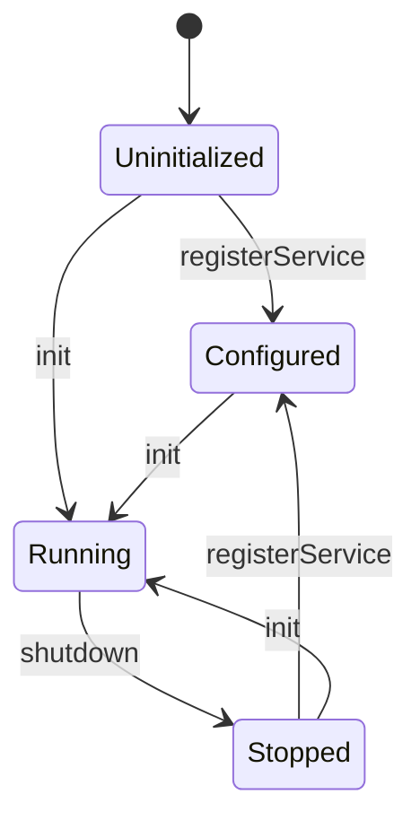

# ADR — Node.js gateway N-API contract v2

- **Status**: **implemented**. Every section below is in place: the surface
  (1), the argument convention (2), the event envelope and its multi-value
  streaming (3), the error codes (4), the lifecycle (5), the async execution (6)
  and the transport-agnostic JSON surface it dispatches to (7). Phases P1–P4 of
  [`plans/gateway-nodejs-amelioration.md`](plans/gateway-nodejs-amelioration.md:1)
  built it; the measurements are in
  [`plans/baseline/BASELINE.md`](plans/baseline/BASELINE.md:1).
- **Scope**: the public surface of the `gateway-nodejs` addon
  ([`gateway_nodejs/src/lib.rs`](gateway_nodejs/src/lib.rs:1))
- **Supersedes**: the surface documented in the root
  [`Readme.md`](Readme.md:790) §12, which no longer matches the code

## Context

The addon exposes seven N-API functions today. Three problems make the current
contract untenable:

1. `init` and `registerService` return a `bool` and swallow the reason; a caller
   cannot distinguish "unknown service name" from "already initialized" from
   "the bridge failed".
2. `callService` is synchronous and, per the measured baseline
   ([`plans/baseline/BASELINE.md`](plans/baseline/BASELINE.md:1)), freezes the
   Node.js event loop for up to 30 s — including on the failure path.
3. The consumer dispatch is a hardcoded table
   ([`consumer.rs`](gateway_nodejs/src/consumer.rs:46)) that already rejects
   `ContextService::get` while `ContextService` is a registered provider.

The consumer surface therefore cannot be described as a contract: nothing ties
it to the services the process actually advertises.

## Decision

### 1. Surface

| JS signature | Notes |
|---|---|
| `registerService(name: string): void` | throws on unknown name, duplicate, or after `init` |
| `init(callback: (err, call) => void): void` | throws if already running or if the bridge cannot be built |
| `callService(service, method, args): Promise<json>` | non-blocking, runs on the libuv pool |
| `callServiceStream(service, method, args): Promise<json[]>` | collects every `next`; rejects on `error` |
| `resolveNodejsCall(correlationId: string, event: Event): void` | unchanged name, typed `Event` |
| `emitNodejsEvent(correlationId: string, event: Event): void` | new: push intermediate events |
| `shutdown(): Promise<void>` | resolves once the IPC resources are released |
| `version(): string` | derived from the real crates, never hardcoded |

`init`'s callback keeps the `(err, call)` shape: the Rust side builds the
ThreadsafeFunction with `callee_handled::<true>()`, which is what
[`provider-context.js`](gateway_nodejs/examples/provider-context.js:100) already
relies on and what the root Readme wrongly documents as `(call) => void`.

### 2. Argument convention (unchanged, already generated)

Owned by [`codegen/json.rs`](ice-rpc-macros/src/codegen/json.rs:1) and kept
identical on the consumer side so both directions agree:

| Arity | On the wire, seen from JS |
|---|---|
| 0 argument | `{}` |
| 1 argument | the value itself (not wrapped) |
| 2+ arguments | `{ "argName": value, … }` |
| `Vec<u8>` argument | base64 string |

### 3. Event envelope (JS → gateway)

```js
{ type: "next",     data: <OkType> }   // one value
{ type: "complete", data?: <OkType> }  // terminal, optional trailing value
{ type: "error",    data: <ErrType> }  // terminal business error
```

`type` defaults to `"next"` when omitted, preserving the current behaviour.
The gateway maps the envelope onto `WireEvent` via the macro-generated
`serialize_response_from_value`, one event per call, which is what makes
`emitNodejsEvent` possible for multi-value streams.

### 4. Error model

Every rejection carries a stable code so JS can branch on it instead of on a
message. `napi::Error` exposes no custom `code` property, so the code is the
**message prefix**: `"<CODE>: <message>"`. That prefix is the contract, and it is
what [`GatewayError`](gateway_nodejs/src/error.rs:1) renders and what the tests
assert on.

| `code` | Raised when |
|---|---|
| `E_GATEWAY_STATE` | `init` called twice, `registerService` after `init`, use before `init` |
| `E_UNKNOWN_SERVICE` | name absent from the gateway's maintained list |
| `E_UNKNOWN_METHOD` | method not part of the Node.js consumer surface |
| `E_INVALID_ARGS` | argument could not be decoded into the declared parameter types |
| `E_NO_PROVIDER` | no peer is connected for the requested service |
| `E_TRANSPORT` | the transport failed for a reason that is not a missing peer |
| `E_TIMEOUT` | the JS dispatcher did not answer within `CALL_TIMEOUT` |
| `E_BUSINESS` | the service returned a business error (or completed with no value) |
| `E_CALLBACK` | the JS dispatcher is unreachable, or dropped a call |
| `E_PENDING_LIMIT` | `MAX_PENDING_CALLS` calls already await a JS answer |
| `E_DUPLICATE_CID` | a call with the same correlation id is already in flight |
| `E_INVALID_CID` | `resolveNodejsCall` received a malformed correlation id |
| `E_UNKNOWN_CID` | no pending call matches the id (expired or answered twice) |

`E_BUSINESS` carries the service's own `Display` output, and `E_TRANSPORT` /
`E_INVALID_ARGS` the message the generated code produced — exactly what the HTTP
gateway already does. The generated consumer dispatch reports a failure *kind*
([`JsonCallError`](ice-rpc/src/json.rs:56)) and the gateway owns
the stable code, so a service never has to make its error type
`serde::Serialize` merely to be callable from Node.js. The only bound the
generator adds on it is `Display`.

### 5. Lifecycle



One state cell replaces the two `OnceLock`s (`SHUTDOWN_GUARD` and `BRIDGE`), so
`init` after `shutdown` is legal (as the state machine above requires) and every
illegal transition is reportable instead of silent.

### 6. Async execution

`callService` is implemented with `napi::bindgen_prelude::AsyncTask<T>`
implementing napi's `Task` trait:

- `compute` runs on the libuv thread pool and calls
  `ice_rpc::rt::block_on(consumer::call_ipc_method(…))`, which dispatches to the
  generated `JsonInvoker` with `ReadMode::First`;
- `resolve` runs on the Node.js main thread and yields the `serde_json::Value`.

Evidence that this needs no extra `napi` feature is in
[`plans/baseline/BASELINE.md`](plans/baseline/BASELINE.md:1) (P0.2 verdict).

### 7. The JSON surface it dispatches to

The addon drives nothing Node-specific in the generated code any more. `#[service]`
emits **one** JSON view per service, whatever the JSON transport:

| Generated | Direction | What it is |
|---|---|---|
| `deserialize_request_to_value(method, bytes)` | host side | rkyv request → `serde_json::Value` |
| `serialize_response_from_value(method, value)` | host side | one event → rkyv `WireEvent` sample |
| `impl JsonInvoker for {Proxy}` | caller side | one match table, `ReadMode` as an argument |

- **Provider direction**: the generated handler reads the events of the registered
  `JsonDispatcher` (`ice_rpc::json::set_json_dispatcher`), one wire sample
  per event — which is what makes `emitNodejsEvent` observable on the wire;
- **Consumer direction**: `callService` / `callServiceStream` reach
  `JsonInvoker::invoke_json(…, ReadMode::First | ReadMode::All)` for the services
  the gateway maintains (`services::maintained_services!`), so the served surface
  is the *declaration*: a declared method is served, an undeclared name is
  reported as `E_UNKNOWN_METHOD`
  without touching the bus.

`ReadMode` is a reading policy, not a difference of contract, which is why it is an
argument rather than a second generated entry point: `call_from_value_all` is gone,
and so is the duplicated match table it carried.

The HTTP gateway consumes that very same `impl JsonInvoker`, so adding a JSON
transport adds no generated code and the two cannot drift apart.

## Consequences

- **Breaking**: `callService` returns a `Promise`; `init`/`registerService`
  throw instead of returning `false`; `shutdown` returns a `Promise`. Callers
  must `await`.
- **Gained**: the event loop is never blocked by an IPC call; a failed call no
  longer costs 30 s; the method surface is generated by `#[service]`, and the
  service list the provider side registers from is the same one the consumer side
  dispatches to, so the two cannot drift.
- **Migration**: the two example scripts and the root Readme §12 are updated in
  the same change as the code, so no shipped document keeps describing the v1
  surface.
