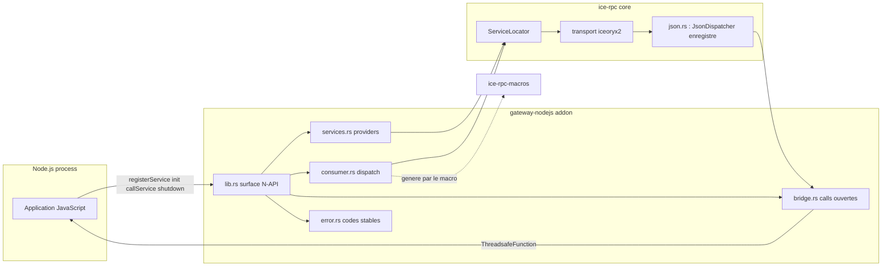
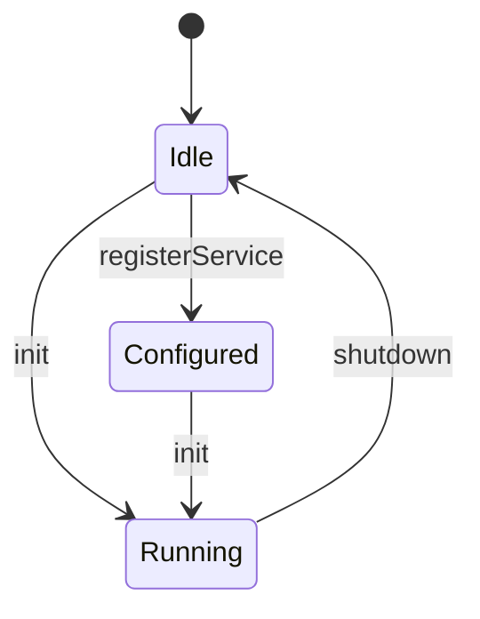

# gateway-nodejs

Node.js gateway for [`ice-rpc`](../ice-rpc/Readme.md): it lets a Node.js process
**provide** and **consume** ice-rpc services — the business logic stays in
JavaScript, the IPC transport stays in Rust over iceoryx2 shared memory.

The gateway is an addon built with [NAPI-RS](https://napi.rs). A service
declared with `#[service("Name")]` in Rust is not implemented in Rust at all: the
generated `ProviderJson` proxy bridges every incoming call to a single
JavaScript dispatcher, and the generated consumer entry points let JavaScript
call any other ice-rpc service of the machine.

The complete contract — signatures, argument convention, event envelope, error
codes and the lifecycle state machine — is in
[`docs/nodejs-gateway-api-v2.md`](../docs/nodejs-gateway-api-v2.md).



## Requirements

- Rust **1.97** or newer (the workspace floor: the optional `http` features pull
  `trillium-http` 1.7.2, which calls `usize::bit_width` — stable since 1.97 —
  without declaring a `rust-version` of its own. The addon itself only needs the
  **1.88** of the napi family).
- Node.js **22.13** or newer — `@napi-rs/cli` requires it, and the addon is built
  with `napi4`/`napi8`.

## Build

```bash
npm ci              # the lockfile is versioned, so `ci` works
npm run build       # release
npm run build:debug # same, unoptimised: what the tests use
```

`npm run build` compiles the Rust cdylib and regenerates `index.js`,
`index.d.ts` and `<platform>.node` — build outputs, not sources: they are
gitignored, so **rebuild after every Rust change**. A stale addon silently
serves the previous API, which is exactly how `index.d.ts` came to advertise a
`Promise`-returning `callService` while the code was synchronous.

## The N-API surface

| JavaScript | Returns | Notes |
|---|---|---|
| `registerService(name)` | `void` | Before `init`. Refuses an unknown name with `E_UNKNOWN_SERVICE`. |
| `init(callback)` | `void` | `callback` is `(err, call)` — not `(call)`. Once per run. |
| `callService(service, method, args)` | `Promise<any>` | Resolves with the first value, without waiting for the stream to end. |
| `callServiceStream(service, method, args)` | `Promise<any[]>` | Resolves with every value, once the stream completed. |
| `emitNodejsEvent(correlationId, event)` | `void` | Pushes an intermediate event, keeps the call open. |
| `resolveNodejsCall(correlationId, event)` | `void` | Sends the terminal event and closes the call. |
| `shutdown()` | `Promise<void>` | Releases the IPC resources; `init` may then run again. |
| `version()` | `string` | Built from the compiled versions, never a literal. |

`callService` and `callServiceStream` run their IPC call on the **libuv thread
pool**: the Node.js event loop is never blocked, not even by a call that takes
30 s to fail.

## Writing a provider

```javascript
const gateway = require('gateway-nodejs');

gateway.registerService('ContextService');   // only what THIS process provides

gateway.init((err, call) => {                // one dispatcher for all services
    if (err) return;
    const { correlationId, service, method, args } = call;
    // `args` is a native JS value: no JSON.parse anywhere.
    const value = store.get(args);
    gateway.resolveNodejsCall(
        correlationId,
        value === undefined
            ? { type: 'error', data: 'KeyNotFound' }   // must fit the declared error type
            : { type: 'next', data: value },
    );
});
```

The argument shapes are generated from the declaration, on both sides:

| Declaration | What JavaScript sees |
|---|---|
| no argument | `args` is ignored |
| one argument | `args` is the value itself |
| two or more | `args` is `{ name: value, … }` |
| `Vec<u8>` | a base64 string |

### Serving a multi-value stream

A method that emits several values is served by pushing each one and closing
once:

```javascript
function handleWatch(correlationId, count) {
    for (let value = 1; value <= count; value += 1) {
        gateway.emitNodejsEvent(correlationId, { type: 'next', data: value });
    }
    gateway.resolveNodejsCall(correlationId, { type: 'complete' });
}
```

Each call becomes its own wire sample, so a consumer sees `count` `Next` events
followed by a `Complete` — exactly what a Rust provider of the same method would
produce. [`examples/provider-notification.js`](examples/provider-notification.js:1)
shows it with a timer, which is the realistic case: the call stays open across
several turns of the event loop.

## Consuming a service

Nothing to declare: the consumer proxy is created on demand, and the methods it
answers to are the ones `#[service]` generated for the service. The **services**
this gateway serves are the list in
[`src/services.rs`](src/services.rs:24) (`maintained_services!`) — its own, not
`common`'s, so a process that maintains a subset says which subset, and the
compiler checks each name against the generated proxies.

```javascript
gateway.init(() => {});   // nothing to dispatch in a pure consumer

const age = await gateway.callService('DatabaseService', 'get_user_age', 'Alice');
const values = await gateway.callServiceStream('NotificationService', 'watch', 3);
```

Failures reject with a **message whose prefix is a stable code**:
`E_NO_PROVIDER`, `E_TIMEOUT`, `E_BUSINESS`, `E_INVALID_ARGS`, `E_UNKNOWN_METHOD`,
… The full table is in the [ADR](../docs/nodejs-gateway-api-v2.md). `napi::Error`
exposes no custom `code` property, so the prefix is the contract.

## Lifecycle and threading



One state cell owns the phase, the bridge and the shutdown guard, so `init` after
`shutdown` is legal and every illegal transition is reported instead of silently
returning `false`.

Two threads are involved and neither is the Node.js main thread:

- **incoming calls** arrive on the transport dispatch thread, which posts the
  call to JavaScript and then reads its events. It waits for the *first* event at
  most `NODEJS_CALL_TIMEOUT` (30 s); after that the call belongs to the service,
  so a long-lived stream is not a timeout;
- **outgoing calls** run on the libuv thread pool.

A table bounds the calls waiting for their first JavaScript event
(`MAX_PENDING_CALLS`), so a dispatcher that never answers cannot grow it without
limit.

## Configuration

Neither the gateway nor `ice-rpc` writes an iceoryx2 configuration file: the
effective configuration is the one iceoryx2 resolves itself, looking for
`./config/iceoryx2.toml` (relative to the current directory), then the user
config directory, then the global one, and falling back to its compiled-in
default. Two processes must agree on the root path to communicate; provide the
same `./config/iceoryx2.toml` — or run on the same machine with the same default —
so they do.

## Tests and benchmark

```bash
cargo test -p gateway-nodejs   # the Rust units: bridge table, codes, lifecycle
npm test                       # the addon's surface, without a bus (7 checks)
npm run test:e2e               # two processes, real IPC round trip (8 checks)
npm run bench                  # latency and throughput of a served call
```

`npm run test:e2e` and `npm run bench` need a provider in a second process, which
is a property of the framework rather than of the test: within one process the
`ServiceLocator` hands back the instance it registered — the `ProviderJson`
proxy — whose methods answer "direct calls are not supported — use IPC". **A
process can therefore not consume a service it provides.**

The measured cost of a served call (200 calls, 32 in flight, one warm-up that
pays discovery):

| | sequential | concurrency 32 |
|---|---|---|
| p50 | 0.072 ms | 0.016 ms |
| p99 | 0.175 ms | 0.021 ms |
| throughput | 12 034 calls/s | 60 912 calls/s |

The first call of a fresh pair costs ~30–50 ms: that is service discovery, not
the bridge.

## Troubleshooting

**A Node.js process dies with a bare `stdout is not a tty` and no other output.**
The shared memory holds services left behind by a process that was killed, and
iceoryx2 aborts while creating its node. Run
`bash ../scripts/purge-iceoryx2-root.sh --yes` (it is a dry run without `--yes`),
then restart every process of the machine. Killing a provider with `SIGKILL` is
what poisons the root: ask it to stop instead, as
[`test/harness.mjs`](test/harness.mjs:1) does with `SIGTERM` first.

**`npm ci` fails, or the addon behaves like an older version.** Rebuild: the
build outputs are gitignored, and a stale `index.d.ts` describes an API the
binary no longer has.

**`EBADENGINE` while installing.** `@napi-rs/cli` needs Node `^22.13.0`; an older
22.x warns and may still work, but the `engines` field says what is supported.

**A call reports `E_NO_PROVIDER` after ~30 s.** That is the core transport's
retry-until-delivered policy: the provider is not connected. It no longer freezes
the Node.js event loop while waiting, but it is still slow by design — check the
provider first.

**A call reports `E_TRANSPORT: ProviderJson: direct calls are not supported`.**
The service is provided by this very process. A service that needs its own values
is a two-process design.

## Layout

```text
src/lib.rs            N-API surface: the whole public contract
src/state.rs          lifecycle: phase, bridge, shutdown guard
src/nodejs_bridge.rs  the pending table and the JS dispatcher
src/services.rs       the maintained list + provider registration
src/consumer.rs       consumer dispatch, driven by that list
src/error.rs          GatewayError and the stable codes
test/provider-child.mjs  the provider used by the two-process checks
test/contract.test.mjs   surface checks, no bus, no spawn
test/e2e-roundtrip.mjs   real round trips, two processes
test/bench-bridge.mjs    latency and throughput
examples/             provider, consumer and multi-value examples
```
