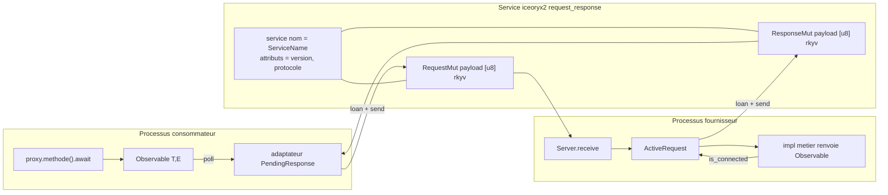

# Plan de simplification — ice-rpc (v3)

> **Changement de cap.** Les v1/v2 proposaient surtout de *réorganiser* le code.
> Cette v3 vise la véritable simplification de la maintenance : **supprimer le
> code maison que `iceoryx2` et `rkyv` fournissent déjà**. Le constat est qu'une
> grande partie du cœur actuel réimplémente à la main des primitives natives
> d'iceoryx2 (requête/réponse, corrélation, découverte, liveness).

## 1. Objectif

Réduire le volume et la surface de maintenance en réutilisant les primitives
natives d'iceoryx2 0.9.3, au lieu de maintenir un hub maison. L'API publique
évolue en conséquence, mais c'est un **effet secondaire** : le but premier est
l'interne.

## 2. Ce qu'iceoryx2 0.9.3 fournit déjà (vérifié dans la source)

| Capacité | Emplacement (source iceoryx2) | Statut |
|---|---|---|
| **Request-Response** (`Client`/`Server`) | `src/port/client.rs`, `src/port/server.rs` | disponible par défaut |
| **Streaming de réponses** (N réponses par requête) | `src/active_request.rs` (`is_connected`, boucle `loan_uninit`), `src/pending_response.rs` (`receive`) | disponible |
| **Annulation par le client** (drop = serveur informé) | `src/pending_response.rs` (doc l. 48-52) | disponible |
| **Découverte + attributs** | `src/service/attribute.rs` (`AttributeSpecifier`, `AttributeVerifier`, `Service::list`) | disponible |
| **QoS requête/réponse** | `src/service/mod.rs` (`max_active_requests_per_client`, `max_loaned_requests`, `max_response_buffer_size`, `max_servers`, `max_clients`, safe-overflow, fire-and-forget) | disponible |
| **Liveness native** | monitoring de nœuds (`node_liveness` déjà utilisé) | déjà utilisé |
| **WaitSet + signaux** | `waitset`, `SignalHandlingMode` | déjà utilisé |
| **Nettoyage des ressources mortes** | `try_cleanup_dead_nodes` | déjà utilisé |

**Preuve que le streaming est supporté** — citations de la source `iceoryx2-0.9.3` :

- `src/service/messaging_pattern.rs:67-68` : le pattern `RequestResponse` est décrit
  comme « the Client sends arbitrary data in form of requests to the Server and
  **receives a stream of responses** ».
- `src/active_request.rs:83-84` : « The Server will use it to **send arbitrary many
  Responses**. »
- Les méthodes de `ActiveRequest` prennent toutes `&self` (elles ne consomment pas
  l'objet, donc on peut les rappeler) : `send_copy` (l. 398), `loan` (l. 443),
  `loan_slice` (l. 497), `loan_slice_uninit` (l. 549).
- `src/active_request.rs:227` : `pub fn is_connected(&self) -> bool` — la boucle
  serveur continue tant que le client écoute.
- `src/pending_response.rs:312` et `:381` :
  `pub fn receive(&self) -> ... Option<Response>` — le client appelle `receive`
  en boucle ; `is_connected` (l. 216) et `number_of_server_connections` (l. 248).

```rust
// iceoryx2 — exemple officiel ActiveRequest (src/active_request.rs, l. 28-40)
// send a stream of responses until the corresponding client
// lets the pending response go out-of-scope
while active_request.is_connected() {
    let response = active_request.loan_uninit()?;
    response.write_payload(456).send()?;
}
// iceoryx2 — exemple officiel PendingResponse (src/pending_response.rs, l. 31-52)
// we receive a stream of responses from the server and are interested in 5 of them
for _ in 0..5 {
    if !pending_response.is_connected() { break; }
    if let Some(response) = pending_response.receive()? { /* ... */ }
}
drop(pending_response); // informe les serveurs : plus aucune réponse attendue
```

Il n'existe **aucune limite de nombre de réponses** : `max_response_buffer_size`
est une QoS de **tampon** (profondeur de file), pas un plafond de réponses. Le mode
requête/réponse est un `MessagingPattern` de premier ordre, disponible avec les
features par défaut d'`iceoryx2` (`std`, `console`) : aucune feature à activer.

## 3. Cartographie : code maison remplaçable

| Module actuel | Lignes (approx.) | Primitive iceoryx2 qui le remplace | Sort |
|---|---|---|---|
| [`hub.rs`](../ice-rpc/src/hub.rs:1) | ~830 | `request_response` : `Client`, `Server`, `ActiveRequest`, `PendingResponse` | **supprimé** |
| [`types/header.rs`](../ice-rpc/src/types/header.rs:1) corrélation | ~150 | corrélation interne de `PendingResponse` (`RequestId`) ; en-tête natif | **supprimé / réduit** |
| [`node_discovery.rs`](../ice-rpc/src/node_discovery.rs:1) | plusieurs centaines | `Service::list` + attributs de service | **supprimé** |
| [`blackboard.rs`](../ice-rpc/src/blackboard.rs:1) | plusieurs centaines | `AttributeSpecifier` / `AttributeVerifier` | **supprimé** |
| [`registry_notify.rs`](../ice-rpc/src/registry_notify.rs:1) / [`registry_listener.rs`](../ice-rpc/src/registry_listener.rs:1) | centaines | découverte native iceoryx2 | **supprimés** |
| [`node_supervisor.rs`](../ice-rpc/src/node_supervisor.rs:1) / [`reconnect_manager.rs`](../ice-rpc/src/reconnect_manager.rs:1) | centaines | `number_of_server_connections`, `is_connected`, ré-open du service | **réduits / supprimés** |
| [`client_core.rs`](../ice-rpc/src/client_core.rs:1) (machine à états) | plusieurs centaines | cycle de vie `PendingResponse` | **réduit** |
| Boucle de dispatch (WaitSet drain) | dans `hub.rs` | `server.receive()` + `pending_response.receive()` | **supprimée** |
| `WireEvent::CompleteWith` (mono-échantillon) | [`wire.rs`](../ice-rpc/src/types/wire.rs:94) | streaming natif : 1 réponse = 1 échantillon | **simplifié** |
| `OnDropCleanup` (C14) | [`stream.rs`](../ice-rpc/src/types/stream.rs:59) | `drop(PendingResponse)` / `is_connected()` | **simplifié** |
| Constantes registry (clé 64, `MAX_SERVICES_PER_NODE`) | [`consts.rs`](../ice-rpc/src/types/consts.rs:71) | attributs de service | **supprimées** |

## 4. Architecture cible



Points remarquables :

- Un **service iceoryx2 request-response par service logique** (`ice_rpc/{Service}`),
  au lieu d'un topic par nœud + corrélation maison.
- `Observable<T, E>` devient un **adaptateur** au-dessus de `PendingResponse`
  (pull) ; le provider devient un **adaptateur** au-dessus d'`ActiveRequest`.
- La découverte repose sur `Service::list` + attributs (`service`, `version`,
  `protocol`), sans blackboard maison.
- L'annulation consommateur est native : `drop(PendingResponse)` rend
  `ActiveRequest::is_connected()` faux côté serveur.

## 5. Axes de simplification

### F1 — Transport : mode requête/réponse natif

- **Avant** : `hub.rs` gère publishers par nœud, handlers de requêtes/réponses,
  `correlation_id`, `pending_calls`, boucle de dispatch, segmentation `_default`/`_large`.
- **Après** : `service_builder(...).request_response::<[u8], [u8]>()` ;
  `client.loan_slice_uninit(n).write_from_fn(...).send()` → `PendingResponse` ;
  `server.receive()` → `ActiveRequest`.
- **Suppressions** : `hub.rs`, `header.rs` (corrélation), la boucle de dispatch,
  `pending_calls`, `response_handlers`, `requests_handlers`.
- **Risque** : un client peut atteindre **plusieurs serveurs** (broadcast
  natif). Il faut décider : first-wins, ou exiger un serveur unique via QoS.

### F2 — Découverte : attributs de service

- **Avant** : 1 Blackboard par nœud + événements de registre + cache local +
  superviseur de nœuds + liveness croisée.
- **Après** : `create_with_attributes(AttributeSpecifier::new().define("service", name)...)`
  et `service_builder(...).open_with_attributes(&AttributeVerifier...)` ;
  `Service::list(Config::global_config(), |s| s.static_details.attributes())`.
- **Suppressions** : `blackboard.rs`, `registry_notify.rs`, `registry_listener.rs`,
  `node_discovery.rs`, `node_supervisor.rs`, les constantes `REGISTRY_*`.
- **Gain** : la découverte devient une lecture de registre native, sans protocole
  maison ni encodage de clé `[u8; 64]`.

### F3 — Liveness et nettoyage

- Déjà natif (monitoring des nœuds, `try_cleanup_dead_nodes`).
- Après F1/F2, `node_liveness.rs` se réduit à du diagnostic ; la mort d'un
  fournisseur est détectée par la disparition du service et/ou la fermeture de la
  connexion `PendingResponse`.

### F4 — Sérialisation rkyv et fin de flux implicite

- **Conserver rkyv** : les payloads des méthodes sont hétérogènes et
  variable-length (`String`, `Vec`), ce que `ZeroCopySend` ne couvre pas
  directement. On garde donc `[u8]` + rkyv comme payload de requête/réponse.

- **Le terminal n'est plus un message transporté** : avec le request-response,
  la fin de flux est la **fermeture de connexion** (`PendingResponse` épuisé /
  serveur qui *drop* l'`ActiveRequest`), pas une trame `Complete`. Conséquences :
  - seuls les **valeurs** (`Next`) et les **erreurs** (`Error`) voyagent ; `Complete`
    n'est plus un échantillon ;
  - `WireEvent` s'effondre : plus besoin de `Complete`, `CompleteWith`, ni des
    variantes de transport — il ne reste que « valeur ou erreur » ;
  - `CompleteWith`, `normalize_wire_event`, le champ `pending` de `Observable` et
    `recv_wire` **disparaissent entièrement** (ce qui supprime aussi le dernier
    reliquat de mutualisation dans la variante transport).

- **Coût transport** : N valeurs = N échantillons (inchangé par rapport à
  `CompleteWith`), et le terminal = **0 échantillon** au lieu d'un `Complete`
  explicite. C'est donc **strictement moins de transport** pour une réponse
  mono-valeur terminale / un flux vide, et à égalité pour N valeurs.

- **Point à trancher** : distinguer une **fin normale** d'une **déconnexion
  abrupte** (crash du fournisseur), puisque `is_connected()` vaut `false` dans les
  deux cas côté client. Politique proposée : une erreur est **toujours** un
  échantillon `Error` explicite ; une fermeture sans `Error` = fin normale, et
  l'abrupt est détecté par la disparition du service / `number_of_server_connections`
  qui tombe à zéro (ou la liveness native), puis mappé en erreur technique.

- **Simplifier aussi rkyv** : encoder directement `Event<T,E>` (un seul type wire
  public au lieu de deux) ; utiliser `rkyv::access` / une validation explicite
  pour les lectures, et un unique chemin d'erreur `rancor::Error`.

- **Gain** : un seul type d'événement, plus de `CompleteWith` ni de normalisation
  dans `Observable`, `recv_wire` et `pending` supprimés.

### F5 — Async / runtime

- Après F1, la boucle de dispatch maison et une grande partie de la
  synchronisation (`async-lock`, `async-channel` pour la livraison des réponses,
  `futures-timer` pour le polling) peuvent être revisitées :
  - les réponses sont reçues par `PendingResponse::receive()` (non bloquant),
    pilotées par `Listener` ou par un thread bloquant dédié ;
  - `async-channel` peut rester en interne, mais sort de la boucle de transport.
- **Objectif** : réduire la surface d'`async-*` au strict nécessaire et supprimer
  la machine à états de reconnexion.

### F6 — Codegen

- Adapter `client.rs` / `server.rs` à un petit **trait interne `Transport`** afin
  de supporter les deux backends pendant la transition, puis retirer l'ancien.
- Le `MethodModel` unifié (ex-item C1) devient le point d'entrée unique de cette
  adaptation.

---

## 6. Migration et coexistence

1. **Trait `Transport`** (interne) : `send(request) -> ResponseStream` côté
   client, `recv() -> (Request, Responder)` côté serveur.
2. **Deux implémentations** : `hub` (actuel) et `reqres` (natif iceoryx2),
   sélectionnées par une feature `native-transport`.
3. **Validation croisée** : les tests `ipc_integration`, `crash_reconnect`,
   `signal_shutdown` doivent passer avec la feature activée avant suppression de
   l'ancien backend.
4. **Suppression** une fois `native-transport` vert : modules listés en section 3.

### Différences de comportement à trancher

- **Multi-serveurs** : `request_response` diffuse la requête à tous les serveurs
  connectés ; définir la politique (first-wins, ou `max_servers = 1`).
- **Mono-valeur** : plus d'optimisation `CompleteWith` ; une réponse =
  un échantillon (impact perf à mesurer).
- **Backpressure / overflow** : choisir `BackpressureStrategy` et les QoS
  (`max_response_buffer_size`, safe-overflow) pour retrouver le comportement actuel.
- **Compatibilité de payload** : ajouter `protocol`/`version` dans les attributs
  et les vérifier à l'`open` (`AttributeVerifier`).

## 7. Risques

| Risque | Impact | Mitigation |
|---|---|---|
| Broadcast multi-serveurs non souhaité | Élevé | politique explicite + tests dédiés |
| Perte de l'optimisation mono-échantillon | Moyen | mesurer ; éventuellement encoder `Next+Complete` dans une seule réponse |
| Stabilité de l'API iceoryx2 request-response | Moyen | trait `Transport` isole le couplage ; pin de version |
| Comportement Windows (shm, nettoyage) | Moyen | tests `ipc_integration` sous Windows |
| Perte de fonctionnalités du hub (large payload par nœud) | Faible | slice API + `AllocationStrategy` |
| Volume de changement | Élevé | feature flag + suppression progressive, jamais un big-bang |

## 8. Ordre d'exécution

| Ordre | Item | Dépend de | Nature |
|---|---|---|---|
| 1 | F0 — spike : 1 service aller-retour + streaming en feature flag | — | prototype |
| 2 | F1 — trait `Transport` + backend `reqres` | F0 | interne |
| 3 | F2 — découverte par attributs | F1 | interne |
| 4 | F3 — liveness/nettoyage natif | F2 | interne |
| 5 | F4 — rkyv consolidé, suppression `WireEvent`/`CompleteWith` | F1 | interne |
| 6 | F6 — codegen sur `Transport` | F1 | interne |
| 7 | Suppression `hub`/`header`/`blackboard`/`registry_*`/`node_discovery`/`node_supervisor`/`reconnect_manager` | F1..F4 | interne |
| 8 | F5 — réduction de la surface async | F4 | interne |
| 9 | A1/A4/A5 (constantes, lints, toposort) | — | interne, indépendant |
| 10 | E4 prelude + E1/E2/E3 API | F1 | API |
| 11 | D1 docs | — | documentation |

> Les items v1/v2 **B1** (découper `hub.rs`) et **B3** (regrouper `discovery/`)
> deviennent sans objet : ces modules sont supprimés plutôt que réorganisés.
> Le codegen unifié (ex-`C1`) est fusionné dans F6.

## 9. Validation

- `cargo fmt --all`, `cargo clippy --workspace --all-targets -- -D warnings`,
  `cargo test --workspace` à chaque étape.
- Les deux backends (feature `native-transport` on/off) passent la même suite :
  `ipc_integration`, `crash_reconnect`, `signal_shutdown`, `ice-rpc-macros-tests`.
- Un banc de performance minimal (réutiliser l'ancien `perf_probe`, supprimé
  volontairement) comparant les deux backends avant bascule.

## 10. Métriques de succès

- Nombre de modules supprimés : `hub.rs`, `blackboard.rs`, `registry_notify.rs`,
  `registry_listener.rs`, `node_discovery.rs`, `node_supervisor.rs`,
  `reconnect_manager.rs` (~7 modules), plus `header.rs` réduit.
- Suppression de la corrélation maison, des publishers par nœud et de la boucle
  de dispatch.
- `Observable` ne porte plus de variante `Transport` complexe ni `recv_wire`/`CompleteWith`.
- `cargo test --workspace` vert sur les deux backends, puis suppression de l'ancien.

## 11. Impact quantifié (mesuré par `wc -l`)

### Modules supprimés d'un coup — 2 208 lignes

| Module | Lignes |
|---|---|
| [`hub.rs`](../ice-rpc/src/hub.rs:1) | 829 |
| [`node_discovery.rs`](../ice-rpc/src/node_discovery.rs:1) | 447 |
| [`blackboard.rs`](../ice-rpc/src/blackboard.rs:1) | 314 |
| [`reconnect_manager.rs`](../ice-rpc/src/reconnect_manager.rs:1) | 210 |
| [`node_supervisor.rs`](../ice-rpc/src/node_supervisor.rs:1) | 181 |
| [`registry_listener.rs`](../ice-rpc/src/registry_listener.rs:1) | 125 |
| [`registry_notify.rs`](../ice-rpc/src/registry_notify.rs:1) | 102 |

### Modules fortement réduits — ~1 000 lignes en moins

| Module | Lignes actuelles | Ce qui disparaît |
|---|---|---|
| [`locator.rs`](../ice-rpc/src/locator.rs:1) | 708 | inscription, découverte, lifecycle du nœud |
| [`lib.rs`](../ice-rpc/src/lib.rs:1) | 692 | bootstrap/dispatch, plumbing de shutdown |
| [`types/wire.rs`](../ice-rpc/src/types/wire.rs:1) | 310 | `WireEvent`, `CompleteWith` |
| [`client_core.rs`](../ice-rpc/src/client_core.rs:1) | 368 | machine à états de connexion/reconnexion |
| [`node_liveness.rs`](../ice-rpc/src/node_liveness.rs:1) | 324 | réduction au diagnostic |
| [`types/stream.rs`](../ice-rpc/src/types/stream.rs:1) | 454 | variante `Transport`, `recv_wire`, `pending` |
| [`types/header.rs`](../ice-rpc/src/types/header.rs:1) | 163 | corrélation maison |
| codegen `client`/`server`/`lifecycle` | 247 / 357 / 240 | routage et enregistrement des handlers |

### Code ajouté — ~400 à 600 lignes

- trait interne `Transport` + backend `reqres` : ~300-400 lignes ;
- découverte par attributs : ~100-150 lignes ;
- adaptateur `Observable` ↔ `PendingResponse` : ~100 lignes.

### Bilan

**Net estimé : −2 500 à −3 000 lignes**, **7 modules supprimés**, et surtout la
disparition d'une catégorie entière de bugs maison (collisions de corrélation,
fuites de `response_handlers`, courses de routage par nœud, cohérence
blackboard/registre, machine à états de reconnexion).

Ce qui est supprimé n'est pas compensé par plus de complexité ailleurs : on
remplace un **transport maison** par un **transport fourni**, et la maintenance
passe de « la justesse de notre boucle de dispatch » à « le bon réglage des QoS ».

## 12. Hors périmètre

- Le protocole logique (méthodes, sémantique des `Observable`) reste identique vu
  de l'utilisateur.
- Pas de changement de format rkyv au-delà de la suppression de `WireEvent`.
