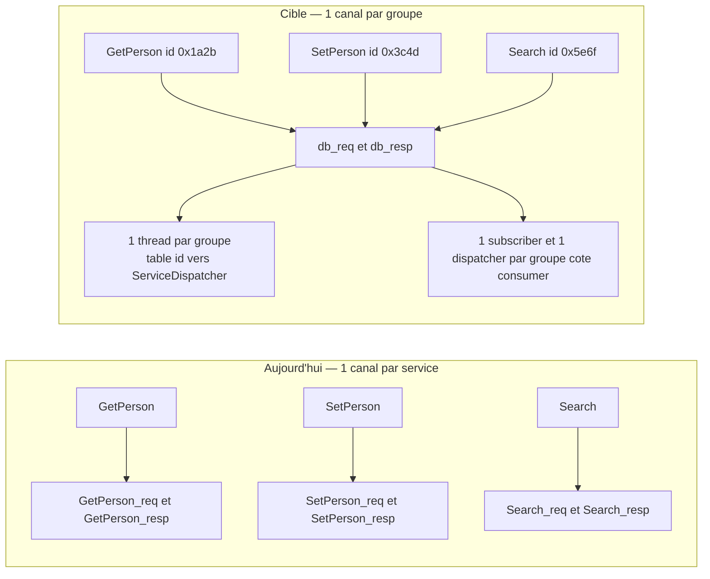

# Plan — Réduire le nombre de canaux : le groupe comme unité de transport

> Suite de [`plans/simplification.md`](simplification.md) et des commits `c6d66ed`
> (header zero-copy) et `2615e0c` (signaux, CPU, buffers).
> Objectif de charge : **~50 services par exécutable**.

## 1. Problème

Aujourd'hui, un service logique = une paire de canaux + 2 services *event* :

| Ressource | Par service logique | Pour 50 services |
|---|---|---|
| Services iceoryx2 | 4 (`_req`, `_resp`, `_req_notify`, `_resp_notify`) | **200** |
| Segments de données | 2 | **100** |
| Threads de dispatch | 1 | **50** |
| Mémoire, `max_loaned_samples = 16 384` | ~2 × 6,5 Mo | **~325 Mo** |
| Mémoire, `max_loaned_samples = 1024` | ~2 × 410 ko | ~20 Mo |

Le pattern est bon (pub/sub + corrélation par cid + WaitSet + header zero-copy) ;
c'est la **granularité du canal** qui ne passe pas l'échelle. Le nombre de canaux
doit devenir indépendant du nombre de services.

## 2. Décision

**Le canal devient le « groupe » de services**, déclaré à la compilation.

- `#[service("GetPerson", group = "db")]` : tous les services de `group` partagent
  **une** paire de canaux (`db_req` / `db_resp`) et **un** thread de dispatch.
- `group` a pour défaut **le nom du service** → le comportement actuel est
  strictement préservé (`G = N`). La réduction est *opt-in*.
- L'aiguillage se fait sur un `service_id: u32` ajouté au [`RpcHeader`](../ice-rpc/src/types/header.rs:44),
  calculé par la macro (`const`, FNV-1a 32 bits) → **même valeur des deux côtés,
  sans coordination ni découverte**. Le groupe est un nom connu statiquement par
  le provider *et* par le consumer : rien à résoudre au runtime.
- `G = nombre de groupes` : `G = N` redonne l'architecture actuelle, `G = 1` donne
  le canal unique par nœud. **Un seul curseur, un seul code.**

Ce qui n'est **pas** ajouté : blackboard, attributs interrogés au runtime,
`Service::list` sur le hot path, cache de découverte à invalider, machine à
états de reconnexion, pattern `request_response` natif.

## 3. Format de trame

[`RpcHeader`](../ice-rpc/src/types/header.rs:44) gagne un champ ; l'ajout tient
dans le budget du layout (alignement 8, **≤ 128 octets**, pinné par un test
unitaire) :

| Champ | Type | Rôle |
|---|---|---|
| `correlation_id` | `[u8; 16]` | pid ++ compteur, unique par appel |
| `service_id` | **`u32` (nouveau)** | id du service cible dans le canal du groupe |
| `method_name` | `StaticString<64>` | méthode ciblée |
| `event_kind` | `u8` | `Request` / `Next` / `Complete` / `Error` |
| `protocol_version` | `u16` | version de trame, vérifiée à la réception |
| `service_version` | `u16` | version d'API du service |

- **Requête** : `service_id` + `method_name` renseignés.
- **Réponse** : `correlation_id` seul suffit (routage par la table
  [`response_handlers()`](../ice-rpc/src/transport.rs:262)) ; `service_id` est
  recopié pour le diagnostic.
- L'id est calculé **une fois, à l'expansion de la macro**, et émis en littéral :

  ```rust
  // ice-rpc-macros
  pub(crate) const fn service_id_of(name: &str) -> u32;   // FNV-1a 32 bits
  // généré :
  pub const GET_PERSON_SERVICE_ID: u32 = 0x1a2b_3c4d;
  ```

- **Collision** (32 bits, ~3·10⁻⁷ à 50 services) : détectée au démarrage côté
  provider (deux `service_id` identiques dans une table de canal → erreur
  explicite, `initialize_all` échoue) ; filet de sécurité côté transport : si la
  méthode reçue n'existe pas dans le dispatcher retenu, journaliser
  « service_id collision probable » au lieu d'un simple « unknown method ».

## 4. Topologie cible



Ressources pour 50 services, selon la taille de groupe :

| Granularité | Canaux | Services iceoryx2 | Segments | Threads (par process) | Mémoire à 1024 emprunts |
|---|---|---|---|---|---|
| `G = 50` (actuel) | 50 | 200 | 100 | 50 | ~20 Mo |
| `G = 7` (groupes de ~8) | 7 | 28 | 14 | 7 | ~2,9 Mo |
| `G = 1` (canal unique) | 1 | 4 | 2 | 1 | ~0,4 Mo |

Sur la base mesurée de ~350k req/s pour un canal et un thread, un groupe reste
sain en dessous de ~50k req/s ; un service plus chaud que cela doit être **seul
dans son groupe**.

## 5. Impact par fichier

### `ice-rpc/src/types/header.rs`
- `RpcHeader { …, service_id: u32, … }` ; `RpcHeader::request(method, service_id, service_version)`.
- Tests : `service_id` transmis, taille du header inchangée (104 o).

### `ice-rpc/src/transport.rs` — le gros du travail
| Aujourd'hui | Cible |
|---|---|
| `open_service(node, service_name, suffix)` | inchangé, mais reçoit un **nom de canal** |
| `consumer_ports(service_name)` | `consumer_ports(channel)` — cache déjà par clé String |
| `native_call(service_name, method, payload)` | `native_call(channel, service_id, method, payload)` |
| `spawn_native_service(service_name, dispatcher, stop)` | `spawn_native_service(channel, Vec<(u32, ServiceDispatcher)>, stop)` |
| `spawn_response_dispatcher(service_name, …)` | inchangé (routage déjà par cid) |
| boucle provider : `dispatcher(method, payload)` | `table.get(&service_id)` → saut + log si absent |

Boucle de réception du provider (cœur du changement, ~10 lignes) :

```rust
let header = *sample.user_header();
let Some(dispatcher) = table.get(&header.service_id) else {
    log::warn!("[transport] '{channel}': unknown service_id {:#x}", header.service_id);
    continue;
};
for response in dispatcher.dispatch(header.method(), &sample[..]) { … }
```

**Ordre de démarrage (point délicat).** Aujourd'hui chaque service démarre son
thread dans son `on_init`. Avec un canal partagé, un thread démarré trop tôt
verrait des requêtes dont le `service_id` n'est pas encore enregistré → requête
perdue sans réponse (le consumer attend alors indéfiniment). Solution retenue :
le provider **enregistre** `(canal, service_id, dispatcher)` pendant ses `on_init`
(avec détection de collision), et les threads de canal sont démarrés **après**
tous les `on_init`, dans la dernière étape de
[`ServiceLocator::initialize_all()`](../ice-rpc/src/locator.rs:140) :

```rust
pub fn start_registered_channels();   // un thread par canal, table figée
```

Ainsi « un subscriber existe » implique de nouveau « le provider est prêt », ce
qui est la garantie sur laquelle repose
[`publish_until_delivered()`](../ice-rpc/src/transport.rs:724).

### `ice-rpc/src/types/consts.rs`
- `GROUP_NAME_LEN = 64` (validé par la macro comme `SERVICE_NAME_LEN`).

### `ice-rpc-macros`
- [`ServiceAttr`](../ice-rpc-macros/src/lib.rs:51) : nouveau champ `group` (défaut =
  nom du service), validé (longueur, caractères) comme le nom de service.
- `service_id_of()` en `const fn` + émission du littéral `*_SERVICE_ID`.
- [`lifecycle.rs`](../ice-rpc-macros/src/codegen/lifecycle.rs:22) : `Provider` et
  `ProviderNodeJs` enregistrent le service sur son canal au lieu de démarrer un
  thread ; le codegen ne connaît pas les autres traits, c'est le registre runtime
  qui regroupe.
- [`client.rs`](../ice-rpc-macros/src/codegen/client.rs:97) : `native_call(channel,
  SERVICE_ID, method, payload)`.

### `ice-rpc/src/gen.rs`
- Re-exporter `start_registered_channels` (façade `#[doc(hidden)]`, contrat testé
  par [`gen_contract.rs`](../ice-rpc-macros-tests/tests/gen_contract.rs:1)).

## 6. QoS à retenir

Défauts iceoryx2 vérifiés dans la source :
`max_subscribers = 8`, `max_publishers = 2`, `max_nodes = 20`
([`config.rs:336-343`](../../C:/Users/max/.cargo/registry/src/index.crates.io-1949cf8c6b5b557f/iceoryx2-0.9.3/src/config.rs:336)),
event : `max_listeners = 16`, `max_notifiers = 16`, `max_nodes = 36`,
`event_id_max_value = 255` ([`config.rs:382-386`](../../C:/Users/max/.cargo/registry/src/index.crates.io-1949cf8c6b5b557f/iceoryx2-0.9.3/src/config.rs:382)).
`max_nodes` = « combien de processus peuvent ouvrir le service en même temps ».

| QoS | Aujourd'hui | Cible | Pourquoi |
|---|---|---|---|
| `max_publishers` | 1 | **16** | sur un canal de groupe, chaque processus consommateur publie ses requêtes |
| `max_subscribers` | 8 | **16** | un subscriber par processus et par groupe |
| `max_nodes` | 20 (défaut) | **32** | processus qui ouvrent le même canal |
| `max_loaned_samples` | 16 384 | **1024** | dimensionne le segment du publisher : `loans × ~400 o` |
| `subscriber_max_buffer_size` | 16 384 | **1024** | file d'offsets du subscriber (~8 o/entrée) |
| `initial_max_slice_len` | 256 | 256 | inchangé |
| `enable_safe_overflow` | `false` | `false` | le plein devient rétroaction, pas perte |

La baisse des buffers n'est sûre que **parce que** `enable_safe_overflow(false)`
est déjà en place. À exposer par service plus tard
(`#[service(..., buffer = 256)]`) pour ne pas imposer 1024 à un service à faible
débit.

## 7. Étapes d'implémentation

Chaque étape compile, passe la suite et peut être un commit séparé (jamais de
big-bang).

1. **Header** : `service_id` ajouté, toujours renseigné, **ignoré** par la
   réception. Tests unitaires de taille et de round-trip.
2. **Transport par canal** : `channel` au lieu de `service_name` dans
   `open_service` / `consumer_ports` / `native_call` / `spawn_native_service`,
   table `Vec<(u32, ServiceDispatcher)>`. À ce stade `G = N` (un service par
   canal) : comportement identique, tests inchangés.
3. **Registre de canaux + démarrage différé** : enregistrement pendant les
   `on_init`, `start_registered_channels()` en fin d'`initialize_all`, détection
   de collision de `service_id`.
4. **Macro `group`** : attribut, défaut = nom du service, `SERVICE_ID` const,
   codegen `lifecycle`/`client` adapté. Test : deux services dans un même groupe.
5. **QoS** : 16 / 16 / 32, `max_loaned_samples` et buffer à 1024.
6. *(optionnel)* **Un service event par nœud** avec `EventId::new(index_groupe)`
   (relever `max_notifiers`/`max_listeners` et `event_id_max_value`) :
   2G → 1 service event. Réveil superflu à ignorer dans le callback.

## 8. Tests et critères d'acceptation

- [`roundtrip.rs`](../ice-rpc-macros-tests/tests/roundtrip.rs:1) : cas mono-service
  inchangé (défaut `group = service`) **et** nouveau cas « deux services, un seul
  groupe, 8 threads concurrents » (0 erreur, `p99` comparable).
- Deux providers distincts dans le même groupe sur des services différents :
  la table contient les deux `service_id`, chacun répond à ses requêtes.
- Collision : deux services du même groupe forcés au même id → l'initialisation
  échoue avec un message explicite.
- `cargo test --workspace` vert (dont `ipc_integration`, `crash_reconnect`,
  `signal_shutdown`, `gen_contract`, trybuild).
- `scripts/bench-load.sh` : 3 modes, 100 % de succès, `blast` sans erreur.
- Mesure de mémoire : `WS` du provider avec 4 services (avant/après) et, en
  option, un test à 50 services générés pour valider le tableau du §4.

## 9. Risques

| Risque | Impact | Mitigation |
|---|---|---|
| Un groupe sature son thread (goulot) | Moyen | garder un service chaud seul dans son groupe ; seuil ~50k req/s |
| Collision de `service_id` | Faible | erreur au démarrage + log ciblé si la méthode est inconnue |
| Requêtes reçues avant l'enregistrement du dispatcher | Élevé | démarrage des threads après tous les `on_init` (§5) |
| Grand nombre de publishers par canal | Faible | `max_publishers = 16`, à relever si la flotte grandit |
| Le consumer reçoit les réponses de tout le groupe | Faible | routage par cid, inconnues ignorées |

## 10. Hors périmètre

- Découverte par attributs de service (`Service::list`) : indépendante, à faire
  plus tard si le versioning doit être vérifié à l'`open`.
- Canal unique par nœud en **défaut** : c'est `group` unique, déjà permis par ce plan.
- Retour au pattern `request_response` natif d'iceoryx2.
