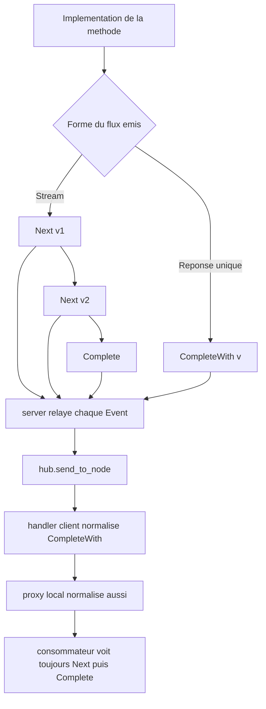

# Plan d'implémentation — suppression du cache, `CompleteWith(T)` transparent + crate `ice-rpc-rx`

## 1. Objectif

1. **Supprimer le cache TTL consommateur** (attribut `#[cache]`), concept jugé
   inadapté au modèle stream et au transport quasi-instantané ; un éventuel cache
   doit vivre dans la logique métier du provider.
2. **Réduire le nombre de messages IPC** pour une réponse RPC simple : le
   producteur émet la valeur dans un terminal unique `Event::CompleteWith(v)`
   (1 message au lieu de 2).
3. **Créer une couche réactive** `ice-rpc-rx` (`Subject`, `ShareReplay`,
   `map`/`filter`/`take`) au-dessus d'`ice-rpc`.

**Principes de conception (issus de l'analyse critique) :**
- Le **payload filaire reste l'enum `Event<T, E>` complet** : aucune
  micro-optimisation du tag enum, aucun changement du hub ni de `ResponseHandler`.
- La **normalisation est appliquée partout** (handler client **et** proxy local) :
  le consommateur voit toujours `Next` + `Complete`, quel que soit le mode.
  `CompleteWith` est un outil d'**écriture** (provider), jamais de lecture.
- Le serveur **ne décide rien** : il relaie le flux tel quel.

Le projet n'étant pas en production, **aucune rétrocompatibilité n'est requise**.

---

## 2. État actuel

### 2.1 Types fondamentaux — [`types.rs`](ice-rpc/src/types.rs)

- [`Event<T, E>`](ice-rpc/src/types.rs:39) :

  ```rust
  pub enum Event<T, E> {
      Next(T),            // valeur intermédiaire
      Complete,           // fin normale du stream (terminal)
      Error(E),           // erreur métier (terminal)
      RpcError(RpcError), // erreur technique RPC (terminal)
  }
  ```

- [`EventKind`](ice-rpc/src/types.rs:146) : `Request = 0`, `Next = 1`,
  `Complete = 2`, `Error = 3`.
- [`EventKind::is_terminal()`](ice-rpc/src/types.rs:161) : `Complete` et `Error`.
- [`Observable<T, E>`](ice-rpc/src/types.rs:51) = `Result<Stream<T, E>, RpcError>`.
- [`Stream<T, E>`](ice-rpc/src/types.rs:57) = `async_channel::Receiver<Event<T, E>>`.

### 2.2 Côté serveur — [`server.rs`](ice-rpc-macros/src/codegen/server.rs)

[`gen_server_match_arm()`](ice-rpc-macros/src/codegen/server.rs:261) boucle sur le
flux et, pour chaque `Event`, sérialise l'enum complet et l'envoie via
[`send_to_node()`](ice-rpc/src/hub.rs:205) :

```rust
while let Ok(event) = stream.recv().await {
    let kind = match &event {
        Event::Next(_)  => EventKind::Next,
        Event::Complete => EventKind::Complete,
        Event::Error(_) => EventKind::Error,
        Event::RpcError(_) => EventKind::Error,
    };
    // sérialise `event` complet -> guard
    let resp_header = RpcHeader::response_from(&hdr, kind, service_version);
    hub.send_to_node(client_node, resp_header, &*guard);
    if kind.is_terminal() { break; }
}
```

### 2.3 Côté client — [`client.rs`](ice-rpc-macros/src/codegen/client.rs)

[`gen_client_method()`](ice-rpc-macros/src/codegen/client.rs:127) crée un canal local
et enregistre un `ResponseHandler` qui décode le payload en `Event<T, E>` :

```rust
Ok(bytes) => match rkyv::from_bytes::<Event<ok, err>, _>(bytes) {
    Ok(event) => tx.try_send(event),
    Err(_) => tx.try_send(Event::RpcError(RpcError::SerializationError)),
}
```

### 2.4 Proxy local — [`proxy.rs`](ice-rpc-macros/src/codegen/proxy.rs)

[`gen_proxy_method()`](ice-rpc-macros/src/codegen/proxy.rs:127) appelle
directement l'implémentation en mode Provider, sans normalisation :

```rust
#mode_name::Provider { local_impl, .. } => {
    local_impl.#fn_name(#(#arg_names),*).await
}
```

### 2.5 Utilitaires — [`macros.rs`](ice-rpc/src/macros.rs)

[`take_one()`](ice-rpc/src/macros.rs:44) et [`take_one_or_cancel()`](ice-rpc/src/macros.rs:74)
sont des utilitaires de consommation réactive actuellement dans `ice-rpc`.

### 2.6 Cache TTL consommateur (à supprimer)

Réparti dans : [`ice-rpc/src/cache.rs`](ice-rpc/src/cache.rs),
[`ice-rpc/src/lib.rs`](ice-rpc/src/lib.rs:146),
[`ice-rpc/Cargo.toml`](ice-rpc/Cargo.toml:24),
[`ice-rpc-macros/src/lib.rs`](ice-rpc-macros/src/lib.rs:26),
[`ice-rpc-macros/src/codegen/client.rs`](ice-rpc-macros/src/codegen/client.rs:13),
et les exemples/tests listés en §4.

---

## 3. Décisions structurantes

1. **Supprimer entièrement le cache TTL consommateur** (première étape).
2. **Le serveur est un relais pur.** Il relaie le flux tel quel et s'arrête sur
   le terminal.
3. **API publique : ajout de `Event::CompleteWith(T)`**, utilisé par le producteur
   pour exprimer une réponse unique terminale.
4. **Payload filaire inchangé** : l'enum `Event<T, E>` complet reste sérialisé
   dans le payload. `CompleteWith` est transporté avec `EventKind::Complete`
   (déjà terminal). **Aucun changement** de hub, de `ResponseHandler` ni
   d'`EventKind`.
5. **Normalisation partout** : le handler client et le proxy local transforment
   `CompleteWith(v)` en `Next(v)` + `Complete`. Le consommateur ne voit jamais
   `CompleteWith`.
6. **`normalize_event` vit dans `ice-rpc`** (le codegen en dépend), et est
   réutilisé par `ice-rpc-rx`.
7. **`take_one`/`take_one_or_cancel` restent dans `ice-rpc`** (aucun changement
   nécessaire grâce à la normalisation). `ice-rpc-rx` expose les opérateurs
   avancés uniquement.

---

## 4. Suppression du cache — périmètre détaillé

1. **Supprimer le fichier** [`ice-rpc/src/cache.rs`](ice-rpc/src/cache.rs).
2. [`ice-rpc/src/lib.rs`](ice-rpc/src/lib.rs) :
   - retirer `#[cfg(feature = "cache")] pub use ice_rpc_macros::cache;`
   - retirer `#[cfg(feature = "cache")] mod cache;`
   - retirer `#[cfg(feature = "cache")] pub use cache::{hash_bytes, hash_key, RpcCache};`
   - retirer la ligne de documentation du module `cache`.
3. [`ice-rpc/Cargo.toml`](ice-rpc/Cargo.toml) :
   - retirer `cache = []` de `[features]` ;
   - retirer `"cache"` de `full` ;
   - retirer `cache` des `required-features` des exemples
     `benchmark-app`, `provider-app`, `consumer-app`, `consumer-http-app`
     (conserver les autres features comme `tokio`/`http`).
4. [`ice-rpc-macros/src/lib.rs`](ice-rpc-macros/src/lib.rs) :
   - retirer l'attribut `#[proc_macro_attribute] pub fn cache(...)` ;
   - retirer l'import de `CacheConfig` ;
   - retirer `parse_cache_config` ;
   - retirer `let cache_config = ...;` et `cache_config: cache_config.as_ref()`.
5. [`ice-rpc-macros/src/codegen/client.rs`](ice-rpc-macros/src/codegen/client.rs) :
   - retirer `CacheConfig`, le champ `cache_config` de `ClientMethodGenInput`,
     `cache_init_block` et la branche cache du `handler_body`.
6. Exemples :
   - [`examples/common/src/config.rs`](examples/common/src/config.rs) : retirer
     `cache` de l'import et `#[cache(...)]`.
   - [`ice-rpc/examples/shared/mod.rs`](ice-rpc/examples/shared/mod.rs) : idem.
   - [`ice-rpc/examples/consumer-app.rs`](ice-rpc/examples/consumer-app.rs) :
     retirer `run_config_cache_test`, ses appels et `ServiceType::ConfigCache`.
7. Tests :
   - [`ice-rpc-macros-tests/tests/service_macro.rs`](ice-rpc-macros-tests/tests/service_macro.rs) :
     retirer `cache` de l'import, `CachedService` et `test_cache_attribute_compiles`.

> Les caches d'infrastructure (proxy HTTP, `ServiceLocator::lazy_cache`,
> `NodeDiscovery`) sont **conservés**.

---

## 5. Protocole filaire cible

**Aucun changement de format de payload.** L'enum `Event<T, E>` complet reste
sérialisé dans le payload. Seul le **nombre de messages** change :

- Streaming : `Next(a)`, `Next(b)`, `Complete` → 3 messages (inchangé).
- Réponse unique : `CompleteWith(v)` → **1 message** (au lieu de
  `Next(v)` + `Complete` = 2 messages).

`CompleteWith` est transporté avec `EventKind::Complete` dans le header
(déjà terminal) ; aucun nouveau `EventKind`, aucun changement du hub.

---

## 6. Design détaillé

### 6.1 Types — [`types.rs`](ice-rpc/src/types.rs)

Ajouter `CompleteWith(T)` après `Complete` :

```rust
pub enum Event<T, E> {
    Next(T),            // valeur intermédiaire
    Complete,           // fin normale du stream (terminal, sans valeur)
    CompleteWith(T),    // réponse unique terminale portée par le Complete
    Error(E),           // erreur métier (terminal)
    RpcError(RpcError), // erreur technique RPC (terminal)
}

impl<T, E> Event<T, E> {
    pub fn is_terminal(&self) -> bool {
        matches!(self, Event::Complete | Event::CompleteWith(_) | Event::Error(_) | Event::RpcError(_))
    }
}
```

Aucun changement d'`EventKind`.

### 6.2 Normalisation — [`types.rs`](ice-rpc/src/types.rs) ou [`macros.rs`](ice-rpc/src/macros.rs)

Fonction publique (utilisée par le codegen et par `ice-rpc-rx`) :

```rust
pub fn normalize_event<T, E>(event: Event<T, E>) -> Vec<Event<T, E>> {
    match event {
        Event::CompleteWith(v) => vec![Event::Next(v), Event::Complete],
        other => vec![other],
    }
}
```

Et un adaptateur de flux pour la normalisation locale (mode Provider) :

```rust
pub fn normalize_stream<T, E>(stream: Stream<T, E>) -> Stream<T, E> { /* rejoue normalize_event */ }
pub fn normalize_observable<T, E>(obs: Observable<T, E>) -> Observable<T, E> { obs.map(normalize_stream) }
```

### 6.3 Serveur — [`server.rs`](ice-rpc-macros/src/codegen/server.rs)

Un seul changement : mapper `CompleteWith` sur `EventKind::Complete` dans le
`match` du `kind`. La sérialisation de l'enum complet reste inchangée :

```rust
let kind = match &event {
    Event::Next(_)         => EventKind::Next,
    Event::Complete        => EventKind::Complete,
    Event::CompleteWith(_) => EventKind::Complete, // terminal, enum complet dans le payload
    Event::Error(_)        => EventKind::Error,
    Event::RpcError(_)     => EventKind::Error,
};
```

Le `break` sur `kind.is_terminal()` fonctionne déjà.

### 6.4 Client — [`client.rs`](ice-rpc-macros/src/codegen/client.rs)

Le handler décode l'enum complet (inchangé) puis **normalise** avant de pousser
dans le canal :

```rust
Ok(event) => {
    match event {
        Event::CompleteWith(v) => {
            let _ = tx.try_send(Event::Next(v));
            let _ = tx.try_send(Event::Complete);
        }
        other => { let _ = tx.try_send(other); }
    }
}
```

Pas de changement de signature du `ResponseHandler`.

### 6.5 Proxy local — [`proxy.rs`](ice-rpc-macros/src/codegen/proxy.rs)

Normaliser aussi en mode Provider pour uniformiser le flux consommé :

```rust
#mode_name::Provider { local_impl, .. } => {
    ice_rpc::normalize_observable(local_impl.#fn_name(#(#arg_names),*).await)
}
```

### 6.6 HTTP — [`http.rs`](ice-rpc-macros/src/codegen/http.rs:132)

Avec la normalisation partout, le HTTP ne voit que `Next`. Par robustesse
défensive, on peut ajouter un bras `CompleteWith(value) => data`, mais ce n'est
pas requis.

### 6.7 Node.js — [`nodejs.rs`](ice-rpc-macros/src/codegen/nodejs.rs)

[`gen_nodejs_serialize_fn()`](ice-rpc-macros/src/codegen/nodejs.rs:154) :

- `"next"` → `(to_bytes(Event::Next(v)), EventKind::Next)` (inchangé) ;
- `"complete"` sans `data` → `(to_bytes(Event::Complete), EventKind::Complete)` ;
- `"complete"` avec `data` → `(to_bytes(Event::CompleteWith(v)), EventKind::Complete)` ;
- `"error"` → `(to_bytes(Event::Error(e)), EventKind::Error)` (inchangé).

---

## 7. Crate `ice-rpc-rx`

Nouveau répertoire [`ice-rpc-rx/`](ice-rpc-rx) avec son propre
[`Cargo.toml`](ice-rpc-rx/Cargo.toml) dépendant de `ice-rpc` (path dependency).
Ajouté au [`Cargo.toml`](Cargo.toml) racine du workspace.

### 7.1 Flux normalisé `RxStream<T, E>`

Wrapper autour de [`Stream<T, E>`](ice-rpc/src/types.rs:57) qui applique
[`normalize_event()`](ice-rpc/src/types.rs) à chaque `poll_next` et rejoue les
éléments éclatés. Comme le transport et le proxy normalisent déjà, ce wrapper est
surtout utile pour le mode Provider local et comme base des opérateurs.

```rust
pub struct RxStream<T, E> { /* inner: Stream<T, E> + buffer de rejeu */ }

impl<T, E> RxStream<T, E> {
    pub fn from_stream(stream: ice_rpc::Stream<T, E>) -> Self;
    pub fn map<U, F>(self, f: F) -> RxStream<U, E> where F: Fn(T) -> U;
    pub fn filter<F>(self, f: F) -> RxStream<T, E> where F: Fn(&T) -> bool;
    pub fn take(self, n: usize) -> RxStream<T, E>;
}
```

### 7.2 `Subject<T, E>`

Primitive multi-producteur / multi-consommateur, équivalent local d'un
`Subject` RxJS :

```rust
pub struct Subject<T, E> { /* fan-out maison ou async-broadcast */ }

impl<T, E> Subject<T, E> {
    pub fn new() -> Self;
    pub fn next(&self, value: T);
    pub fn complete(&self);
    pub fn error(&self, err: E);
    pub fn subscribe(&self) -> RxStream<T, E>;
}
```

Implémentation recommandée : fan-out maison basé sur
`async_lock::Mutex<Vec<Sender>>` (ré-exporté par `ice-rpc`), runtime-agnostic,
sans dépendance supplémentaire. Alternative : crate `async-broadcast`.

### 7.3 `ShareReplay<T, E>`

Multicast avec replay de la dernière valeur (équivalent `shareReplay(1)` RxJS) :

```rust
pub struct ShareReplay<T, E> { /* source + dernière valeur + souscripteurs */ }

impl<T, E> ShareReplay<T, E> {
    pub fn new(source: RxStream<T, E>) -> Self;
    pub fn subscribe(&self) -> RxStream<T, E>;
}
```

### 7.4 Opérateurs `map`, `filter`, `take`

- `map` : `T -> U`, préserve `complete`/`error`.
- `filter` : filtre les `Next`, préserve `complete`/`error`.
- `take(n)` : émet au plus `n` `Next` puis force un `Complete`.

---

## 8. Plan d'implémentation ordonné

1. **Supprimer le cache** (voir §4) : module, feature, attribut, codegen, exemples, tests.
2. [`types.rs`](ice-rpc/src/types.rs:39) — ajouter `Event::CompleteWith(T)` +
   `is_terminal()` + `normalize_event()` + `normalize_stream()`/`normalize_observable()`
   + tests rkyv.
3. [`server.rs`](ice-rpc-macros/src/codegen/server.rs:261) — mapper
   `CompleteWith(_) => EventKind::Complete` (sérialisation inchangée).
4. [`client.rs`](ice-rpc-macros/src/codegen/client.rs:212) — normaliser
   `CompleteWith -> Next + Complete` dans le handler.
5. [`proxy.rs`](ice-rpc-macros/src/codegen/proxy.rs:127) — normaliser le flux en
   mode Provider via `normalize_observable`.
6. [`nodejs.rs`](ice-rpc-macros/src/codegen/nodejs.rs:169) — produire
   `Event::CompleteWith(v)` + `EventKind::Complete` pour un `complete` avec `data`.
7. [`ipc_integration.rs`](ice-rpc/tests/ipc_integration.rs) — tests d'intégration
   réponse unique et streaming.
8. Créer [`ice-rpc-rx/`](ice-rpc-rx) — `RxStream`, `Subject`, `ShareReplay`,
   `map`/`filter`/`take`.
9. [`Cargo.toml`](Cargo.toml) — workspace ; [`lib.rs`](ice-rpc/src/lib.rs:199)
   exports de `normalize_event` ; [`Readme.md`](Readme.md) ; benchmark comparatif.

---

## 9. Tests

### 9.1 Unitaires

- `types.rs` : rkyv aller-retour de chaque variant ; `is_terminal()` ;
  `normalize_event(CompleteWith(v)) == [Next(v), Complete]`.
- `macros.rs` : `take_one` inchangé (il ne voit que `Next` après normalisation).

### 9.2 Génération (`ice-rpc-macros-tests`)

- Vérifier la compilation du code généré (`server`, `client`, `proxy`, `http`,
  `nodejs`) avec le nouveau variant, **et sans le cache**.

### 9.3 Intégration IPC

Dans [`ipc_integration.rs`](ice-rpc/tests/ipc_integration.rs) :

- méthode émettant un seul `CompleteWith(v)` → le client reçoit `Next(v)` puis
  `Complete` en **un seul** message IPC ;
- méthode émettant `Next(a)`, `Next(b)`, `Complete` → le client reçoit les deux
  valeurs puis la fin ;
- erreur métier `Error(e)` et erreur technique `RpcError(e)` inchangées.

### 9.4 Crate `ice-rpc-rx`

- `Subject` : `next`/`complete`/`error` + plusieurs souscripteurs ;
- `ShareReplay` : replay de la dernière valeur à un souscripteur tardif ;
- `map`/`filter`/`take` sur des flux normalisés.

---

## 10. Benchmark

Réutiliser les charges existantes (`blast`, `pipeline`, `sequential`) et comparer :

- `Next` + `Complete` (2 messages) ;
- `CompleteWith` (1 message, normalisé côté client).

Indicateurs : latence, débit, nombre de messages et de `notify` observés.

---

## 11. Diagramme de flux cible



---

## 12. Risques et points d'attention

- **Suppression du cache en premier** : étape isolée, vérifier la compilation
  avant d'entamer le protocole.
- **Exhaustivité des `match`** : le nouveau variant `CompleteWith` impose de mettre
  à jour [`server.rs`](ice-rpc-macros/src/codegen/server.rs:262),
  [`client.rs`](ice-rpc-macros/src/codegen/client.rs:191),
  [`http.rs`](ice-rpc-macros/src/codegen/http.rs:133),
  [`macros.rs`](ice-rpc/src/macros.rs:50).
- **Normalisation partout** : le handler client **et** le proxy local doivent
  normaliser, sinon le flux consommé diffère selon le mode. La fonction
  `normalize_event`/`normalize_stream` est le point unique de cette logique.
- **Pas de changement de hub** : `ResponseHandler` conserve sa signature ; ne pas
  réintroduire de décodage conditionnel par `EventKind`.
- **ProviderNodeJs** : `"complete"` avec `data` → `Event::CompleteWith(v)` +
  `EventKind::Complete`.
- **Documentation** : mettre à jour l'exemple de [`lib.rs`](ice-rpc/src/lib.rs:42),
  documenter `CompleteWith` pour les réponses uniques, et retirer toute mention
  du cache.
